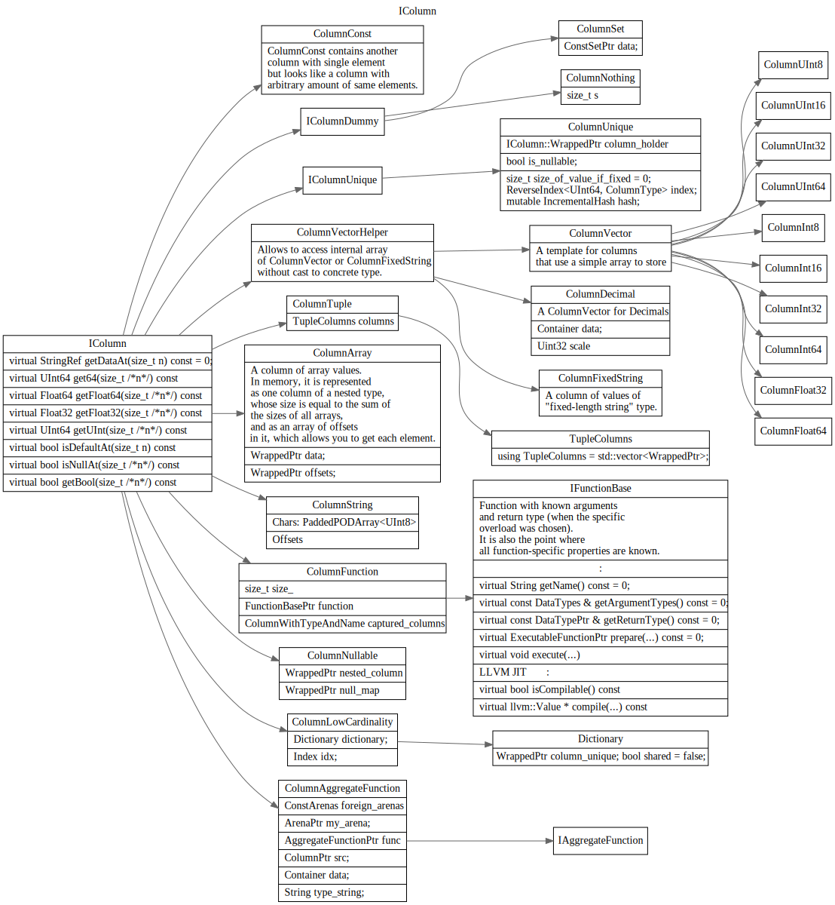

# Block

<!-- toc -->


## Block

最基本的数据处理单元, 有点类似于Pandas的dataframe

```cpp
/** Container for set of columns for bunch of rows in memory.
  * This is unit of data processing.
  * Also contains metadata - data types of columns and their names
  *  (either original names from a table, or generated names during temporary calculations).
  * Allows to insert, remove columns in arbitrary position, to change order of columns.
  */
```


## BlockInfo

```cpp
    /** is_overflows:
      * After running GROUP BY ... WITH TOTALS with the max_rows_to_group_by and group_by_overflow_mode = 'any' settings,
      *  a row is inserted in the separate block with aggregated values that have not passed max_rows_to_group_by.
      * If it is such a block, then is_overflows is set to true for it.
      */

    /** bucket_num:
      * When using the two-level aggregation method, data with different key groups are scattered across different buckets.
      * In this case, the bucket number is indicated here. It is used to optimize the merge for distributed aggregation.
      * Otherwise -1.
      */
```

## IColumn



## IDataType
