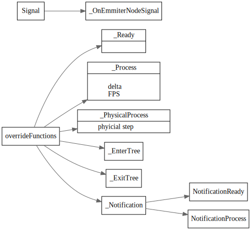
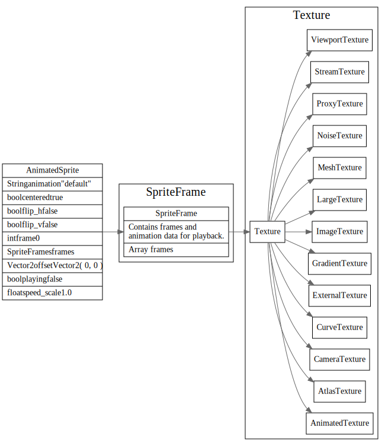

# godot 学习笔记

<!-- toc -->

## node tree
1. 在tree中怎么快速定位到某个Node? 并转换为相应类型？
2. node之间怎么互相调用？
3. scene之间的过渡场景怎么搞？
4. 目前有哪些node 各自负责干啥？


## Node2D


## Node 虚函数

Rust中没有虚函数，是咋搞的

```c#
public override void _EnterTree()
{
    // When the node enters the Scene Tree, it becomes active
    // and  this function is called. Children nodes have not entered
    // the active scene yet. In general, it's better to use _ready()
    // for most cases.
    base._EnterTree();
}

public override void _Ready()
{
    // This function is called after _enter_tree, but it ensures
    // that all children nodes have also entered the Scene Tree,
    // and became active.
    base._Ready();
}

public override void _ExitTree()
{
    // When the node exits the Scene Tree, this function is called.
    // Children nodes have all exited the Scene Tree at this point
    // and all became inactive.
    base._ExitTree();
}

public override void _Process(float delta)
{
    // This function is called every frame.
    base._Process(delta);
}

public override void _PhysicsProcess(float delta)
{
    // This is called every physics frame.
    base._PhysicsProcess(delta);
}
```



## Instance Scene

先load scene, 然后将scene instance为node，可以放在场景里面
```
var scene = GD.Load<PackedScene>("res://myscene.tscn"); // Will load when the script is instanced.

//preload
var scene = preload("res://myscene.tscn") # Will load when parsing the script.

//instance
var node = scene.Instance();
AddChild(node);
```

## Signal

可以在editor中connect. 也可以在代码中connect 信号和handler 

带参数的Signal
```
extends Node

signal my_signal(value, other_value)

func _ready():
    emit_signal("my_signal", true, 42)
```

### Connect signal

```
// <source_node>.connect(<signal_name>, <target_node>, <target_function_name>)
extends Node2D


func _ready():
    $Timer.connect("timeout", self, "_on_Timer_timeout")


func _on_Timer_timeout():
    $Sprite.visible = !$Sprite.visible
```

### Emit signal

定义和发射signal
```
extends Node2D


signal my_signal


func _ready():
    emit_signal("my_signal")
```

### AnimatedSprite




## KinematicBody2D

控制角色运动和碰撞检测， 和RigionBody2D有什么区别？

1. CollisionShape2D: 碰撞检测, Geometric Shape: New RectTangeShape2D
2. Modulation: 调制，在inspector中可以改变collisionShape的颜色, 在debug模式比较有用.
3. Sprite, render顺序，从上到下，下面的覆盖上面的.
4. snaping feature: 用于精确放置图片到0点, snap to grid, 快捷键G Snap to pixel
5. collision shape比sprite稍微小一点.
6. Dector Monitorble是干啥的, 为啥要把Dector的physical Layer去掉？这样就不会发生碰撞检测了吗？只会做dector?
7. stampdector检测的时候，比较global_y 来判断player是否不是在头顶
8. player身上的enemyDector，jump更高一些, onAreaEnter和onBodyEnter有啥区别啊


```
src/Actors/Player.tscn
```

```
func _physic_process(delta: float) -> void:
  velocity.y = gravity * delta;
  velocity.y = max(velocity.y, speed.y)
  velocity = move_and_slide(velocity)

```

is_on_wall
is_on_floor

Actor.gd, player和enemy共享公用的代码


## TileMap

tileset.tres 这个制作细节需要去学习下

Cell collision, 给每个cell添加collsion，这个画完tilemap之后，自动就有了collision.
snapOptions: Step

CellSize

可以直接将Player drag到tilemap里面

physics layers
masks: 需要检测碰撞的layer

Input Mapping

get_action_strength


## Camera2D控制
Camera Limit: Top, left, Right, Bottom, Smoothed
Drag Margin, H,V enable


### LevelTemplate

rules: pixels, shiyong rules来衡量位置，然后修改camera的limit

## Background

TextureRectangle, Layout, FullRect

CanvasLayer-> Background, Layer -100, 
