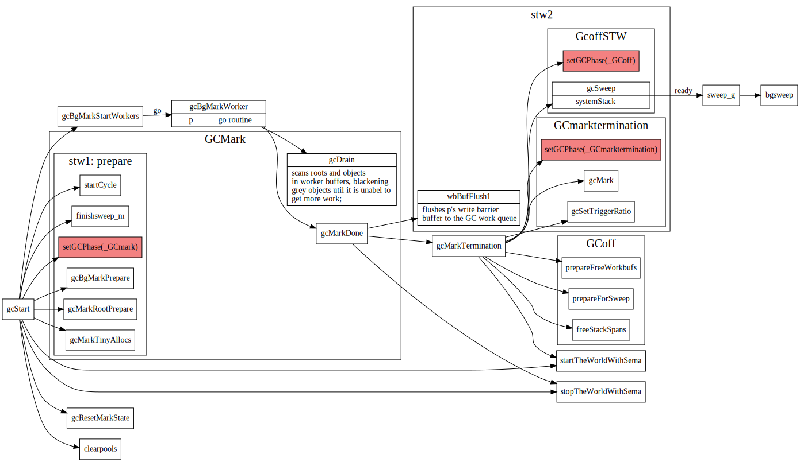
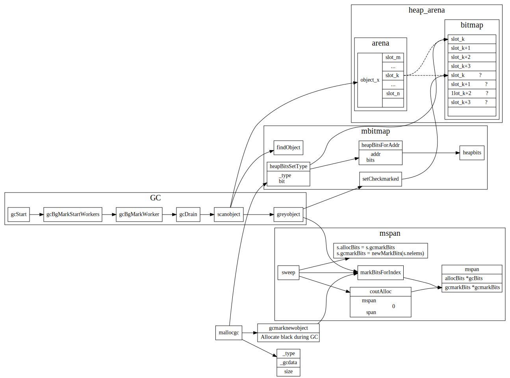
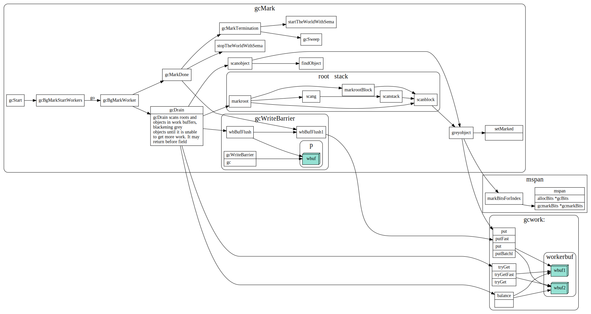
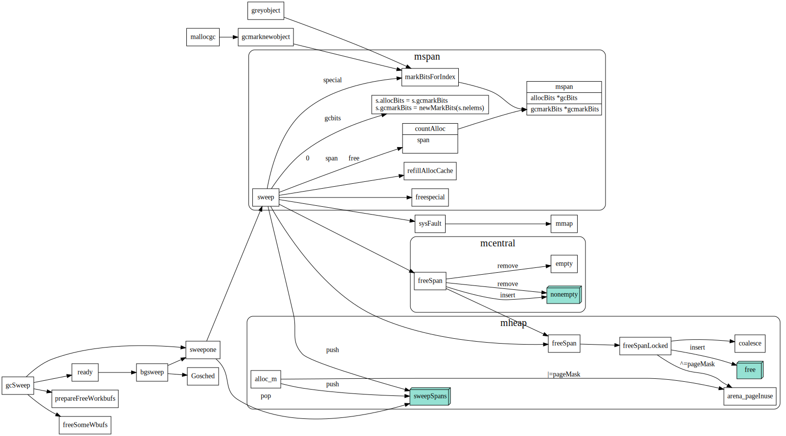

# GC

## GcPhase

1. `_GCoff`:  GC not running; sweeping in background, write barrier disabled
2. `_GCmark`: GC marking roots and workbufs: allocate black, write barrier ENABLED
3. `_GCmarktermination`: GC mark termination: allocate black, P's help GC, write barrier ENABLED

如下图所示，GC过程中开启了两次STW(stop the world),　第一次主要为parepare阶段，
第二次为Marktermination阶段:



```go
//go:nosplit
func setGCPhase(x uint32) {
	atomic.Store(&gcphase, x)
	writeBarrier.needed = gcphase == _GCmark || gcphase == _GCmarktermination
	writeBarrier.enabled = writeBarrier.needed || writeBarrier.cgo
}
```

## Mark Phase

Golang中是如何根据指针找到对象，以及该对象所引用的对象的？答案是根据heap Arena中bitmap存储的元信息。
对于Arena中每个word, bitmap使用了两个bit，来标识该word是否是指针，以及该word是否已被扫描过。

```go
type heapArena struct {
	// bitmap stores the pointer/scalar bitmap for the words in
  // this arena
	bitmap [heapArenaBitmapBytes]byte
	spans [pagesPerArena]*mspan
	pageInUse [pagesPerArena / 8]uint8
	pageMarks [pagesPerArena / 8]uint8
	zeroedBase uintptr
}
```



另外每个span中有allocBits和gcmarkbits用来标记span中每个slot是否被分配。在mallocgc中会使用该信息，找到可分配的slot,
另外在gc sweep阶段根据coutAlloc()==0 来判断mspan是否是空闲的，可以被回收.

```go
//go:nosplit
// 返回一个指针在heapArena中的bits位
func heapBitsForAddr(addr uintptr) (h heapBits) {
	// 2 bits per word, 4 pairs per byte, and a mask is hard coded.
	arena := arenaIndex(addr)
	ha := mheap_.arenas[arena.l1()][arena.l2()]
	// The compiler uses a load for nil checking ha, but in this
	// case we'll almost never hit that cache line again, so it
	// makes more sense to do a value check.
	if ha == nil {
		// addr is not in the heap. Return nil heapBits, which
		// we expect to crash in the caller.
		return
	}
	h.bitp = &ha.bitmap[(addr/(sys.PtrSize*4))%heapArenaBitmapBytes]
	h.shift = uint32((addr / sys.PtrSize) & 3)
	h.arena = uint32(arena)
	h.last = &ha.bitmap[len(ha.bitmap)-1]
	return
}
```
```go
func (s *mspan) markBitsForIndex(objIndex uintptr) markBits {
	bytep, mask := s.gcmarkBits.bitp(objIndex)
	return markBits{bytep, mask, objIndex}
}

// bitp returns a pointer to the byte containing bit n and a mask for
// selecting that bit from *bytep.
func (b *gcBits) bitp(n uintptr) (bytep *uint8, mask uint8) {
	return b.bytep(n / 8), 1 << (n % 8)
}
```

### 并发标记



#### WriteBarrier
```go
	a := new(A)
	a.c = new(C)
```
混合写屏障[1](https://github.com/golang/proposal/blob/master/design/17503-eliminate-rescan.md)
这里的shade就是将白色对象放入待扫描队列中(wbBuf)

```
writePointer(slot, ptr):
    shade(*slot)
    if current stack is grey:
        shade(ptr)
    *slot = ptr
```

编译器注入的writeBarrier
```go
	0x0059 00089 (test.go:14)	CMPL	runtime.writeBarrier(SB), $0
	0x0060 00096 (test.go:14)	JEQ	100
	0x0062 00098 (test.go:14)	JMP	115
	0x0064 00100 (test.go:14)	MOVQ	AX, (DI)
	0x0067 00103 (test.go:14)	JMP	105
	0x0069 00105 (test.go:15)	PCDATA	$0, $0
	0x0069 00105 (test.go:15)	PCDATA	$1, $0
	0x0069 00105 (test.go:15)	MOVQ	56(SP), BP
	0x006e 00110 (test.go:15)	ADDQ	$64, SP
	0x0072 00114 (test.go:15)	RET
	0x0073 00115 (test.go:14)	PCDATA	$0, $-2
	0x0073 00115 (test.go:14)	PCDATA	$1, $-2
	0x0073 00115 (test.go:14)	CALL	runtime.gcWriteBarrier(SB)
	0x0078 00120 (test.go:14)	JMP	105
```

#### scanobject

scanobject:根据bitmap信息，判断是否是指针，是否已扫描过。
如果是指针的话，查找指针对应的object, 并加到队列里面（标记为灰色）
这样下次gcDrain会从队列中去取，接着循环的扫描。。

```go
// scanobject scans the object starting at b, adding pointers to gcw.
// b must point to the beginning of a heap object or an oblet.
// scanobject consults the GC bitmap for the pointer mask and the
// spans for the size of the object.
//
//go:nowritebarrier
func scanobject(b uintptr, gcw *gcWork) {
	// Find the bits for b and the size of the object at b.
	//
	// b is either the beginning of an object, in which case this
	// is the size of the object to scan, or it points to an
	// oblet, in which case we compute the size to scan below.
	hbits := heapBitsForAddr(b)
	s := spanOfUnchecked(b)
  //...
			if s.spanclass.noscan() {
				// Bypass the whole scan.
				gcw.bytesMarked += uint64(n)
				return
			}

	var i uintptr
	for i = 0; i < n; i += sys.PtrSize {
		// Find bits for this word.
		if i != 0 {
			// Avoid needless hbits.next() on last iteration.
			hbits = hbits.next()
		}
		// Load bits once. See CL 22712 and issue 16973 for discussion.
		bits := hbits.bits()
		// During checkmarking, 1-word objects store the checkmark
		// in the type bit for the one word. The only one-word objects
		// are pointers, or else they'd be merged with other non-pointer
		// data into larger allocations.
		if i != 1*sys.PtrSize && bits&bitScan == 0 {
			break // no more pointers in this object
		}
		if bits&bitPointer == 0 {
			continue // not a pointer
		}

		// Work here is duplicated in scanblock and above.
		// If you make changes here, make changes there too.
		obj := *(*uintptr)(unsafe.Pointer(b + i))

		// At this point we have extracted the next potential pointer.
		// Quickly filter out nil and pointers back to the current object.
		if obj != 0 && obj-b >= n {
			// Test if obj points into the Go heap and, if so,
			// mark the object.
			//
			// Note that it's possible for findObject to
			// fail if obj points to a just-allocated heap
			// object because of a race with growing the
			// heap. In this case, we know the object was
			// just allocated and hence will be marked by
			// allocation itself.
			if obj, span, objIndex := findObject(obj, b, i); obj != 0 {
				greyobject(obj, b, i, span, gcw, objIndex)
			}
		}
	}
  //...
}
```

## Sweep Phase



### scavenging

go1.13之后改为更智能的内存归还给os[2](https://github.com/golang/go/issues/30333)


## Ref 
1. [Proposal: Eliminate STW stack re-scanning](https://github.com/golang/proposal/blob/master/design/17503-eliminate-rescan.md)
2. [Proposal: Smarter Scavenging](https://github.com/golang/go/issues/30333)
