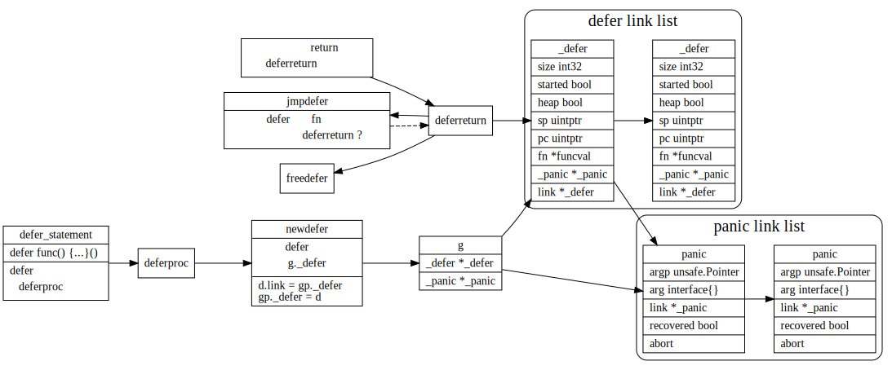
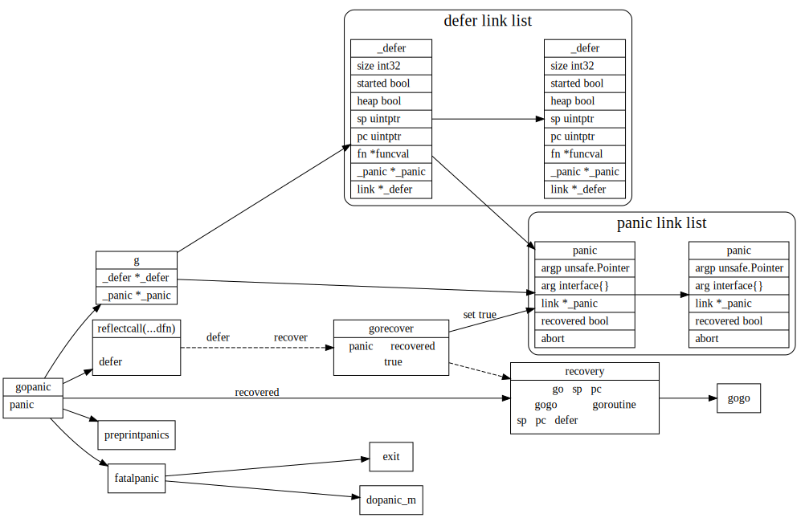

# defer, recover, panic

1. 每个defer语句生成的defer结构会插到队首，defer执行时从defer link list头开始执行.所以defer以LIFO顺序执行。
2. 每个return语句会编译器会插入deferreturn。
3. 在panic中会调用defer 链表中的函数，然后在defer中可以recover, 也可以接着panic.

## defer



### defer 语句

每个defer语句会转换成对deferproc的调用.
```go
// Calls the function n using the specified call type.
// Returns the address of the return value (or nil if none).
func (s *state) call(n *Node, k callKind) *ssa.Value {
//...
		switch {
		case k == callDefer:
			call = s.newValue1A(ssa.OpStaticCall, types.TypeMem, deferproc, s.mem())
      ...
}
```

deferproc 会新建一个`_defer`结构的struct, 并插到当前goroutine的`_defer`列表队头

```go
// Create a new deferred function fn with siz bytes of arguments.
// The compiler turns a defer statement into a call to this.
//go:nosplit
func deferproc(siz int32, fn *funcval) { // arguments of fn follow fn
	if getg().m.curg != getg() {
		// go code on the system stack can't defer
		throw("defer on system stack")
	}

	// the arguments of fn are in a perilous state. The stack map
	// for deferproc does not describe them. So we can't let garbage
	// collection or stack copying trigger until we've copied them out
	// to somewhere safe. The memmove below does that.
	// Until the copy completes, we can only call nosplit routines.
	sp := getcallersp()
	argp := uintptr(unsafe.Pointer(&fn)) + unsafe.Sizeof(fn)
	callerpc := getcallerpc()

	d := newdefer(siz)
	if d._panic != nil {
		throw("deferproc: d.panic != nil after newdefer")
	}
	d.fn = fn
	d.pc = callerpc
	d.sp = sp
	switch siz {
	case 0:
		// Do nothing.
	case sys.PtrSize:
		*(*uintptr)(deferArgs(d)) = *(*uintptr)(unsafe.Pointer(argp))
	default:
		memmove(deferArgs(d), unsafe.Pointer(argp), uintptr(siz))
	}

	// deferproc returns 0 normally.
	// a deferred func that stops a panic
	// makes the deferproc return 1.
	// the code the compiler generates always
	// checks the return value and jumps to the
	// end of the function if deferproc returns != 0.
	return0()
	// No code can go here - the C return register has
	// been set and must not be clobbered.
}
```

其中return0的定义如下
```
TEXT runtime·return0(SB), NOSPLIT, $0
	MOVL	$0, AX
	RET
```
compiler生成的代码会检查ax寄存器的值。

### defer函数的调用
编译器在函数的return RET指令后面加入deferreturn的调用.
```
func fa() {
		defer fmt.Printf("hello")
}
```

```go
"".fa STEXT size=106 args=0x0 locals=0x48
	0x0000 00000 (test.go:7)	TEXT	"".fa(SB), ABIInternal, $72-0
	0x0000 00000 (test.go:7)	MOVQ	(TLS), CX
	0x0009 00009 (test.go:7)	CMPQ	SP, 16(CX)
	0x000d 00013 (test.go:7)	JLS	99
	0x000f 00015 (test.go:7)	SUBQ	$72, SP
	0x0013 00019 (test.go:7)	MOVQ	BP, 64(SP)
	0x0018 00024 (test.go:7)	LEAQ	64(SP), BP
	0x001d 00029 (test.go:7)	FUNCDATA	$0, gclocals·33cdeccccebe80329f1fdbee7f5874cb(SB)
	0x001d 00029 (test.go:7)	FUNCDATA	$1, gclocals·33cdeccccebe80329f1fdbee7f5874cb(SB)
	0x001d 00029 (test.go:7)	FUNCDATA	$2, gclocals·9fb7f0986f647f17cb53dda1484e0f7a(SB)
	0x001d 00029 (test.go:8)	PCDATA	$0, $0
	0x001d 00029 (test.go:8)	PCDATA	$1, $0
	0x001d 00029 (test.go:8)	MOVL	$0, ""..autotmp_1+8(SP)
	0x0025 00037 (test.go:8)	PCDATA	$0, $1
	0x0025 00037 (test.go:8)	LEAQ	"".fa.func1·f(SB), AX
	0x002c 00044 (test.go:8)	PCDATA	$0, $0
	0x002c 00044 (test.go:8)	MOVQ	AX, ""..autotmp_1+32(SP)
	0x0031 00049 (test.go:8)	PCDATA	$0, $1
	0x0031 00049 (test.go:8)	LEAQ	""..autotmp_1+8(SP), AX
	0x0036 00054 (test.go:8)	PCDATA	$0, $0
	0x0036 00054 (test.go:8)	MOVQ	AX, (SP)
	0x003a 00058 (test.go:8)	CALL	runtime.deferprocStack(SB)
  // 如果deferprocStack返回值不为０,则调到末尾执行deferreturn
	0x003f 00063 (test.go:8)	TESTL	AX, AX
	0x0041 00065 (test.go:8)	JNE	83
	0x0043 00067 (test.go:11)	XCHGL	AX, AX
	0x0044 00068 (test.go:11)	CALL	runtime.deferreturn(SB)
	0x0049 00073 (test.go:11)	MOVQ	64(SP), BP
	0x004e 00078 (test.go:11)	ADDQ	$72, SP
	0x0052 00082 (test.go:11)	RET
	0x0053 00083 (test.go:8)	XCHGL	AX, AX
	0x0054 00084 (test.go:8)	CALL	runtime.deferreturn(SB)
	0x0059 00089 (test.go:8)	MOVQ	64(SP), BP
	0x005e 00094 (test.go:8)	ADDQ	$72, SP
	0x0062 00098 (test.go:8)	RET
	0x0063 00099 (test.go:8)	NOP
	0x0063 00099 (test.go:7)	PCDATA	$1, $-1
	0x0063 00099 (test.go:7)	PCDATA	$0, $-1
	0x0063 00099 (test.go:7)	CALL	runtime.morestack_noctxt(SB)
	0x0068 00104 (test.go:7)	JMP	0
```

deferreturn 会调用jmpdefer，不断的执行defer link中的fn

```go
// func jmpdefer(fv *funcval, argp uintptr)
// argp is a caller SP.
// called from deferreturn.
// 1. pop the caller
// 2. sub 5 bytes from the callers return
// 3. jmp to the argument
TEXT runtime·jmpdefer(SB), NOSPLIT, $0-16
	MOVQ	fv+0(FP), DX	// fn
	MOVQ	argp+8(FP), BX	// caller sp
	LEAQ	-8(BX), SP	// caller sp after CALL
	MOVQ	-8(SP), BP	// restore BP as if deferreturn returned (harmless if framepointers not in use)
	SUBQ	$5, (SP)	// return to CALL again
	MOVQ	0(DX), BX
	JMP	BX	// but first run the deferred function
```

## panic



在panic中会调用当前goroutine的defer 函数，在这些defer函数中也可能会有panic，所有每个goroutine也有个panic的link list。

如果在defer中调用了recover, 那么goroutine会从derfer的sp,pc处接着执行，否则就进入fatalpanic，打印堆栈，最后``exit(2)``

```go
func gopanic(e interface{}) {
  //other code
	var p _panic
	p.arg = e
	p.link = gp._panic
	gp._panic = (*_panic)(noescape(unsafe.Pointer(&p)))

	atomic.Xadd(&runningPanicDefers, 1)

	for {
		d := gp._defer
		if d == nil {
			break
		}

		// If defer was started by earlier panic or Goexit (and, since we're back here, that triggered a new panic),
		// take defer off list. The earlier panic or Goexit will not continue running.
		if d.started {
			if d._panic != nil {
				d._panic.aborted = true
			}
			d._panic = nil
			d.fn = nil
			gp._defer = d.link
			freedefer(d)
			continue
		}

		// Mark defer as started, but keep on list, so that traceback
		// can find and update the defer's argument frame if stack growth
		// or a garbage collection happens before reflectcall starts executing d.fn.
		d.started = true

		// Record the panic that is running the defer.
		// If there is a new panic during the deferred call, that panic
		// will find d in the list and will mark d._panic (this panic) aborted.
		d._panic = (*_panic)(noescape(unsafe.Pointer(&p)))

		p.argp = unsafe.Pointer(getargp(0))
		reflectcall(nil, unsafe.Pointer(d.fn), deferArgs(d), uint32(d.siz), uint32(d.siz))
		p.argp = nil

		// reflectcall did not panic. Remove d.
		if gp._defer != d {
			throw("bad defer entry in panic")
		}
		d._panic = nil
		d.fn = nil
		gp._defer = d.link

		// trigger shrinkage to test stack copy. See stack_test.go:TestStackPanic
		//GC()

		pc := d.pc
		sp := unsafe.Pointer(d.sp) // must be pointer so it gets adjusted during stack copy
		freedefer(d)
		if p.recovered {
			atomic.Xadd(&runningPanicDefers, -1)

			gp._panic = p.link
			// Aborted panics are marked but remain on the g.panic list.
			// Remove them from the list.
			for gp._panic != nil && gp._panic.aborted {
				gp._panic = gp._panic.link
			}
			if gp._panic == nil { // must be done with signal
				gp.sig = 0
			}
			// Pass information about recovering frame to recovery.
			gp.sigcode0 = uintptr(sp)
			gp.sigcode1 = pc
			mcall(recovery)
			throw("recovery failed") // mcall should not return
		}
	}

	// ran out of deferred calls - old-school panic now
	// Because it is unsafe to call arbitrary user code after freezing
	// the world, we call preprintpanics to invoke all necessary Error
	// and String methods to prepare the panic strings before startpanic.
	preprintpanics(gp._panic)

	fatalpanic(gp._panic) // should not return
	*(*int)(nil) = 0      // not reached
}
```

recovery, 这个地方将ret值改为了1

```go
func recovery(gp *g) {
	// Info about defer passed in G struct.
	sp := gp.sigcode0
	pc := gp.sigcode1

	// d's arguments need to be in the stack.
	if sp != 0 && (sp < gp.stack.lo || gp.stack.hi < sp) {
		print("recover: ", hex(sp), " not in [", hex(gp.stack.lo), ", ", hex(gp.stack.hi), "]\n")
		throw("bad recovery")
	}

	// Make the deferproc for this d return again,
	// this time returning 1.  The calling function will
	// jump to the standard return epilogue.
	gp.sched.sp = sp
	gp.sched.pc = pc
	gp.sched.lr = 0
	gp.sched.ret = 1
	gogo(&gp.sched)
}
```


## Ref:

1. https://tiancaiamao.gitbooks.io/go-internals/content/zh/03.4.html
2. https://blog.learngoprogramming.com/gotchas-of-defer-in-go-1-8d070894cb01
