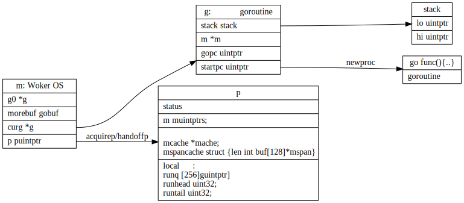
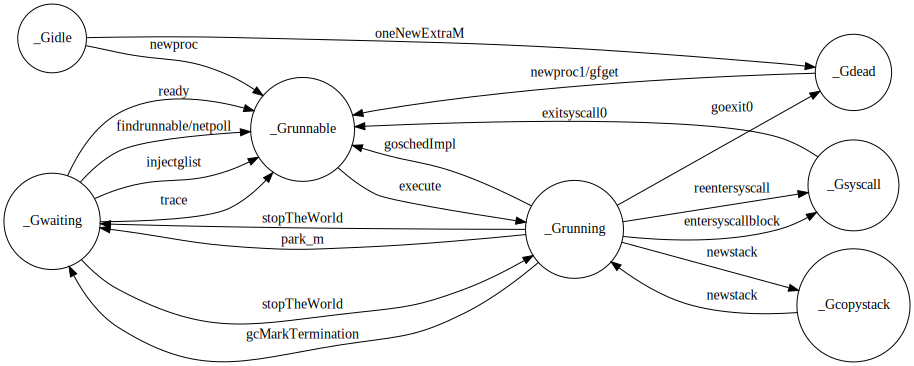

# Runtime PGM Schedule

## PGM concept:

```go
// 摘自src/runtime/proc.go
// G - goroutine.
// M - worker thread, or machine.
// P - processor, a resource that is required to execute Go code.
//     M must have an associated P to execute Go code, however it can be
//     blocked or in a syscall w/o an associated P.
```
三者struct之间的引用关系如下：



## Work stealing scheduler

Golang中的PGM采用类似于tokio的thread pool executor.  采用了worksteal的形式, 一方面降低了对global队列的锁的竞争。

另一方面每个G(go routine) 生成的go routine优先放到proc的local 队列里面，优先由同一个线程执行，比较好的增加了局部性。


## m 线程创建


## Status

### Goroutine



### Proc


## sysmon
