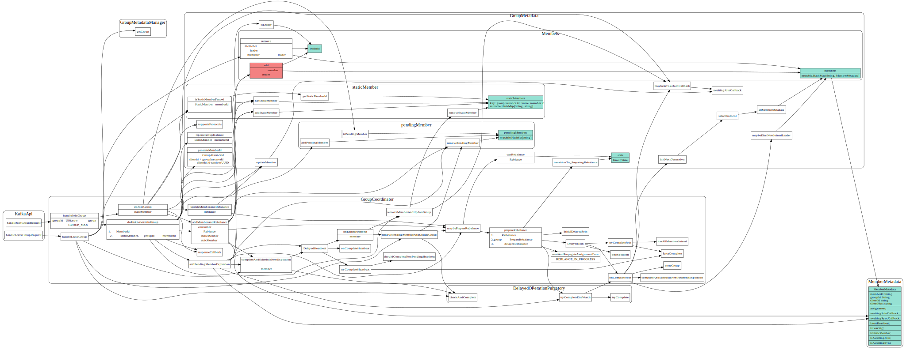
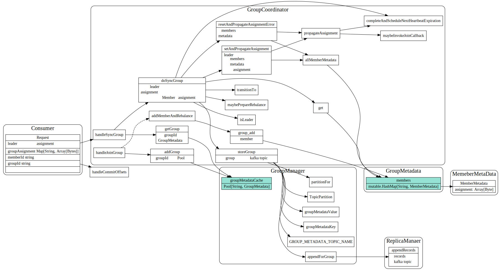
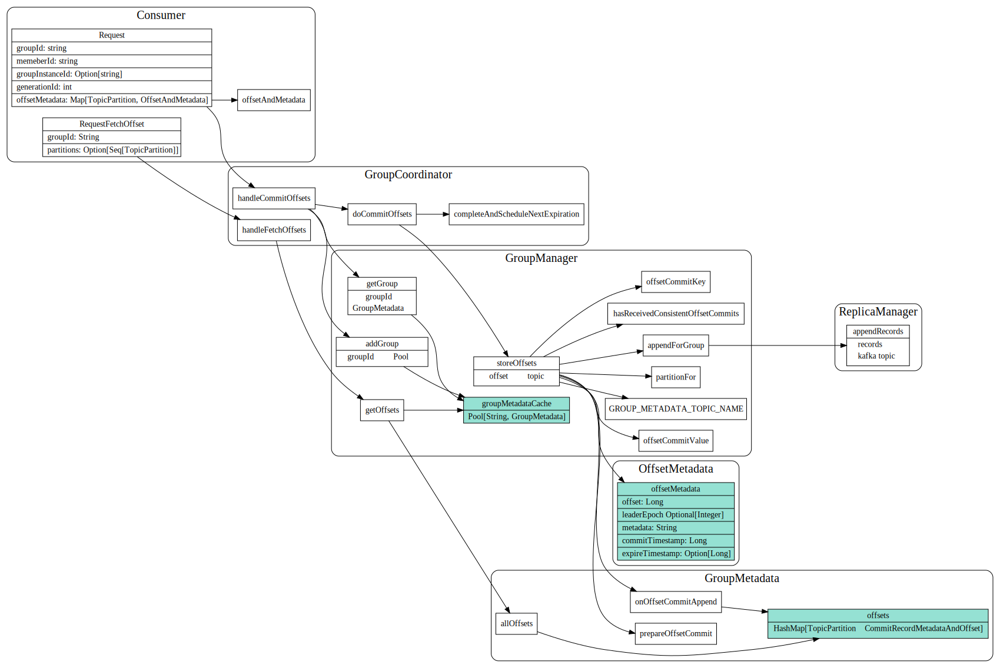
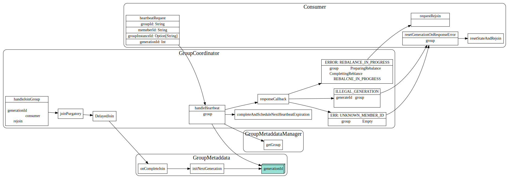
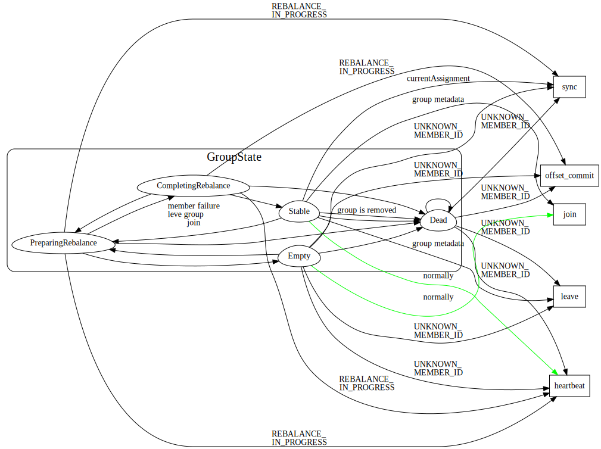

# Kafka GroupCoordinator

GroupCoordinator handles general group membership and offset management.

## ConsumerGroup 
consumer group是kafka提供的可扩展且具有容错性的消费者机制。既然是一个组，那么组内必然可以有多个消费者或消费者实例(consumer instance)，它们共享一个公共的ID，即group ID。组内的所有消费者协调在一起来消费订阅主题(subscribed topics)的所有分区(partition)。当然，每个分区只能由同一个消费组内的一个consumer来消费

1. consumer group下可以有一个或多个consumer instance，consumer instance可以是一个进程，也可以是一个线程
2. group.id是一个字符串，唯一标识一个consumer group
3. consumer group下订阅的topic下的每个分区只能分配给某个group下的一个consumer(当然该分区还可以被分配给其他group)

``__consumer_offsets`` 中的消息保存了每个consumer group某一时刻提交的offset信息。 这个key是consumer-group-id-topic-partition- 这样？
谁来提交offsets?

group与coordinator共同使用它来完成group的rebalance。目前kafka提供了5个协议来处理与consumer group coordination相关的问题：

1. Heartbeat请求：consumer需要定期给coordinator发送心跳来表明自己还活着
4. JoinGroup请求：成员请求加入组
2. LeaveGroup请求：主动告诉coordinator我要离开consumer group
3. SyncGroup请求：group leader把分配方案告诉组内所有成员
5. DescribeGroup请求：显示组的所有信息，包括成员信息，协议名称，分配方案，订阅信息等。通常该请求是给管理员使用

## join/leave group


reblance的时候发生了啥？parition 和consumer之间的分配？？谁负责把partition给各个consumer?

staticMember 是client指定的groupInsanceID

staticMember 和PendingMember是啥？作用是啥？

GroupInstanceId用户指定的consumerid,每个group中这些ID必须是唯一的。

和member.id不同的是，每次成员重启回来后，其静态成员ID值是不变的，因此之前分配给该成员的所有分区也是不变的，而且在没有超时前静态成员重启回来是不会触发Rebalance的。
```
Static Membership: the membership protocol where the consumer group will not trigger rebalance unless 
  * A new member joins
  * A leader rejoins (possibly due to topic assignment change)
  * An existing member offline time is over session timeout
  * Broker receives a leave group request containing alistof `group.instance.id`s (details later)

Group instance id: the unique identifier defined by user to distinguish each client instance.
```



## Sync group

总体而言，rebalance分为2步：Join和Sync

1. Join， 顾名思义就是加入组。这一步中，所有成员都向coordinator发送JoinGroup请求，请求入组。一旦所有成员都发送了JoinGroup请求，coordinator会从中选择一个consumer担任leader的角色，并把组成员信息以及订阅信息发给leader——注意leader和coordinator不是一个概念。leader负责消费分配方案的制定。
2. Sync，这一步leader开始分配消费方案，即哪个consumer负责消费哪些topic的哪些partition。一旦完成分配，leader会将这个方案封装进SyncGroup请求中发给coordinator，非leader也会发SyncGroup请求，只是内容为空。coordinator接收到分配方案之后会把方案塞进SyncGroup的response中发给各个consumer。这样组内的所有成员就都知道自己应该消费哪些分区了。



## Fetch/Commit Offset



## heartbeat



## Group状态

group状态，以及group各个状态下对join/leave/sync/offset_commit等行为的反应




## Ref

1. [static memeber](https://cwiki.apache.org/confluence/display/KAFKA/KIP-345%3A+Introduce+static+membership+protocol+to+reduce+consumer+rebalances)
2. [Kafka Client-side Assignment Proposal](https://cwiki.apache.org/confluence/display/KAFKA/Kafka+Client-side+Assignment+Proposal)
3. [Kafka消费者组静态成员](https://www.cnblogs.com/huxi2b/p/11386847.html)
4. [Kafka消费组(consumer group)](https://www.cnblogs.com/huxi2b/p/6223228.html)
