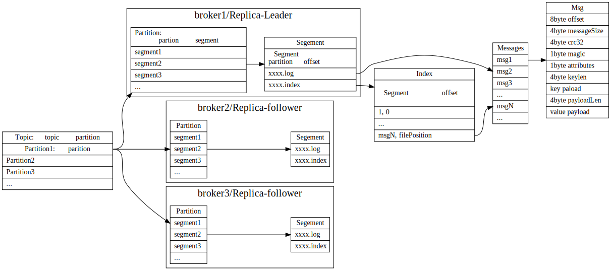
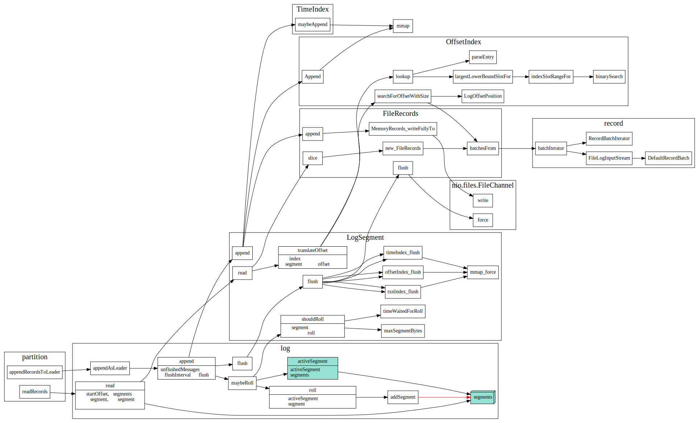
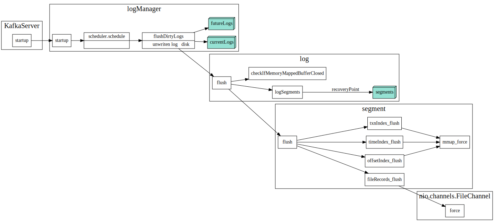
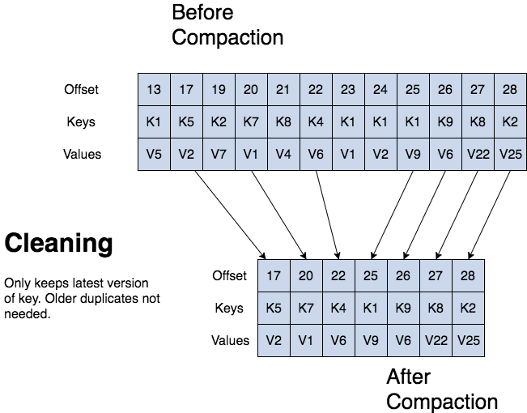

# Kafka LogManager


## Kafka日志层级

在kafka中每个topic可以有多个partition,　每个partition存储时候分为多个segment。

每个parition有多个副本，副本分布在不同的broker上，其中一个broker被选为该partition的leader,
消息是写到kafka partition leader副本中的，而follower通过fetchmessage，同步该partition的消息。



## 日志文件加载和创建

启动时候，会打开log所有segment log file, Lazy的加载他们对应的index.


## 日志读写

写的message个数超过了配置也会触发flush，将cache中msg刷新到磁盘中。




## 日志后台清理和压缩

### 清理过期日志

后台线程根据配置定期清理过期或者超过大小的日志segment


### 日志缓存flush

后台线程定期将cache刷新到磁盘.



### 日志compact

有相同key的msg按照时间顺序只用保留最后一条。




首先会创建key -> offset的映射，然后在遍历records的时候，只保留offset最大的那个。

```scala
  private def buildOffsetMapForSegment(topicPartition: TopicPartition,
                                       segment: LogSegment,
                                       map: OffsetMap,
                                       startOffset: Long,
                                       maxLogMessageSize: Int,
                                       transactionMetadata: CleanedTransactionMetadata,
                                       stats: CleanerStats): Boolean = {
      //other code
      val records = MemoryRecords.readableRecords(readBuffer)
      throttler.maybeThrottle(records.sizeInBytes)
      for (batch <- records.batches.asScala) {
        //other code...
        map.put(record.key, record.offset)
      }
}
```

在memory records的filter中根据这个OffsetMap 过滤掉相同key下offset小的record

```scala
  private def shouldRetainRecord(map: kafka.log.OffsetMap,
                                 retainDeletes: Boolean,
                                 batch: RecordBatch,
                                 record: Record,
                                 stats: CleanerStats): Boolean = {
    val pastLatestOffset = record.offset > map.latestOffset
    if (pastLatestOffset)
      return true

    if (record.hasKey) {
      val key = record.key
      val foundOffset = map.get(key)
      /* First,the message must have the latest offset for the key
       * then there are two cases in which we can retain a message:
       *   1) The message has value
       *   2) The message doesn't has value but it can't be deleted now.
       */
      val latestOffsetForKey = record.offset() >= foundOffset
      val isRetainedValue = record.hasValue || retainDeletes
      latestOffsetForKey && isRetainedValue
    } else {
      stats.invalidMessage()
      false
    }
  }
```


## Ref 
1. [Kafka Architecture: Log Compaction](http://cloudurable.com/blog/kafka-architecture-log-compaction/index.html)
