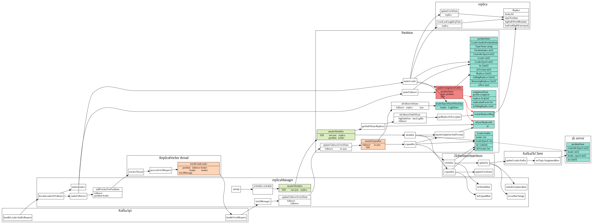

# Kafka Partition

## PartionState

PartionState中重要信息为当前partion的leader和ISR(in sync replica)的replicaId， PartitionState最终是存储在zk中的。
isr信息有``maybeShrinkIsr``和``maybeExpandIsr``这两个函数维护.

每个parition的replica follower都有一个replicaFetcher 线程，该线程负责从partition的leader中
获取消息，然后该replica达到in sync标准的话，就将该replicaId加入到该partiton中的ISR中。

另外ReplicaManager后台会周期性的调用``maybeShrinkIsr``将outOfSync的replica从ISR中踢掉。




### replica in/out sync state

判断replica是否处于in/out sync状态

```scala
  private def isFollowerOutOfSync(replicaId: Int,
                                  leaderEndOffset: Long,
                                  currentTimeMs: Long,
                                  maxLagMs: Long): Boolean = {
    val followerReplica = getReplicaOrException(replicaId)
    followerReplica.logEndOffset != leaderEndOffset &&
      (currentTimeMs - followerReplica.lastCaughtUpTimeMs) > maxLagMs
  }

  private def isFollowerInSync(followerReplica: Replica, highWatermark: Long): Boolean = {
    val followerEndOffset = followerReplica.logEndOffset
    followerEndOffset >= highWatermark && leaderEpochStartOffsetOpt.exists(followerEndOffset >= _)
  }
```

### Partition sate 在zk中的存储

#### 存储路径

Partition 的ISR信息存储在zk下
```
/broker/topics/{topic}/partitions/{partition}/state，
```

具体对应代码在``zkData.scala``中
```scala
// tp partition状态在zk中存储路径
object TopicPartitionStateZNode {
  def path(partition: TopicPartition) = s"${TopicPartitionZNode.path(partition)}/state"
  //other code
}

//tp路径
object TopicPartitionsZNode {
  def path(topic: String) = s"${TopicZNode.path(topic)}/partitions"
}

object TopicZNode {
  def path(topic: String) = s"${TopicsZNode.path}/$topic"
  //othercode
}

//topics路径
object TopicsZNode {
  def path = s"${BrokersZNode.path}/topics"
}

```

#### 存储信息
paritionstate中存储信息如下
```scala
  def decode(bytes: Array[Byte], stat: Stat): Option[LeaderIsrAndControllerEpoch] = {
    Json.parseBytes(bytes).map { js =>
      val leaderIsrAndEpochInfo = js.asJsonObject
      val leader = leaderIsrAndEpochInfo("leader").to[Int]
      val epoch = leaderIsrAndEpochInfo("leader_epoch").to[Int]
      val isr = leaderIsrAndEpochInfo("isr").to[List[Int]]
      val controllerEpoch = leaderIsrAndEpochInfo("controller_epoch").to[Int]
      val zkPathVersion = stat.getVersion
      LeaderIsrAndControllerEpoch(LeaderAndIsr(leader, epoch, isr, zkPathVersion), controllerEpoch)
    }
  }
```

LeaderAndIsrPartitionState定义如下
```json
  "commonStructs": [
    { "name": "LeaderAndIsrPartitionState", "versions": "0+", "fields": [
      { "name": "TopicName", "type": "string", "versions": "0-1", "entityType": "topicName", "ignorable": true,
        "about": "The topic name.  This is only present in v0 or v1." },
      { "name": "PartitionIndex", "type": "int32", "versions": "0+",
        "about": "The partition index." },
      { "name": "ControllerEpoch", "type": "int32", "versions": "0+",
        "about": "The controller epoch." },
      { "name": "Leader", "type": "int32", "versions": "0+", "entityType": "brokerId",
        "about": "The broker ID of the leader." },
      { "name": "LeaderEpoch", "type": "int32", "versions": "0+",
        "about": "The leader epoch." },
      { "name": "Isr", "type": "[]int32", "versions": "0+",
        "about": "The in-sync replica IDs." },
      { "name": "ZkVersion", "type": "int32", "versions": "0+",
        "about": "The ZooKeeper version." },
      { "name": "Replicas", "type": "[]int32", "versions": "0+",
        "about": "The replica IDs." },
      { "name": "AddingReplicas", "type": "[]int32", "versions": "3+", "ignorable": true,
        "about": "The replica IDs that we are adding this partition to, or null if no replicas are being added." },
      { "name": "RemovingReplicas", "type": "[]int32", "versions": "3+", "ignorable": true,
        "about": "The replica IDs that we are removing this partition from, or null if no replicas are being removed." },
      { "name": "IsNew", "type": "bool", "versions": "1+", "default": "false", "ignorable": true,
        "about": "Whether the replica should have existed on the broker or not." }
    ]}
  ]
```

# Ref
1. [Kafka ISR 副本同步机制](http://objcoding.com/2019/11/05/kafka-isr/)
