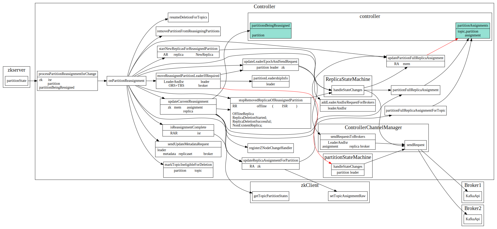

# Kafka Replica Assignment

## Replica 迁移过程

缩写说明
1. RS: replica set 所有的replica set
2. AR: add replica, 需要添加的replica
3. RR: remove replica,　需要删除的replica
4. TRS: target replica set, 要达到目标的replica set
4. ORS: target replica set, 原有的replica set

具体迁移过程kafka代码中注释写的比较详细, 主要分为俩个阶段:

#### Phase A
如果AR没有在partition的ISR中，controller会发送NewReplica请求给AR的broker, 这些broker开始调用
replicaManager的makeFollowers, 启动Replicafetch线程和parititon leader同步，达到in-sync条件后，partition leader会将该broker加入到ISR中。

然后会触发controller在zk中注册的handler,开始下一步的迁移

#### Phase B

删除RR中的replica, 更新zk, 如果leader不在TRS中，controller需要发送LeaderAndIsr request给broker, 指定新的leader.

```
   * Phase A (when TRS != ISR): The reassignment is not yet complete
   *
   *   A1. Bump the leader epoch for the partition and send LeaderAndIsr updates to RS.
   *   A2. Start new replicas AR by moving replicas in AR to NewReplica state.
   *
   * Phase B (when TRS = ISR): The reassignment is complete
   *
   *   B1. Move all replicas in AR to OnlineReplica state.
   *   B2. Set RS = TRS, AR = [], RR = [] in memory.
   *   B3. Send a LeaderAndIsr request with RS = TRS. This will prevent the leader from adding any replica in TRS - ORS back in the isr.
   *       If the current leader is not in TRS or isn't alive, we move the leader to a new replica in TRS.
   *       We may send the LeaderAndIsr to more than the TRS replicas due to the
   *       way the partition state machine works (it reads replicas from ZK)
   *   B4. Move all replicas in RR to OfflineReplica state. As part of OfflineReplica state change, we shrink the
   *       isr to remove RR in ZooKeeper and send a LeaderAndIsr ONLY to the Leader to notify it of the shrunk isr.
   *       After that, we send a StopReplica (delete = false) to the replicas in RR.
   *   B5. Move all replicas in RR to NonExistentReplica state. This will send a StopReplica (delete = true) to
   *       the replicas in RR to physically delete the replicas on disk.
   *   B6. Update ZK with RS=TRS, AR=[], RR=[].
   *   B7. Remove the ISR reassign listener and maybe update the /admin/reassign_partitions path in ZK to remove this partition from it if present.
   *   B8. After electing leader, the replicas and isr information changes. So resend the update metadata request to every broker.
   *
   * In general, there are two goals we want to aim for:
   * 1. Every replica present in the replica set of a LeaderAndIsrRequest gets the request sent to it
   * 2. Replicas that are removed from a partition's assignment get StopReplica sent to them
   *
   * For example, if ORS = {1,2,3} and TRS = {4,5,6}, the values in the topic and leader/isr paths in ZK
   * may go through the following transitions.
   * RS                AR          RR          leader     isr
   * {1,2,3}           {}          {}          1          {1,2,3}           (initial state)
   * {4,5,6,1,2,3}     {4,5,6}     {1,2,3}     1          {1,2,3}           (step A2)
   * {4,5,6,1,2,3}     {4,5,6}     {1,2,3}     1          {1,2,3,4,5,6}     (phase B)
   * {4,5,6,1,2,3}     {4,5,6}     {1,2,3}     4          {1,2,3,4,5,6}     (step B3)
   * {4,5,6,1,2,3}     {4,5,6}     {1,2,3}     4          {4,5,6}           (step B4)
   * {4,5,6}           {}          {}          4          {4,5,6}           (step B6)
   *
   * Note that we have to update RS in ZK with TRS last since it's the only place where we store ORS persistently.
   * This way, if the controller crashes before that step, we can still recover.
```


