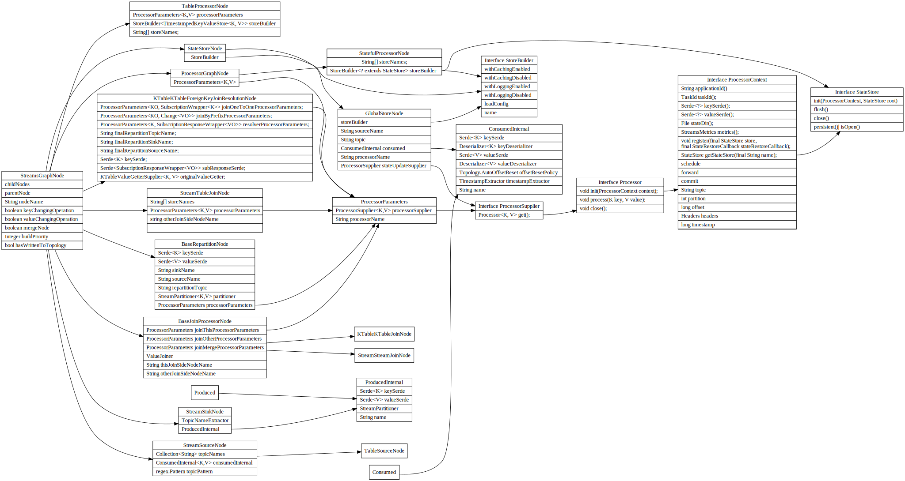
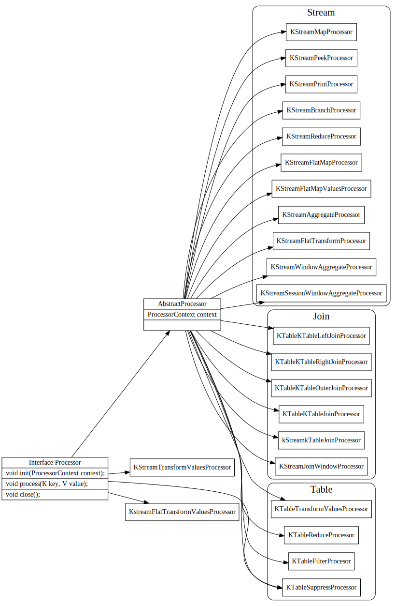
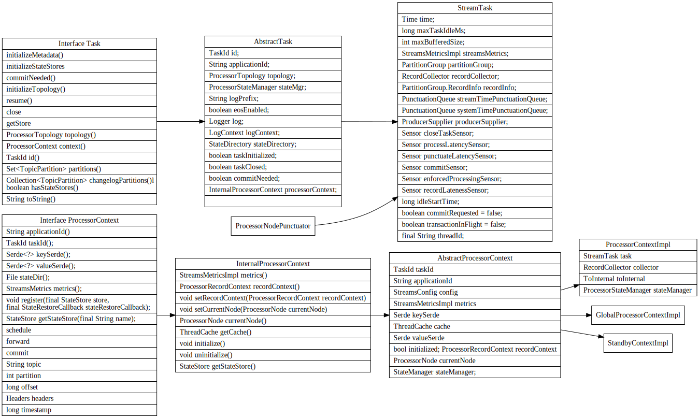
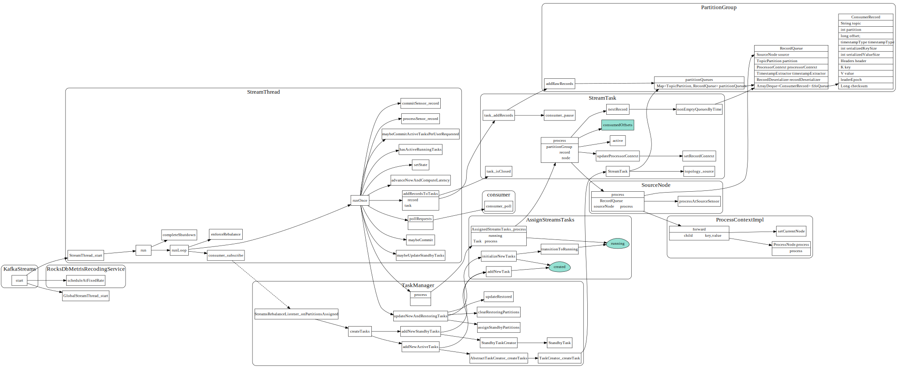

# Draft: Stream

## StreamGraphNode

### Processor

### ProcessorContext 

## Stream start

## Questions

1. DAG图是怎么建立起来的。
2. Kafka怎么调度DAG？怎么在不同线程，不同机器上部署？
3. DAG节点之间是怎么通信的？单纯通过kafka topic ?
4. 怎么处理节点之间的依赖关系的?
5. Stream中的localstate, sharestate是怎么搞得，怎么保证故障恢复的。状态存储实现快速故障恢复和从故障点继续处理
6. Window join 具体指的是啥
7. KStream和KTable在kafka中是怎么表示的。
8. Kafka中的window有哪些？分别是怎么实现的？
9. through方法提供了类似Spark的Shuffle机制，为使用不同分区策略的数据提供了Join的可能

KTable, KStream, KGroupedTable

StreamsBuilder

StreamGraphNode;
GlobalStoreNode;
StateStoreNode;
storeBuilder

writeToTopology

map/filter/groupBy/join(leftJoin, outerJoin)
queryableStoreName;

context.getStateStore

kafka Stream的并行模型中，最小粒度为Task，而每个Task包含一个特定子Topology的所有Processor。因此每个Task所执行的代码完全一样，唯一的不同在于所处理的数据集互补。

这里要保证两个进程的``StreamsConfig.APPLICATION_ID_CONFIG``完全一样。因为Kafka Stream将``APPLICATION_ID_CONFIG``作为隐式启动的Consumer的Group ID。只有保证APPLICATION_ID_CONFIG相同，才能保证这两个进程的Consumer属于同一个Group，从而可以通过Consumer Rebalance机制拿到互补的数据集。

State store被用来存储中间状态。它可以是一个持久化的Key-Value存储，也可以是内存中的HashMap，或者是数据库。Kafka提供了基于Topic的状态存储。

Topic中存储的数据记录本身是Key-Value形式的，同时Kafka的log compaction机制可对历史数据做compact操作，保留每个Key对应的最后一个Value，从而在保证Key不丢失的前提下，减少总数据量，从而提高查询效率。

# Ref

1. [Kafka设计解析（七）- Kafka Stream](https://cloud.tencent.com/developer/article/1149756)
2. [Kafka Streams开发者指南](https://www.orchome.com/335)
3. [Kafka Streams Internal: TaskManager](https://jaceklaskowski.gitbooks.io/mastering-kafka-streams/kafka-streams-internals-TaskManager.html)
4. [Kafka Streams Architecture](https://cwiki.apache.org/confluence/display/KAFKA/Kafka+Streams+Architecture)
