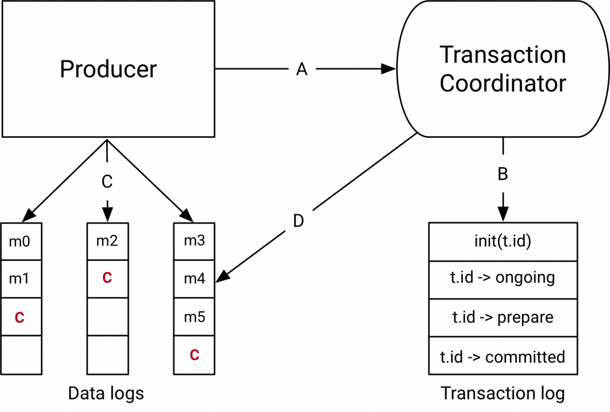
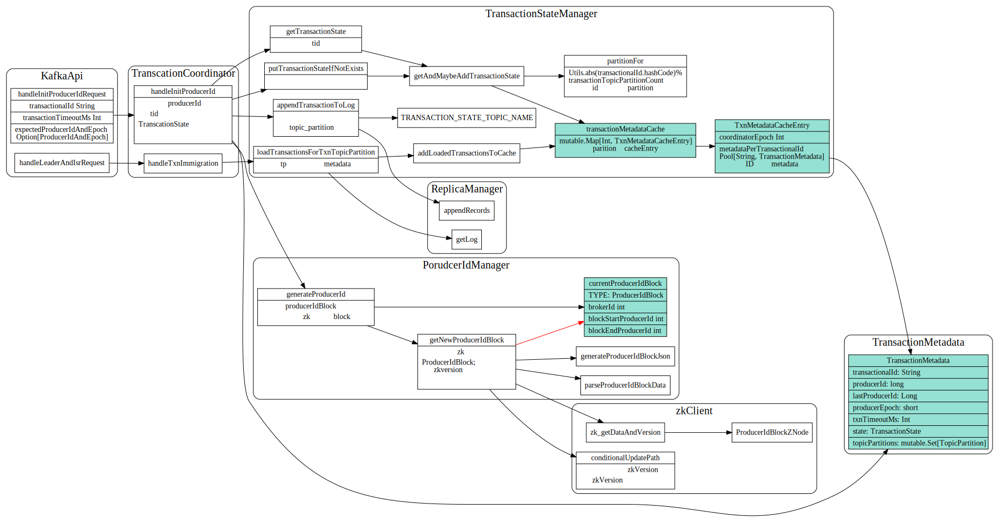
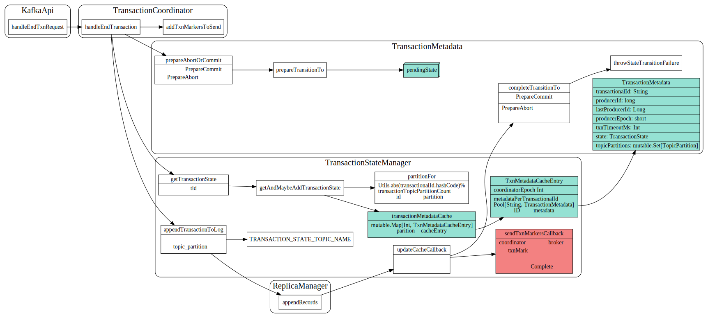
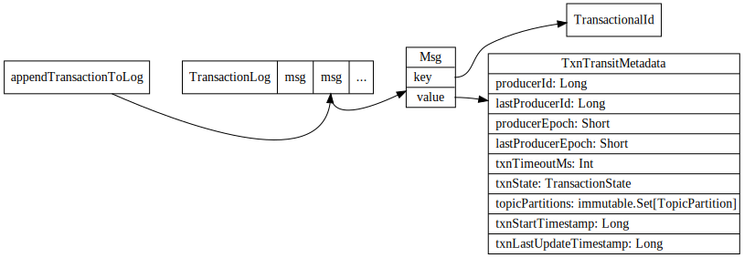

# Txn coordinator

kafka streams中实现exactly once处理
read process write cycle
```java
KafkaProducer producer = createKafkaProducer(
  “bootstrap.servers”, “localhost:9092”,
  “transactional.id”, “my-transactional-id”);

producer.initTransactions();

KafkaConsumer consumer = createKafkaConsumer(
  “bootstrap.servers”, “localhost:9092”,
  “group.id”, “my-group-id”,
  "isolation.level", "read_committed");

consumer.subscribe(singleton(“inputTopic”));

while (true) {
  ConsumerRecords records = consumer.poll(Long.MAX_VALUE);
  producer.beginTransaction();
  for (ConsumerRecord record : records)
    producer.send(producerRecord(“outputTopic”, record));
  producer.sendOffsetsToTransaction(currentOffsets(consumer), group);  
  producer.commitTransaction();
}
```
## Dataflow

[Transactions in Apache Kafka](https://www.confluent.io/blog/transactions-apache-kafka/)中从整体上介绍了kafka中的事务处理流程,
摘抄如下：

1. 在A中producer和txn coordinator交互，获取唯一producerId，注册涉及到的partition等。主要发送请为InitProducerId, AddPartitionsToTxn, AddOffsetsToPartitions
2. 在B中txn coordinator将事务各种状态写入日志中。
3. 在C中producer正常向各个topic paritition写数据。
4. 在D中coordinator开始两阶段提交，coordinator确保每个paritition将WriteMark写入成功。




## FindCoordinator

首先producer发送FindCoordinator请求找到transcationId对应的coordinator. transactionId由client端提供，保证唯一性。
服务端会根据transactionId做hash，分配到相应的topic state 的paritition 中。
该parition 的leader即为这个事务的coordinator.


## InitProducerId

生成全局唯一producerId, 每个transactionId对应着一个TransactionMetadata,
其中的topicPartitions 该事务涉及到的topic partition set.

服务端生成ProducerID时候，有个producerManager每次向zk申请一段的producerId区间，请求来了，先用改区间的id，如果用完了
就像zk再申请。这里面使用了expect zk version 来做分布式控制。避免申请的block被其他的txn coordinator覆盖了。




## AddPartitionsToTxn

向事务添加Partitions, 或者提交当前消费的offset, 由于提交offset也是一种写入topic paritition行为，所以这边统一处理了。


## endTxn

最后producer发送endTxn请求， commit/abort 事务, coordinator开始两阶段提交。

### 准备阶段：PrepareCommit/PrepareAbort

将prepareCommit/PrepareAbort写入日志中, 写成功之后，coordinator会保证事务一定会被commit或者abort.




### 提交阶段

prepareCommit/preapreAbort日志写入成功后调用`sendTxnMarkersCallback`, coordinator 向事务中涉及到的broker发送WriteTxnMarker 请求，coordinator会一直尝试发送直到成功。
所有broker都响应成功后，会写入日志，并迁移到complete状态。

`SendTxnMarkers`将请求放入队列中, 有个单独的InterBrokerThread线程负责从队列, 以及处理失败的队列中取出这些消息，然后将相同broker的请求batch起来，统一发送。


### broker对WriteMarkers请求的处理


## TxnImmigration

txn coordinator partition leader发生了变化，新的leader读取事务日志，加载到内存中，保存在变量``transactionMetadataCache``中.
对于PrepareCommit/PrepareAbort状态的事务会重新`SendTxnMarkers`请求


## 事务状态机迁移

状态迁移时候先``prepareTransionTo`` 设置要转移到的Metadata状态, 然后调用appendTransactionToLog将事务写入日志，日志写入成功后
调用completeTransitionTo 迁移到目标状态


## 事务日志消息格式

事务日志中消息格式如下, 启动了log compaction



## Ref

1. [Transactions in Apache Kafka](https://www.confluent.io/blog/transactions-apache-kafka/)
2. [Kafka设计解析8](https://cloud.tencent.com/developer/article/1149669)
3. [Transactional Messaging in Kafka](https://cwiki.apache.org/confluence/display/KAFKA/Transactional+Messaging+in+Kafka)
4. [Exactly Once Delivery and Transactional Messaging in Kafka](https://docs.google.com/document/d/11Jqy_GjUGtdXJK94XGsEIK7CP1SnQGdp2eF0wSw9ra8/edit#heading=h.i4ub5zye01nh)
5. [Kafka 事务实现原理](https://zhmin.github.io/2019/05/20/kafka-transaction/)
