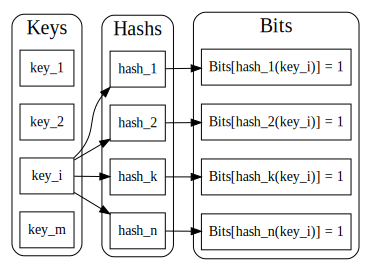
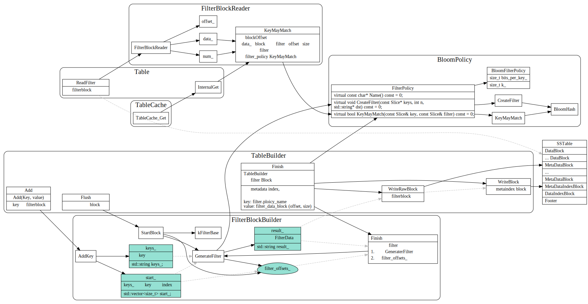

# Bloom filter

## filer policy

leveldb中filter用于快速确定key是否不在table中, 一堆key经过一系列的hash计算后，可以得到
很小指纹数据。查询时候，可以根据这个指纹信息，快速排除key不存在的情况。



计算keys对应的指纹数据：
```cpp
for (int i = 0; i < n; i++) {
  // Use double-hashing to generate a sequence of hash values.
  // See analysis in [Kirsch,Mitzenmacher 2006].
  uint32_t h = BloomHash(keys[i]);
  const uint32_t delta = (h >> 17) | (h << 15);  // Rotate right 17 bits
  for (size_t j = 0; j < k_; j++) {
    const uint32_t bitpos = h % bits;
    array[bitpos / 8] |= (1 << (bitpos % 8));
    h += delta;
  }
```

match过程:

```cpp
uint32_t h = BloomHash(key);
const uint32_t delta = (h >> 17) | (h << 15);  // Rotate right 17 bits
for (size_t j = 0; j < k; j++) {
  const uint32_t bitpos = h % bits;
  if ((array[bitpos / 8] & (1 << (bitpos % 8))) == 0) return false;
  h += delta;
}
return true;
```

## filter数据写入和读取流程

### 写入流程

每个table的block数据的filter数据是写在一块的，通过一个`filter_offsets`来保存每个datablock对应的filter
在整个filter数据中的偏移和大小。

TableBuilder时候，每次开始新的一个datablock，都会调用filter的start new block， 然后Add Key，value时候，调用
AddKey, 创建key的指纹数据。

最后Table finish时候，写入filter data block数据，并且在metaindexblock中添加filter_policy_name和filter data block handle

### 读取流程

每个talbe Get时候，会使用ReadFilter加载该table的所有filterdata, 然后根据blockData的offset 找到该block对应的
filter数据，并使用该数据来判断key是不是不存在。


