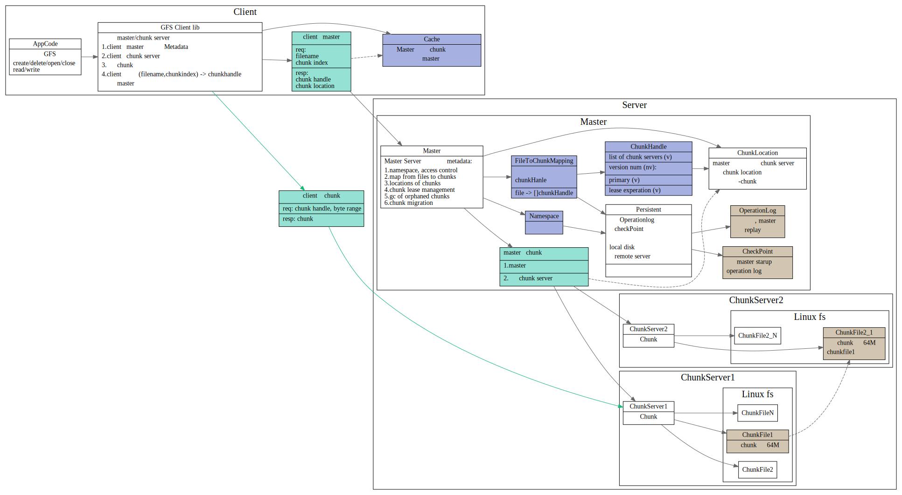
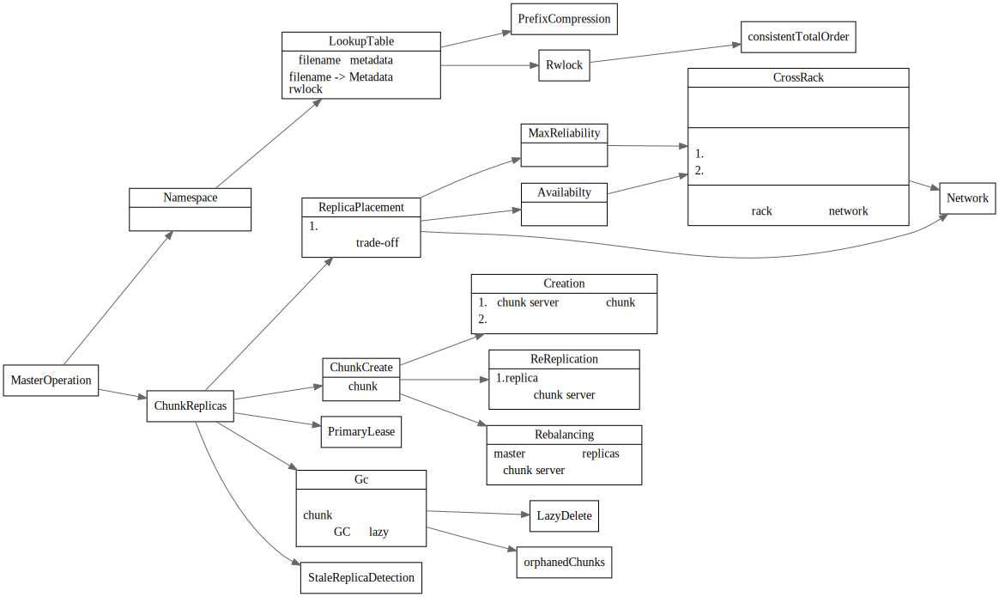

# GFS

## Questions

1. master 和chunk之间是怎么互相自动发现的？
2. master 和chunk之间心跳信息具体内容是啥
3. master信息存在哪儿？master挂了？集群都挂？
4. Cache怎么解决失效的问题？
5. 谁负责写入多个副本？
6. 副本的一致性是怎么保证的
7. Atomic Append是咋搞的
8. 写入流程是怎样的？

### ChunkSize
chunksize 64MB的好处
1. 减轻client 和master的通信.
2. client和chunk server长时间通信,减少需要和多个chunk server网络通信

缺点：
1. 小文件只有一个或几个chunk，容易造成成为热点

### Metadata

master 相当于一个路由表, master主要存储三种metadata
1. the file and chunk namespace
2. mapping from files to chunk
3. location of each chunk replica
这三个信息都存储在内存中，前两个信息会通过operation log, 持久化存储到磁盘上
信息3没有存在磁盘上，master询问每个chunk server, 来构建这个信息.

## 写入流程

### lease and mutation order

如果修改的区域跨chunk了,上面的lease机制无法保证对多个chunk的修改，有一致的修改顺序。
### Atomic record append

这块没怎么看明白，好像是append时候，如果primary发现chunk size不够写，就直接先将当前chunk pad填满，并且
让secondary也pad，填充, 然后让client重试,为了避免过多的碎片，chunk append的record size 现在在`maxSize/4`
这样就避免了跨chunk写

### snapshot

## Master operation

1. namespace namespace operation 
2. manages chunk replicas
3. placement decisions

