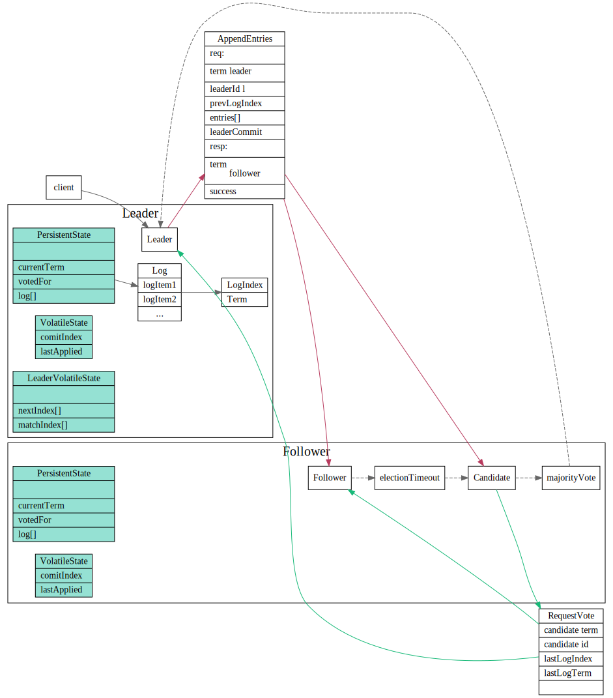

# Raft

## 主要元素

在raft中，主要有leader, candidate, follower三种状态, 一个cluster只有一个leader, leader负责处理client的写请求，然后
leader将日志push给各个follower。

leader通过心跳机制告诉follower自己还活着，当follower有一段时间没收到leader的心跳后，认为leader已经挂掉后，就转变为candidate，
发起投票请求，尝试成为leader。

### term: 任期

在Raft中，任期扮演着逻辑时钟的角色，节点之间的请求和返回中都带上node当前的term。node在处理请求时，发现请求中的term比自己大，就
将自己term 改为该值，如果比自己小，就拒绝请求，并返回带上自己term。 

leader发送给follower的心跳中，如果收到了term比自己大的回复，那么leader就知道自己stale了，就会step down.

candidate在发起requestforvote时候，会将自己term +=1 , 然后经过一轮处理后，整个集群term

### AppendEntries

AppendEntries 是由leader发送给follower的RPC请求，一方面用于同步日志，另一方面AppendEntries的log entriy可以为空，扮演着心跳的角色，
而心跳用于抑制follower 转变为candidate。

### RequestForVote

follower 变为candidate之后，会将自己term + 1, 并且会发送RequestForVote请求给所有成员，开始选举，如果收到了大部分成员的投票，则成为
新的任期的leader。

### SplitVote

为了解决有多个candidate 同时发起投票，然后每个candidate获得的选票都达不到大多数的问题，Raft采用了 random election timeout的机制，每个
candidate的election timout是个随机值，可以在很大程度上保证一段时间内只有一个candidate在request for vote

## Raft子问题

## Raft server state

## AppendEntries请求

### Pre vote
raft中一个机器频繁掉线下
假设有三个server, s1, s2,s3, 其中s2为old leader, s1，s3是follower，s1和s2,s3之间网络频繁掉线。
1. election timeout , s1 进入candidate状态, s1将自己的term ++
2. s1和s2,s3之间通信恢复了，s1收到s2(leader)的AE请求，S1拒绝了S2 AE请求, s2成为follower
3. 

