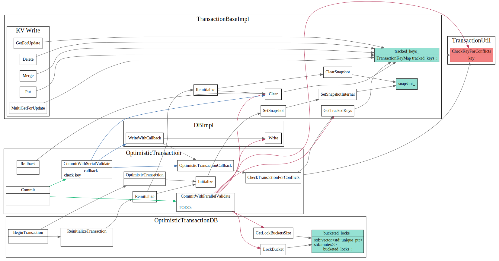

# Optimistic Transaction


乐观事务在commit前，Write操作只会记录事务有哪些key, 不需要做加锁和key冲突检测，适合事务之间
write key重叠比较低的场景。

乐观事务在write时候，使用`tracked_keys`, 记录受影响的key以及该key的seq, 



在commit时候会遍历该`tracked_keys`, 对每个key查找当前db中该key的seq，然后和`tracked_key`中seq比较。
如果数据库中的seq比key的seq新，则认为发生了冲突。

不太理解这里面的`min_uncommited` 起了什么作用.


遍历`TransactionKeyMap`, 检查每个key的冲突
```cpp
Status TransactionUtil::CheckKeysForConflicts(DBImpl* db_impl,
                                              const TransactionKeyMap& key_map,
                                              bool cache_only) {
    //other code..
    //遍历迭代key_map
    for (const auto& key_iter : keys) {
      const auto& key = key_iter.first;
      const SequenceNumber key_seq = key_iter.second.seq;

      result = CheckKey(db_impl, sv, earliest_seq, key_seq, key, cache_only);

      if (!result.ok()) {
        break;
      }
    }

}
```

检查具体某个key的冲突

```cpp
// min_uncommitted 默认值为 KMaxSequnceNumber
// snap_checker默认值为nullptr;
Status TransactionUtil::CheckKey(DBImpl* db_impl, SuperVersion* sv,
                                 SequenceNumber earliest_seq,
                                 SequenceNumber snap_seq,
                                 const std::string& key, bool cache_only,
                                 ReadCallback* snap_checker,
                                 SequenceNumber min_uncommitted) {
  
  //...other code
    SequenceNumber seq = kMaxSequenceNumber;
    bool found_record_for_key = false;

    // When min_uncommitted == kMaxSequenceNumber, writes are committed in
    // sequence number order, so only keys larger than `snap_seq` can cause
    // conflict.
    // When min_uncommitted != kMaxSequenceNumber, keys lower than
    // min_uncommitted will not triggered conflicts, while keys larger than
    // min_uncommitted might create conflicts, so we need  to read them out
    // from the DB, and call callback to snap_checker to determine. So only
    // keys lower than min_uncommitted can be skipped.
    SequenceNumber lower_bound_seq =
        (min_uncommitted == kMaxSequenceNumber) ? snap_seq : min_uncommitted;

    // 去数据库中查找key的最新seq
    Status s = db_impl->GetLatestSequenceForKey(sv, key, !need_to_read_sst,
                                                lower_bound_seq, &seq,
                                                &found_record_for_key);

    if (!(s.ok() || s.IsNotFound() || s.IsMergeInProgress())) {
      result = s;
    } else if (found_record_for_key) {
      bool write_conflict = snap_checker == nullptr
                                ? snap_seq < seq
                                : !snap_checker->IsVisible(seq);
      if (write_conflict) {
        result = Status::Busy();
      }
    }
  }
  return result;
}
```

一些问题：

1. 根据什么判断是否有冲突的？貌似是根据sequnceNumber，但是具体细节不太清楚
2. `bucketed_locks_`的作用是啥？
3. CommitWithSerialValidate和 CommitWithParallelValidate这两者区别是啥？
4. key冲突检测是咋搞的
5. 并行和顺序这个是怎么弄的
