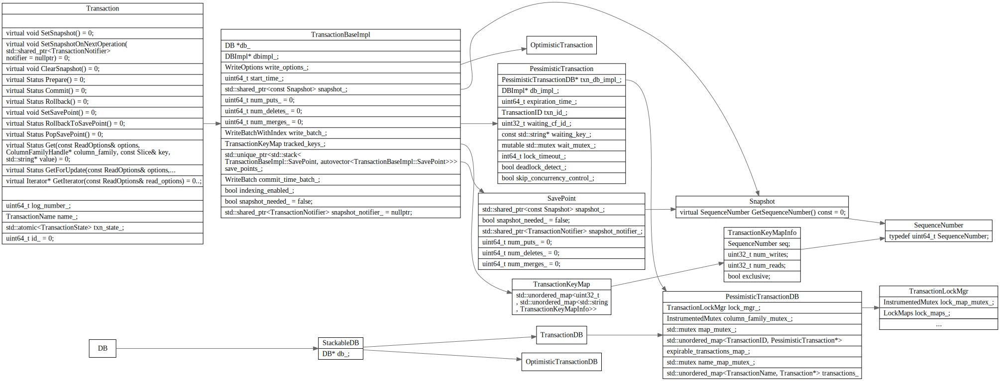
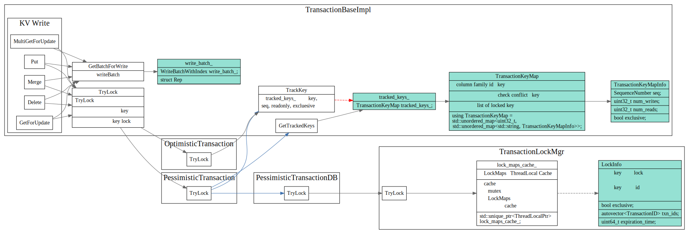

# Transaction

## Transaction struct

### 主要数据成员

rocksdb中，每个事务主要有`track_keys_`和`write_batch_`这两个数据成员，

* `track_keys_`用于跟踪管理该事务写操作涉及的key 
* `write_batch_`用于记录事务最终的写结果。

所有的悲观事务(pessimistic transaction), 通过`txn_db_impl_`指针共享 PessimisticTransactionDB，
从而共享全局的TransactionLockMgr,用来统一管理key的lock。

## 乐观事务
在commit的时候才去检查key的冲突

一些问题：

1. 根据什么判断是否有冲突的？貌似是根据sequnceNumber，但是具体细节不太清楚
2. `bucketed_locks_`的作用是啥？
3. CommitWithSerialValidate和 CommitWithParallelValidate这两者区别是啥？

## 悲观事务

分为三种？
1. writeCommitedTxn

WriteCommitted, which means that the data is written to the DB, i.e., the memtable, only after the transaction is committed

2. WritePrepared
3. WriteUnpreparedTxnDB

## 参考

[Facebook WritePrepared](https://github.com/facebook/rocksdb/wiki/WritePrepared-Transactions)
