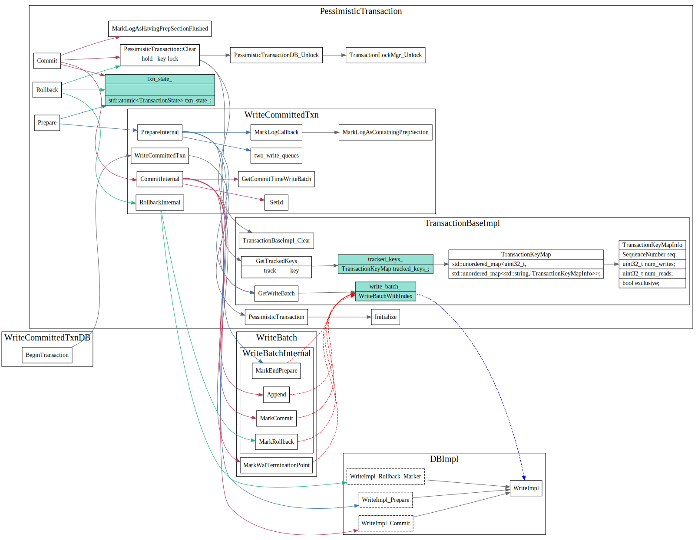

# Two phase commit

## Write Commited txn

事务只有在提交之后，才会写入到db的memtable中，事务在数据库中读到的
kv都是提交之后的，这种需要在提交之前把所有的write kv操作保存在内存writeBatch中，
对于大的事务来说，内存是个瓶颈，另一方面，commit时候才集中的写入memtabe，这个延迟可能也无法忽略。



WriteCommited 两阶段提交：

* Prepare阶段 将writebatch 写入WAL日志中,并将writeBatch中内容用`ktypeBeginPrepare(Xid)`, `kTypeEndPrepare(xid)` 括起来
由于只写到了WAL日志中,　其他事务看不到这个事务的修改
* Commit阶段 向WAL日志写入commit 标记，比如`kTypeCommit(xid)` 并writeBatch中内容insert到memtable上，写入memtable之后，该事务的修改对其他事务就可以见了。
如果向WAL日志中写入`KtypeCommit(xid)`日志就挂了的话，下次recover时候，会重新从日志中恢复writeBatch，然后插入到memtabl中。


```cpp
Status WriteBatchInternal::MarkEndPrepare(WriteBatch* b, const Slice& xid,
                                          bool write_after_commit,
                                          bool unprepared_batch) {
  // other code..
  // rewrite noop as begin marker
  b->rep_[12] = static_cast<char>(
      write_after_commit ? kTypeBeginPrepareXID
                         : (unprepared_batch ? kTypeBeginUnprepareXID
                                             : kTypeBeginPersistedPrepareXID));
  b->rep_.push_back(static_cast<char>(kTypeEndPrepareXID));
  PutLengthPrefixedSlice(&b->rep_, xid);
  // other code..
}
```

#### Recover
事务日志会以writeBatch为单位写入到WAL日志中，恢复时MemtableInsetor会去遍历日志中的writeBatch,
将`BeginPrepare`....`EndPrepare(xid)`之间的kv操作插入到新的writeBatch中，
在遍历到`Commit(xid)`时候，将该writeBatch插入到memtable中，完成提交。


## Write prepared txn

没有commit，就把数据insert到db中，有以下几个问题需要解决:

* How do we identify the key/values in the DB with transactions that wrote them?
* How do we figure if a key/value written by transaction `Txn_w` is in the read snapshot of the reading transaction Txn_r?
* How do we rollback the data written by aborted transactions?

在prepare阶段就插入memtalbe中.

CommitCache 用于判断是否提交了


## Write unprepared txn

