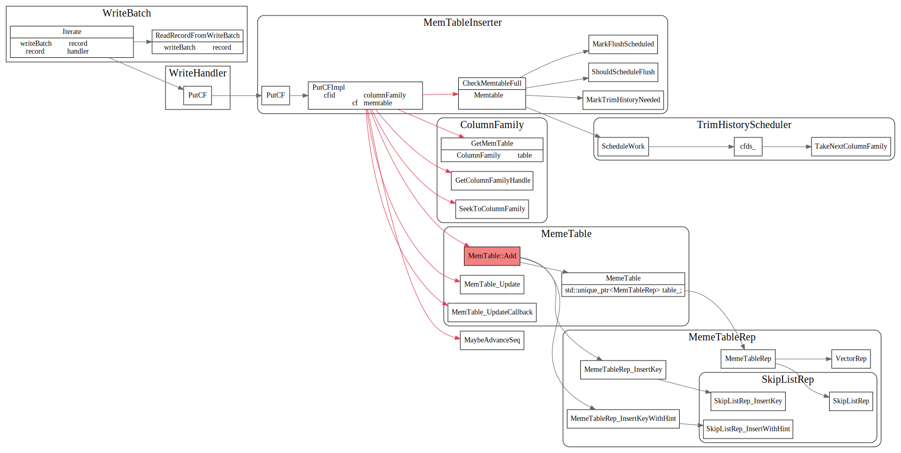

# Write Ahead Log

### WriteBatch

put/delete等操作先写入writeBatch中


writeBatch中Record类型如下:
```cpp
// WriteBatch::rep_ :=
//    sequence: fixed64
//    count: fixed32
//    data: record[count]
```

```cpp
enum ValueType : unsigned char {
  kTypeDeletion = 0x0,
  kTypeValue = 0x1,
  kTypeMerge = 0x2,
  kTypeLogData = 0x3,               // WAL only.
  kTypeColumnFamilyDeletion = 0x4,  // WAL only.
  kTypeColumnFamilyValue = 0x5,     // WAL only.
  kTypeColumnFamilyMerge = 0x6,     // WAL only.
  kTypeSingleDeletion = 0x7,
  kTypeColumnFamilySingleDeletion = 0x8,  // WAL only.
  kTypeBeginPrepareXID = 0x9,             // WAL only.
  kTypeEndPrepareXID = 0xA,               // WAL only.
  kTypeCommitXID = 0xB,                   // WAL only.
  kTypeRollbackXID = 0xC,                 // WAL only.
  kTypeNoop = 0xD,                        // WAL only.
  kTypeColumnFamilyRangeDeletion = 0xE,   // WAL only.
  kTypeRangeDeletion = 0xF,               // meta block
  kTypeColumnFamilyBlobIndex = 0x10,      // Blob DB only
  kTypeBlobIndex = 0x11,                  // Blob DB only
  // When the prepared record is also persisted in db, we use a different
  // record. This is to ensure that the WAL that is generated by a WritePolicy
  // is not mistakenly read by another, which would result into data
  // inconsistency.
  kTypeBeginPersistedPrepareXID = 0x12,  // WAL only.
  // Similar to kTypeBeginPersistedPrepareXID, this is to ensure that WAL
  // generated by WriteUnprepared write policy is not mistakenly read by
  // another.
  kTypeBeginUnprepareXID = 0x13,  // WAL only.
  kMaxValue = 0x7F                // Not used for storing records.
};
```


### MemtableInserter

MemTableInsertor 遍历writeBatch，将记录插入到memtable中,使用MemTableRep封装了skiplist和VectorRep这两种类型的memtable;


