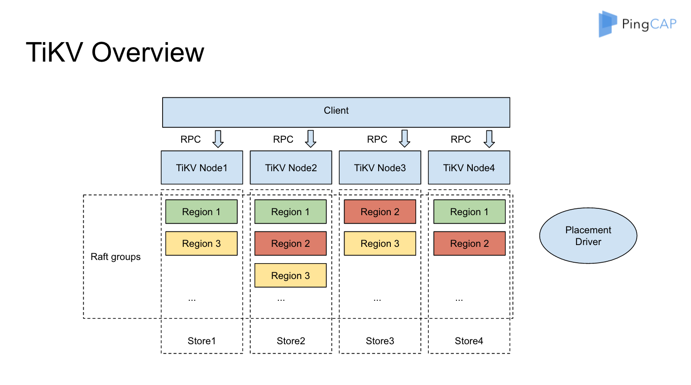
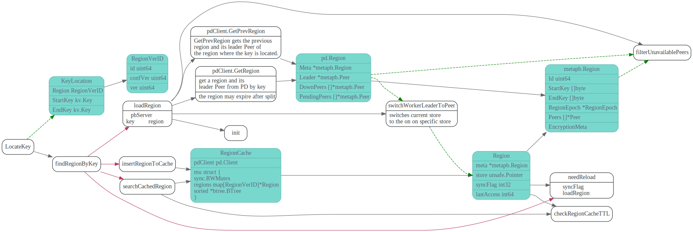
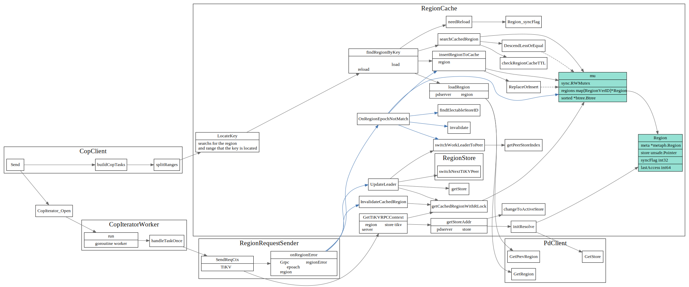

# ReginCache

<!-- toc -->

## 简介

> TiDB 的数据分布是以 Region 为单位的，一个 Region 包含了一个范围内的数据，通常是 96MB 的大小，Region 的 meta 信息包含了 StartKey 和 EndKey 这两个属性。当某个 key >= StartKey && key < EndKey 的时候，我们就知道了这个 key 所在的 Region，然后我们就可以通过查找该 Region 所在的 TiKV 地址，去这个地址读取这个 key 的数据

TiKV中数据是按照Region为单位存储key,value的，
TiDB拿到key, 或者key range之后，需要定位去哪个TiKV服务去取数据。

PDServer(placement driver)就是用来做这个事情的，TiDB需要先去PDserver
获取region leader的addr,然后再向TiKV发起请求。

为了提高效率，TiDB 本地对region做了一层cache，避免每次都要向Pd server发请求。
TiKV层region split之后，TiDB的cache就过期了，这时候，TiDB去TikV发请求，TiKV
会返回错误，然后TiDB根据错误信息，更新region Cache.

## CopClient.Send

## LocateKey

> RegionCache 的内部，有两种数据结构保存 Region 信息，一个是 map，另一个是 b-tree，用 map 可以快速根据 region ID 查找到 Region，用 b-tree 可以根据一个 key 找到包含该 key 的 Region

## RegionStore

RegionStore represents region stores info

## SendReqCtx

根据RegionVerID，去cache中获取region, 然后获取peer(TiKV/TiFlash)的addr
发送GRPC请求.

## onRegionError

TiKV返回RegionError, TiDB根据error 信息更新本地RegionCache

## 参考文献

1. [TiDB 源码阅读系列文章（十八）tikv-client（上）](https://pingcap.com/blog-cn/tidb-source-code-reading-18/)
