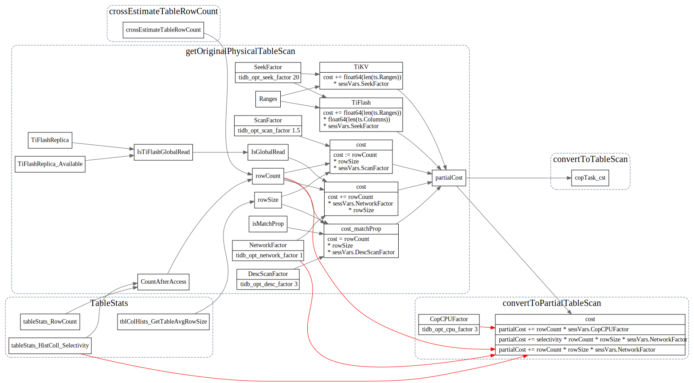
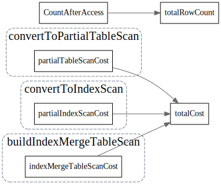

# Physical Optimize

<!-- toc -->
## findBestTask
DataSource 对应的Physical plan分为三种：

* PhysicalTableReader: 读表
* PhysicalIndexReader: 读index
* PhysicalIndexLookUpReader: 读完index之后，根据rowID再去读index

其对应的copTask为PhysicalTableScan, PhysicalIndexScan


## cost

估算Datasource的rowCount, rowSize，然后使用session vars中定义的一些factor来计算cost.

#### session vars factor

TiDB中定义了一些Session Vars, 这些值由`SetSystemVars`来设置

```
func (s *SessionVars) SetSystemVar(name string, val string) error {
```

```go
type SessionVars struct {
  //..
	// CPUFactor is the CPU cost of processing one expression for one row.
	CPUFactor float64
	// CopCPUFactor is the CPU cost of processing one expression for one row in coprocessor.
	CopCPUFactor float64
	// CopTiFlashConcurrencyFactor is the concurrency number of computation in tiflash coprocessor.
	CopTiFlashConcurrencyFactor float64
	// NetworkFactor is the network cost of transferring 1 byte data.
	NetworkFactor float64
	// ScanFactor is the IO cost of scanning 1 byte data on TiKV and TiFlash.
	ScanFactor float64
	// DescScanFactor is the IO cost of scanning 1 byte data on TiKV and TiFlash in desc order.
	DescScanFactor float64
	// SeekFactor is the IO cost of seeking the start value of a range in TiKV or TiFlash.
	SeekFactor float64
	// MemoryFactor is the memory cost of storing one tuple.
	MemoryFactor float64
	// DiskFactor is the IO cost of reading/writing one byte to temporary disk.
	DiskFactor float64
	// ConcurrencyFactor is the CPU cost of additional one goroutine.
	ConcurrencyFactor float64
  //..
}
```

可以在tidb client中看下当前session对应的factor

```sql
show session variables like '%factor'
+-------------------------------------+-------+
| Variable_name                       | Value |
+-------------------------------------+-------+
| innodb_fill_factor                  |       |
| tidb_opt_concurrency_factor         | 3     |
| tidb_opt_copcpu_factor              | 3     |
| tidb_opt_correlation_exp_factor     | 1     |
| tidb_opt_cpu_factor                 | 3     |
| tidb_opt_desc_factor                | 3     |
| tidb_opt_disk_factor                | 1.5   |
| tidb_opt_memory_factor              | 0.001 |
| tidb_opt_network_factor             | 1     |
| tidb_opt_scan_factor                | 1.5   |
| tidb_opt_seek_factor                | 20    |
| tidb_opt_tiflash_concurrency_factor | 24    |
+-------------------------------------+-------+
```
#### crossEstimateRowCount

估算rowcount
这个地方用到了信息统计的Histogram和CMSketch，用来估算RowCount(filter后的rowCount)
crossEstimateTableRowCount


### convertToTableScan



### convertToIndexScan


### convertToIndexMergeScan


