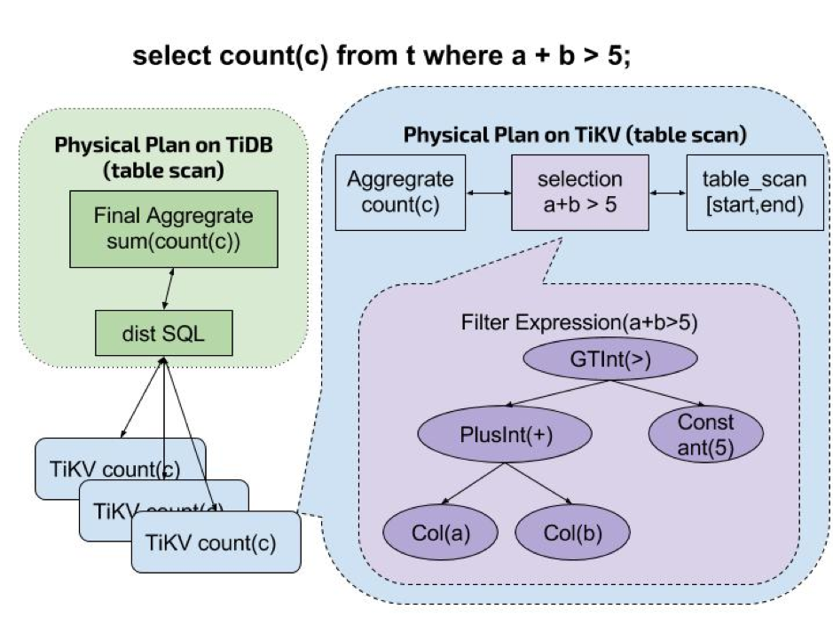

# distSql

<!-- toc -->

## 从KeyRanges到copTask

pingcap的[TiDB 源码阅读系列文章（十九）tikv-client（下）](https://pingcap.com/blog-cn/tidb-source-code-reading-19/#tidb-%E6%BA%90%E7%A0%81%E9%98%85%E8%AF%BB%E7%B3%BB%E5%88%97%E6%96%87%E7%AB%A0%E5%8D%81%E4%B9%9Dtikv-client%E4%B8%8B) 
详细介绍了distsql.

> distsql 是位于 SQL 层和 coprocessor 之间的一层抽象，它把下层的 coprocessor 请求封装起来对上层提供一个简单的 Select 方法。执行一个单表的计算任务。最上层的 SQL 语句可能会包含 JOIN，SUBQUERY 等复杂算子，涉及很多的表，而 distsql 只涉及到单个表的数据。一个 distsql 请求会涉及到多个 region，我们要对涉及到的每一个 region 执行一次 coprocessor 请求。
> 所以它们的关系是这样的，一个 SQL 语句包含多个 distsql 请求，一个 distsql 请求包含多个 coprocessor 请求。


### kv.Request

```go
// Request represents a kv request.
type Request struct {
	// Tp is the request type.
	Tp        int64
	StartTs   uint64
	Data      []byte
	KeyRanges []KeyRange
  // ..
}

// KeyRange represents a range where StartKey <= key < EndKey.
type KeyRange struct {
	StartKey Key
	EndKey   Key
}

// Key represents high-level Key type.
type Key []byte
```

### copTask
```go
// copTask contains a related Region and KeyRange for a kv.Request.
type copTask struct {
	id     uint32
	region RegionVerID
	ranges *copRanges

	respChan  chan *copResponse
	storeAddr string
	cmdType   tikvrpc.CmdType
	storeType kv.StoreType
}

// copRanges is like []kv.KeyRange, but may has extra elements at head/tail.
// It's for avoiding alloc big slice during build copTask.
type copRanges struct {
	first *kv.KeyRange
	mid   []kv.KeyRange
	last  *kv.KeyRange
}
```


### buildCopTasks


#### regionCache

buildCopTasks首先会通过从RegionCache中找到keyRange对应的regions, 
会先去RegionCache中取LocateKey查找key所在的region, 如果cache中
没有则会去pd server中查找, 并将region信息保存到pd cache.


在CopIterworker run goroutine中，在发送请求给region之前，会在GetTiKVRPCContext
中，通过regionVerID获取tikv server addr，这个地方类似也有cache, 从cache获取
失败，会去pd server中调用GetStore rpc调用了来获取store addr.

`RegionCache`相关数据结构如下:

```go
// RegionCache caches Regions loaded from PD.
type RegionCache struct {
	pdClient pd.Client

	mu struct {
		sync.RWMutex                         // mutex protect cached region
		regions      map[RegionVerID]*Region // cached regions be organized as regionVerID to region ref mapping
		sorted       *btree.BTree            // cache regions be organized as sorted key to region ref mapping
	}
	storeMu struct {
		sync.RWMutex
		stores map[uint64]*Store
	}
	notifyCheckCh chan struct{}
	closeCh       chan struct{}
}
// RegionVerID is a unique ID that can identify a Region at a specific version.
type RegionVerID struct {
	id      uint64
	confVer uint64
	ver     uint64
}

// Region presents kv region
type Region struct {
	meta       *metapb.Region // raw region meta from PD immutable after init
	store      unsafe.Pointer // point to region store info, see RegionStore
	syncFlag   int32          // region need be sync in next turn
	lastAccess int64          // last region access time, see checkRegionCacheTTL
}

// RegionStore represents region stores info
// it will be store as unsafe.Pointer and be load at once
type RegionStore struct {
	workTiKVIdx    AccessIndex          // point to current work peer in meta.Peers and work store in stores(same idx) for tikv peer
	workTiFlashIdx int32                // point to current work peer in meta.Peers and work store in stores(same idx) for tiflash peer
	stores         []*Store             // stores in this region
	storeEpochs    []uint32             // snapshots of store's epoch, need reload when `storeEpochs[curr] != stores[cur].fail`
	accessIndex    [NumAccessMode][]int // AccessMode => idx in stores
}

// Store contains a kv process's address.
type Store struct {
	addr         string        // loaded store address
	saddr        string        // loaded store status address
	storeID      uint64        // store's id
	state        uint64        // unsafe store storeState
	resolveMutex sync.Mutex    // protect pd from concurrent init requests
	epoch        uint32        // store fail epoch, see RegionStore.storeEpochs
	storeType    kv.StoreType  // type of the store
	tokenCount   atomic2.Int64 // used store token count
}
```

在CopIterworker中发送请求失败后，会调用`onRegionError`更新RegionCache中信息。


## copIteratorWorker

Coprocessor 中通过copIteratorWorker来并发的向tikv(可能是多个tikv sever) 发送请求.

Worker负责发送RPC请求到Tikv server，处理错误，然后将正确的结果放入respCh channel中
在copIterator Next方法中会respCh中获取结果。


## Coprocessor

[TiKV 源码解析系列文章（十四）Coprocessor 概览](https://pingcap.com/blog-cn/tikv-source-code-reading-14/)
中介绍了TiKV端的Coprocessor, 相关信息摘抄如下：


TiKV Coprocessor 处理的读请求目前主要分类三种：

* DAG：执行物理算子，为 SQL 计算出中间结果，从而减少 TiDB 的计算和网络开销。这个是绝大多数场景下 Coprocessor 执行的任务。
* Analyze：分析表数据，统计、采样表数据信息，持久化后被 TiDB 的优化器采用。
* CheckSum：对表数据进行校验，用于导入数据后一致性校验。




### DAGRequest

以下结构由tipb 中Proto自动生成, 这些Executor将在TiKV端执行。


### PhysicalPlan.ToPB
PhysicalPlan有ToPB方法，用来生成tipb Executor
```go
// PhysicalPlan is a tree of the physical operators.
type PhysicalPlan interface {
	Plan

	// attach2Task makes the current physical plan as the father of task's physicalPlan and updates the cost of
	// current task. If the child's task is cop task, some operator may close this task and return a new rootTask.
	attach2Task(...task) task

	// ToPB converts physical plan to tipb executor.
	ToPB(ctx sessionctx.Context, storeType kv.StoreType) (*tipb.Executor, error)
}
```


PhysicalPlan toPB


# ref
[MPP and SMP in TiDB](https://github.com/pingcap/blog-cn/blob/master/mpp-smp-tidb.md)
[TiKV 源码解析系列文章（十四）Coprocessor 概览](https://pingcap.com/blog-cn/tikv-source-code-reading-14/)
