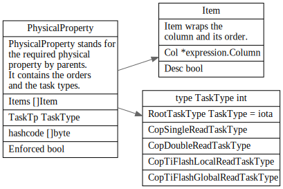

# Physical Optimize

<!-- toc -->

## Physical Join 继承关系


## Physical PhysicalProperty



```go
// It contains the orders and the task types.
type PhysicalProperty struct {
	Items []Item

	// TaskTp means the type of task that an operator requires.
	//
	// It needs to be specified because two different tasks can't be compared
	// with cost directly. e.g. If a copTask takes less cost than a rootTask,
	// we can't sure that we must choose the former one. Because the copTask
	// must be finished and increase its cost in sometime, but we can't make
	// sure the finishing time. So the best way to let the comparison fair is
	// to add TaskType to required property.
	TaskTp TaskType

	// ExpectedCnt means this operator may be closed after fetching ExpectedCnt
	// records.
	ExpectedCnt float64

	// hashcode stores the hash code of a PhysicalProperty, will be lazily
	// calculated when function "HashCode()" being called.
	hashcode []byte

	// whether need to enforce property.
	Enforced bool
}
```

### taskType
```go
// TaskType is the type of execution task.
type TaskType int

const (
	// RootTaskType stands for the tasks that executed in the TiDB layer.
	RootTaskType TaskType = iota

	// CopSingleReadTaskType stands for the a TableScan or IndexScan tasks
	// executed in the coprocessor layer.
	CopSingleReadTaskType

	// CopDoubleReadTaskType stands for the a IndexLookup tasks executed in the
	// coprocessor layer.
	CopDoubleReadTaskType

	// CopTiFlashLocalReadTaskType stands for flash coprocessor that read data locally,
	// and only a part of the data is read in one cop task, if the current task type is
	// CopTiFlashLocalReadTaskType, all its children prop's task type is CopTiFlashLocalReadTaskType
	CopTiFlashLocalReadTaskType

	// CopTiFlashGlobalReadTaskType stands for flash coprocessor that read data globally
	// and all the data of given table will be read in one cop task, if the current task
	// type is CopTiFlashGlobalReadTaskType, all its children prop's task type is
	// CopTiFlashGlobalReadTaskType
	CopTiFlashGlobalReadTaskType
)
```

## findBestTask

枚举所有满足parent plan physicalProperty 的join物理计划, 其中GetMergeJoin, 给child加了PhyscialProp 要求child plan是按照joinKey 降序排序.

```go
// LogicalJoin can generates hash join, index join and sort merge join.
// Firstly we check the hint, if hint is figured by user, we force to choose the corresponding physical plan.
// If the hint is not matched, it will get other candidates.
// If the hint is not figured, we will pick all candidates.
func (p *LogicalJoin) exhaustPhysicalPlans(prop *property.PhysicalProperty) ([]PhysicalPlan, bool) {
//...
}
```


## Cost 估算

估算每个join计划的cost


### PhysicalMergeJoin

```go
func (p *PhysicalMergeJoin) attach2Task(tasks ...task) task {
	lTask := finishCopTask(p.ctx, tasks[0].copy())
	rTask := finishCopTask(p.ctx, tasks[1].copy())
	p.SetChildren(lTask.plan(), rTask.plan())
	return &rootTask{
		p:   p,
		cst: lTask.cost() + rTask.cost() + p.GetCost(lTask.count(), rTask.count()),
	}
}
```
### PhysicalHashJoin

```go
func (p *PhysicalHashJoin) attach2Task(tasks ...task) task {
	lTask := finishCopTask(p.ctx, tasks[0].copy())
	rTask := finishCopTask(p.ctx, tasks[1].copy())
	p.SetChildren(lTask.plan(), rTask.plan())
	task := &rootTask{
		p:   p,
		cst: lTask.cost() + rTask.cost() + p.GetCost(lTask.count(), rTask.count()),
	}
	return task
}
```

### PhysicalIndexJoin

```go
func (p *PhysicalIndexJoin) attach2Task(tasks ...task) task {
	innerTask := p.innerTask
	outerTask := finishCopTask(p.ctx, tasks[1-p.InnerChildIdx].copy())
	if p.InnerChildIdx == 1 {
		p.SetChildren(outerTask.plan(), innerTask.plan())
	} else {
		p.SetChildren(innerTask.plan(), outerTask.plan())
	}
	return &rootTask{
		p:   p,
		cst: p.GetCost(outerTask, innerTask),
	}
}
```
