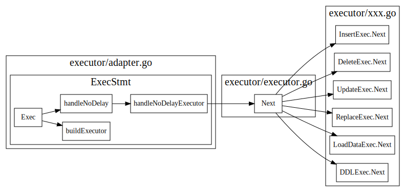

# TiDB Server Main Loop

跟着官方的tidb源码阅读博客，看了TiDB main函数，大致了解了一个SQL的处理过程

## conn accept

下图显示了TiDB中Accept一个mysql连接的处理流程，对于每个新的conn, TiDB会启动一个goroutine来处理这个conn, 并按照Mysql协议，处理不同的mysql cmd。

对于Query语句，会session.Execute生成一个执行器，返回一个resultSet, 最后调用``writeResultset``, 从ResultSet.Next中获取结果，然后将结果返回给客户端。


### 处理conn loop

```go
// Run reads client query and writes query result to client in for loop, if there is a panic during query handling,
// it will be recovered and log the panic error.
// This function returns and the connection is closed if there is an IO error or there is a panic.
func (cc *clientConn) Run(ctx context.Context) {
//other code..
for {
    // other code ...
		data, err := cc.readPacket()

    // other code ...
		if err = cc.dispatch(ctx, data); err != nil {
      // other code ...
    }
    // other code ...
}
}
```

### cmd dispatch

```go
// dispatch handles client request based on command which is the first byte of the data.
// It also gets a token from server which is used to limit the concurrently handling clients.
// The most frequently used command is ComQuery.
func (cc *clientConn) dispatch(ctx context.Context, data []byte) error {
//other code ...
	cmd := data[0]
	data = data[1:]
//other code ...
	dataStr := string(hack.String(data))

	switch cmd {
	case mysql.ComQuery: // Most frequently used command.
		if len(data) > 0 && data[len(data)-1] == 0 {
			data = data[:len(data)-1]
			dataStr = string(hack.String(data))
		}
		return cc.handleQuery(ctx, dataStr)
    //other case ...
  }
}
```

## SQL Execute

TiDB中SQL执行过程如下


### SQL Plan Optimize: 制定查询计划以及优化


### SQL build executor

根据plan生成相应的executor


Executor interface如下, 使用了Volcano模型，接口用起来和迭代器差不多，采用Open-Next-Close套路来使用。
```go
// Executor is the physical implementation of a algebra operator.
//
// In TiDB, all algebra operators are implemented as iterators, i.e., they
// support a simple Open-Next-Close protocol. See this paper for more details:
//
// "Volcano-An Extensible and Parallel Query Evaluation System"
//
// Different from Volcano's execution model, a "Next" function call in TiDB will
// return a batch of rows, other than a single row in Volcano.
// NOTE: Executors must call "chk.Reset()" before appending their results to it.
type Executor interface {
	base() *baseExecutor
	Open(context.Context) error
	Next(ctx context.Context, req *chunk.Chunk) error
	Close() error
	Schema() *expression.Schema
}
```

### executor Next

#### handleNoDelay

不需要返回结果的立即执行



#### RecordSet driver


```go
// RecordSet is an abstract result set interface to help get data from Plan.
type RecordSet interface {
	// Fields gets result fields.
	Fields() []*ast.ResultField

	// Next reads records into chunk.
	Next(ctx context.Context, req *chunk.Chunk) error

	// NewChunk create a chunk.
	NewChunk() *chunk.Chunk

	// Close closes the underlying iterator, call Next after Close will
	// restart the iteration.
	Close() error
}
```

RecordSet Next方法接口的实现.
```go
// Next use uses recordSet's executor to get next available chunk for later usage.
// If chunk does not contain any rows, then we update last query found rows in session variable as current found rows.
// The reason we need update is that chunk with 0 rows indicating we already finished current query, we need prepare for
// next query.
// If stmt is not nil and chunk with some rows inside, we simply update last query found rows by the number of row in chunk.
func (a *recordSet) Next(ctx context.Context, req *chunk.Chunk) error {
	err := Next(ctx, a.executor, req)
	if err != nil {
		a.lastErr = err
		return err
	}
	numRows := req.NumRows()
	if numRows == 0 {
		if a.stmt != nil {
			a.stmt.Ctx.GetSessionVars().LastFoundRows = a.stmt.Ctx.GetSessionVars().StmtCtx.FoundRows()
		}
		return nil
	}
	if a.stmt != nil {
		a.stmt.Ctx.GetSessionVars().StmtCtx.AddFoundRows(uint64(numRows))
	}
	return nil
}
```

在writeResult时候不断调用RecordSet的Next方法，去驱动调用executor的Next;

```go
// writeChunks writes data from a Chunk, which filled data by a ResultSet, into a connection.
// binary specifies the way to dump data. It throws any error while dumping data.
// serverStatus, a flag bit represents server information
func (cc *clientConn) writeChunks(ctx context.Context, rs ResultSet, binary bool, serverStatus uint16) error {
	data := cc.alloc.AllocWithLen(4, 1024)
	req := rs.NewChunk()
  //...
	for {
		// Here server.tidbResultSet implements Next method.
		err := rs.Next(ctx, req)
    /...
		rowCount := req.NumRows()
    //...
		for i := 0; i < rowCount; i++ {
			data = data[0:4]
      /...
			if err = cc.writePacket(data); err != nil {
				return err
			}
      //...
    }
  }
	return cc.writeEOF(serverStatus)
}
```


