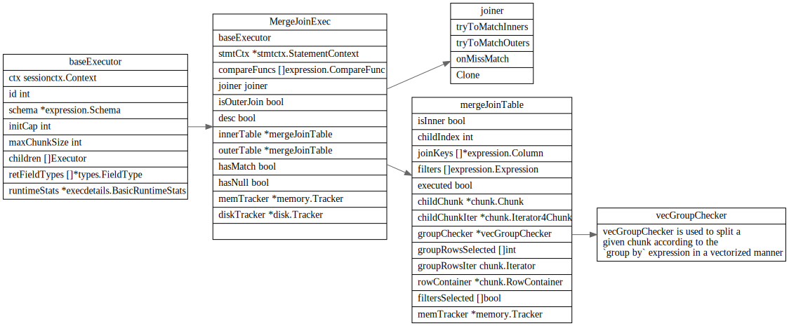
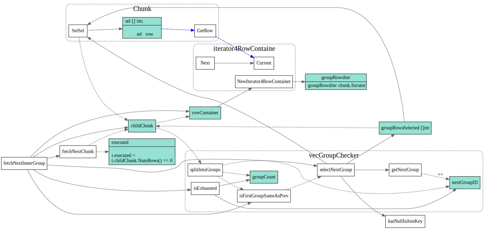

# MergeJoin

<!-- toc -->

## MergeJoinExec Struct 
```go
// MergeJoinExec implements the merge join algorithm.
// This operator assumes that two iterators of both sides
// will provide required order on join condition:
// 1. For equal-join, one of the join key from each side
// matches the order given.
// 2. For other cases its preferred not to use SMJ and operator
// will throw error.
type MergeJoinExec struct {
	baseExecutor

	stmtCtx      *stmtctx.StatementContext
	compareFuncs []expression.CompareFunc
	joiner       joiner
	isOuterJoin  bool
	desc         bool

	innerTable *mergeJoinTable
	outerTable *mergeJoinTable

	hasMatch bool
	hasNull  bool

	memTracker  *memory.Tracker
	diskTracker *disk.Tracker
}
```




首先使用vecGroupCheck分别将innner chunk和outerchunk 分为相同groupkey的组


#### fetchNextInnerGroup

这个地方没怎么看明白，不太明白它是怎么处理一个groupkey超过多个chunk的情况



#### fetchNextOuterGroup


## Ref
参考资料[TiDB 源码阅读系列文章（十五）Sort Merge Join](https://pingcap.com/blog-cn/tidb-source-code-reading-15/)
