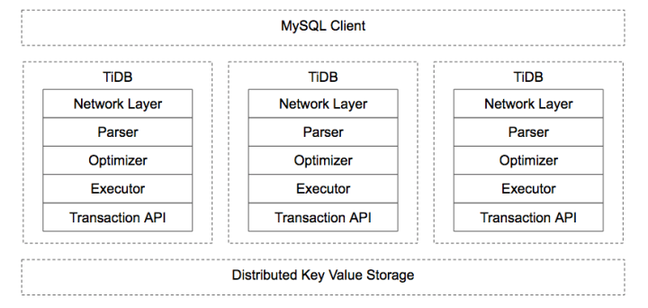
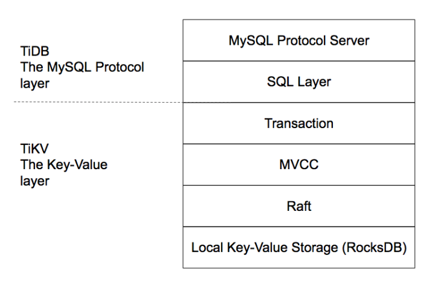

# TiDB 学习资料整理

## 参考资料
本文主要摘自pingcap 如下几篇blog, 从整体上介绍了tidb/tikv的设计架构，以及为什么要这么设计，为了解决什么问题。
看完后能对tidb有个整体的认识。

1. [TiDB 架构的演进和开发哲学](https://zhuanlan.zhihu.com/p/25142743)
2. [十问 TiDB ：关于架构设计的一些思考](https://pingcap.com/blog-cn/10-questions-tidb-structure/)
3. [三篇文章了解 TiDB 技术内幕 - 说存储](https://pingcap.com/blog-cn/tidb-internal-1/)
4. [三篇文章了解 TiDB 技术内幕 - 谈调度](https://pingcap.com/blog-cn/tidb-internal-3/)

## TiDb 整体架构


TiDB包含三大核心组件，TiDB/TiKV/PD, 各自功能如下：[TiDB Operator，让 TiDB 成为真正的 Cloud-Native 数据库](https://pingcap.com/blog-cn/tidb-operator-introduction/)
1. TiDB Server：主要负责 SQL 的解析器和优化器，它相当于计算执行层，同时也负责客户端接入和交互。
2. TiKV Server：是一套分布式的 Key-Value 存储引擎，它承担整个数据库的存储层，数据的水平扩展和多副本高可用特性都是在这一层实现。
3. PD Server：相当于分布式数据库的大脑，一方面负责收集和维护数据在各个 TiKV 节点的分布情况，另一方面 PD 承担调度器的角色，根据数据分布状况以及各个存储节点的负载来采取合适的调度策略，维持整个系统的平衡与稳定。

组件之间通过GRPC通信.


TiDB/TiKV 背后对应的论文基础[How do we build TiDB](https://pingcap.com/blog-cn/how-do-we-build-tidb/), Google Spanner/F1, Raft.


### tidb



tidb开发选择从上往下开发，无缝兼容MYSQL协议。talk is cheap, show me the test，使用了大量的测试用例来保证正确性。


### 关系模型到 Key-Value 模型的映射

[三篇文章了解 TiDB 技术内幕 - 说计算](https://pingcap.com/blog-cn/tidb-internal-2/#三篇文章了解-tidb-技术内幕---说计算)

```SQL
CREATE TABLE User {
	ID int,
	Name varchar(20),
	Role varchar(20),
	Age int,
	PRIMARY KEY (ID),
	Key idxAge (age)
};
```

每行数据按照如下规则进行编码成 Key-Value pair：
```
Key: tablePrefix{tableID}_recordPrefixSep{rowID}
Value: [col1, col2, col3, col4]
```
其中 Key 的 tablePrefix/recordPrefixSep 都是特定的字符串常量，用于在 KV 空间内区分其他数据。
对于 Index 数据，会按照如下规则编码成 Key-Value pair：
```
Key: tablePrefix{tableID}_indexPrefixSep{indexID}_indexedColumnsValue
Value: rowID
```
注意上述编码规则中的 Key 里面的各种 xxPrefix 都是字符串常量，作用都是区分命名空间，以免不同类型的数据之间相互冲突，定义如下：
```
var(
	tablePrefix     = []byte{'t'}
	recordPrefixSep = []byte("_r")
	indexPrefixSep  = []byte("_i")
)
```

### tikv


TiKV 利用 Raft 来做数据复制，每个数据变更都会落地为一条 Raft 日志，通过 Raft 的日志复制功能，将数据安全可靠地同步到 Group 的多数节点中。
通过单机的 RocksDB，我们可以将数据快速地存储在磁盘上；通过 Raft，我们可以将数据复制到多台机器上，以防单机失效。数据的写入是通过 Raft 这一层的接口写入，而不是直接写 RocksDB。通过实现 Raft，我们拥有了一个分布式的 KV，现在再也不用担心某台机器挂掉了。


MVCC

很多数据库都会实现多版本控制（MVCC），TiKV 也不例外。设想这样的场景，两个 Client 同时去修改一个 Key 的 Value，如果没有 MVCC，就需要对数据上锁，在分布式场景下，可能会带来性能以及死锁问题。 TiKV 的 MVCC 实现是通过在 Key 后面添加 Version 来实现，简单来说，没有 MVCC 之前，可以把 TiKV 看做这样的：

### pd

下面问题值得仔细思考。

1. 如何保证同一个 Region 的多个 Replica 分布在不同的节点上？更进一步，如果在一台机器上启动多个 TiKV 实例，会有什么问题？
2. TiKV 集群进行跨机房部署用于容灾的时候，如何保证一个机房掉线，不会丢失 Raft Group 的多个 Replica？
3. 添加一个节点进入 TiKV 集群之后，如何将集群中其他节点上的数据搬过来?
4. 当一个节点掉线时，会出现什么问题？整个集群需要做什么事情？如果节点只是短暂掉线（重启服务），那么如何处理？如果节点是长时间掉线（磁盘故障，数据全部丢失），需要如何处理？
5. 假设集群需要每个 Raft Group 有 N 个副本，那么对于单个 Raft Group 来说，Replica 数量可能会不够多（例如节点掉线，失去副本），也可能会 过于多（例如掉线的节点又回复正常，自动加入集群）。那么如何调节 Replica 个数？
6. 读/写都是通过 Leader 进行，如果 Leader 只集中在少量节点上，会对集群有什么影响？
7. 并不是所有的 Region 都被频繁的访问，可能访问热点只在少数几个 Region，这个时候我们需要做什么？
8. 集群在做负载均衡的时候，往往需要搬迁数据，这种数据的迁移会不会占用大量的网络带宽、磁盘 IO 以及 CPU？进而影响在线服务？

作为一个分布式高可用存储系统，必须满足的需求，包括四种：

1. 副本数量不能多也不能少
2. 副本需要分布在不同的机器上
3. 新加节点后，可以将其他节点上的副本迁移过来
4. 节点下线后，需要将该节点的数据迁移走

作为一个良好的分布式系统，需要优化的地方，包括：

1. 维持整个集群的 Leader 分布均匀
2. 维持每个节点的储存容量均匀
3. 维持访问热点分布均匀
4. 控制 Balance 的速度，避免影响在线服务
5. 管理节点状态，包括手动上线/下线节点，以及自动下线失效节点

