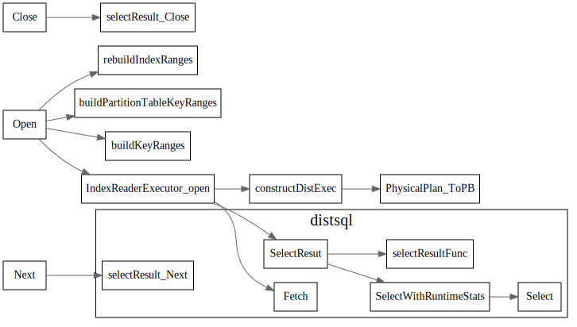
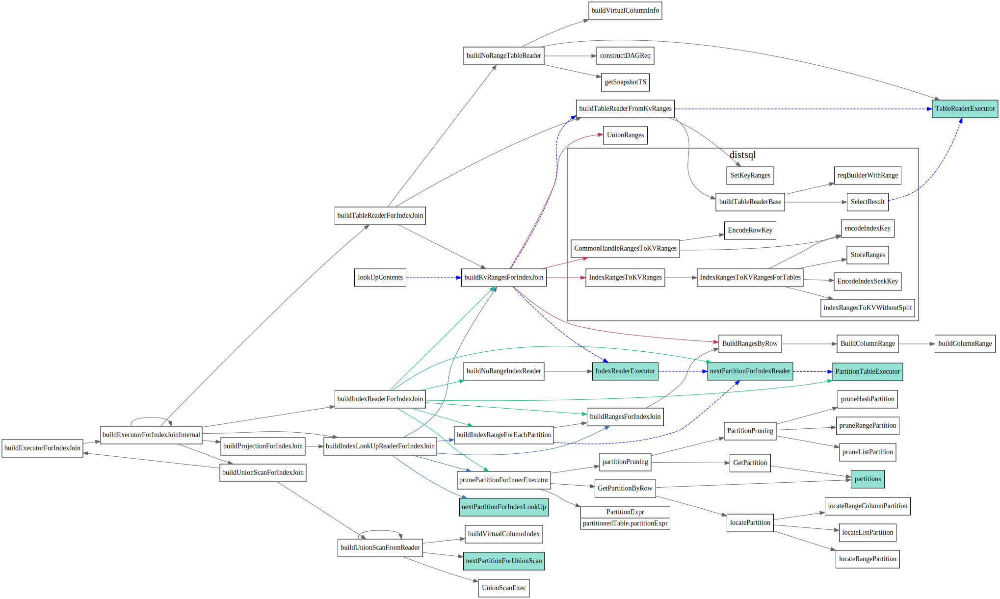

# Select 语句

<!-- toc -->

## SelectStmt

```go
type SelectStmt struct {
	dmlNode
	resultSetNode

	// SelectStmtOpts wraps around select hints and switches.
	*SelectStmtOpts
	// Distinct represents whether the select has distinct option.
	Distinct bool
	// From is the from clause of the query.
	From *TableRefsClause
	// Where is the where clause in select statement.
	Where ExprNode
	// Fields is the select expression list.
	Fields *FieldList
	// GroupBy is the group by expression list.
	GroupBy *GroupByClause
	// Having is the having condition.
	Having *HavingClause
	// WindowSpecs is the window specification list.
	WindowSpecs []WindowSpec
	// OrderBy is the ordering expression list.
	OrderBy *OrderByClause
	// Limit is the limit clause.
	Limit *Limit
	// LockInfo is the lock type
	LockInfo *SelectLockInfo
	// TableHints represents the table level Optimizer Hint for join type
	TableHints []*TableOptimizerHint
	// IsInBraces indicates whether it's a stmt in brace.
	IsInBraces bool
	// QueryBlockOffset indicates the order of this SelectStmt if counted from left to right in the sql text.
	QueryBlockOffset int
	// SelectIntoOpt is the select-into option.
	SelectIntoOpt *SelectIntoOption
	// AfterSetOperator indicates the SelectStmt after which type of set operator
	AfterSetOperator *SetOprType
	// Kind refer to three kind of statement: SelectStmt, TableStmt and ValuesStmt
	Kind SelectStmtKind
	// Lists is filled only when Kind == SelectStmtKindValues
	Lists []*RowExpr
}
```

## LogicalPlan


## PhysicalPlan

### DataSource.findBestTask


### LogicalJoin.exhaustPhysicalPlans


## Executor

### SelectionExec

```
// SelectionExec represents a filter executor.
type SelectionExec struct {
	baseExecutor

	batched     bool
	filters     []expression.Expression
	selected    []bool
	inputIter   *chunk.Iterator4Chunk
	inputRow    chunk.Row
	childResult *chunk.Chunk

	memTracker *memory.Tracker
}
```

生成的计划
```sql
explain select name, age from t where id = 'pingcap';

+-----------------------+---------+-----------+---------------+--------------------------------+
| id                    | estRows | task      | access object | operator info                  |
+-----------------------+---------+-----------+---------------+--------------------------------+
| Projection_4          | 0.00    | root      |               | tests.t.name, tests.t.age      |
| └─TableReader_7       | 0.00    | root      |               | data:Selection_6               |
|   └─Selection_6       | 0.00    | cop[tikv] |               | eq(tests.t.id, "pingcap")      |
|     └─TableFullScan_5 | 3.00    | cop[tikv] | table:t       | keep order:false, stats:pseudo |
+-----------------------+---------+-----------+---------------+--------------------------------+
```

### DataSource
#### TableReaderExecutor

从PhyscialTableReader中 build TableReaderExecutor


执行Open/Next/Close操作。


#### TableIndexExecutor


IndexExecutor Open/Next/Close方法, 也调用了distsql的方法，调用类似扇面的tableReader


#### distsql/coprocessor

pingcap的[TiDB 源码阅读系列文章（十九）tikv-client（下）](https://pingcap.com/blog-cn/tidb-source-code-reading-19/#tidb-%E6%BA%90%E7%A0%81%E9%98%85%E8%AF%BB%E7%B3%BB%E5%88%97%E6%96%87%E7%AB%A0%E5%8D%81%E4%B9%9Dtikv-client%E4%B8%8B) 
详细介绍了distsql.

> distsql 是位于 SQL 层和 coprocessor 之间的一层抽象，它把下层的 coprocessor 请求封装起来对上层提供一个简单的 Select 方法。执行一个单表的计算任务。最上层的 SQL 语句可能会包含 JOIN，SUBQUERY 等复杂算子，涉及很多的表，而 distsql 只涉及到单个表的数据。一个 distsql 请求会涉及到多个 region，我们要对涉及到的每一个 region 执行一次 coprocessor 请求。

> 所以它们的关系是这样的，一个 SQL 语句包含多个 distsql 请求，一个 distsql 请求包含多个 coprocessor 请求。

tidb抽象了一个distsql,封装了对tikv的rpc请求操作, 包含了并发控制，region, 出错重试等逻辑。

Close 时候使用了finishCh控制启动的gorotuine退出。


在TableReaderExecutor open时候，会启动一个copIteratorWorker，来执行copTask. worker取
到数据后，会放到respCh中，然后在Executor Next时候，会去respCh中取数据。


### Join

#### MergeJoinExec
参考资料
1. [TiDB 源码阅读系列文章（十五）Sort Merge Join](https://pingcap.com/blog-cn/tidb-source-code-reading-15/)

> Sort Merge Join (SMJ)，定义可以看 wikipedia。简单说来就是将 Join 的两个表，首先根据连接属性进行排序，然后进行一次扫描归并, 进而就可以得出最后的结果。这个算法最大的消耗在于对内外表数据进行排序，而当连接列为索引列时，我们可以利用索引的有序性避免排序带来的消耗, 所以通常在查询优化器中，连接列为索引列的情况下可以考虑选择使用 SMJ。


首先使用vecGroupCheck分别将innner chunk和outerchunk 分为相同groupkey的组


#### HashJoinExec


[TiDB 源码阅读系列文章（九）Hash Join](https://pingcap.com/blog-cn/tidb-source-code-reading-9/)

```go
// step 1. fetch data from build side child and build a hash table;
// step 2. fetch data from probe child in a background goroutine and probe the hash table in multiple join workers.
```
 

#### PhysicalIndexJoin -> IndexLookUpJoin

参考资料
1. [TiDB 源码阅读系列文章（十一）Index Lookup Join](https://pingcap.com/blog-cn/tidb-source-code-reading-11/)
2. [wikipedia: Nested_loop_join](https://en.wikipedia.org/wiki/Nested_loop_join)

##### nest loop join
`nest loop join`, 遍历取外表R中一条记录r, 然后遍历inner表S每条记录和r做join。
对于外表中的每一条记录，都需要对Inner表做一次全表扫描。复杂度为O`(M * N)`

```
algorithm nested_loop_join is
    for each tuple r in R do
        for each tuple s in S do
            if r and s satisfy the join condition then
                yield tuple <r,s>
```

##### index join
`index join` inner表中对于要join的attribute由了索引, 可以使用索引
来避免对inner表的全表扫描, 复杂度为`O(M * log N)`

```
algorithm index_join is
    for each tuple r in R do
        for each tuple s in S in the index lookup do
            yield tuple <r,s>
```

##### TiDB impl

根据[TiDB 源码阅读系列文章（十一）Index Lookup Join](https://pingcap.com/blog-cn/tidb-source-code-reading-11/)中介绍，其实现思路主要如下：

1. 从 Outer 表中取一批数据，设为 B；
2. 通过 Join Key 以及 B 中的数据构造 Inner 表取值范围，只读取对应取值范围的数据，设为 S；
3. 对 B 中的每一行数据，与 S 中的每一条数据执行 Join 操作并输出结果；
4. 重复步骤 1，2，3，直至遍历完 Outer 表中的所有数据。


```go
// IndexLookUpJoin employs one outer worker and N innerWorkers to execute concurrently.
// It preserves the order of the outer table and support batch lookup.
//
// The execution flow is very similar to IndexLookUpReader:
// 1. outerWorker read N outer rows, build a task and send it to result channel and inner worker channel.
// 2. The innerWorker receives the task, builds key ranges from outer rows and fetch inner rows, builds inner row hash map.
// 3. main thread receives the task, waits for inner worker finish handling the task.
// 4. main thread join each outer row by look up the inner rows hash map in the task.

type IndexLookUpJoin struct {
	baseExecutor

	resultCh   <-chan *lookUpJoinTask
	cancelFunc context.CancelFunc
	workerWg   *sync.WaitGroup

	outerCtx outerCtx
	innerCtx innerCtx

	task       *lookUpJoinTask
	joinResult *chunk.Chunk
	innerIter  chunk.Iterator

	joiner      joiner
	isOuterJoin bool

	requiredRows int64

	indexRanges   []*ranger.Range
	keyOff2IdxOff []int
	innerPtrBytes [][]byte

	// lastColHelper store the information for last col if there's complicated filter like col > x_col and col < x_col + 100.
	lastColHelper *plannercore.ColWithCmpFuncManager

	memTracker *memory.Tracker // track memory usage.

	stats *indexLookUpJoinRuntimeStats
}
```

实现要点如下：
1. outerWorker 只有一个, 负责从outer executor中读取一个batch数据，建立lookUpJoinTask然后放入innerCh和resultCh中
2. innerCh将由inner worker来consume, 在innser worker处理完这个task之后，才会标记该task为done
3. resultCh 将由executor的Next来consume, executor的Next从resultCh取出一个task之后，会一直等到这个task 为done，然后去做join
这样保证了结果顺序和outer表中顺序一致。
4. inner worker可以有N个，inner worker会去innser表根据index查找在这个batch 范围内的inner executor数据, 最后建立lookupMap, 在executor.Next中match时候会用到该map


buildExecutorForIndexJoin


