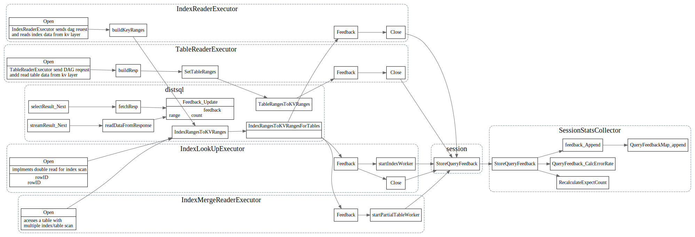

# QueryFeedback

<!-- toc -->

## 收集QueryFeedback

Datasource对应的一些Executor: `TableReaderExecutor`, `IndexReaderExecutor`, 
`IndexLookupExecutor`, `IndexMergeReaderExecutor`
执行时候会生成一些feedback信息 

```go
// Feedback represents the total scan count in range [lower, upper).
type Feedback struct {
	Lower  *types.Datum
	Upper  *types.Datum
	Count  int64
	Repeat int64
}
// QueryFeedback is used to represent the query feedback info. It contains the query's scan ranges and number of rows
// in each range.
type QueryFeedback struct {
	PhysicalID int64
	Hist       *Histogram
	Tp         int
	Feedback   []Feedback
	Expected   int64 // Expected is the Expected scan count of corresponding query.
	actual     int64 // actual is the actual scan count of corresponding query.
	Valid      bool  // Valid represents the whether this query feedback is still Valid.
	desc       bool  // desc represents the corresponding query is desc scan.
}
```



## TablesRangesToKVRanges

```go
// TablesRangesToKVRanges converts table ranges to "KeyRange".
func TablesRangesToKVRanges(tids []int64, ranges []*ranger.Range, fb *statistics.QueryFeedback) []kv.KeyRange {
	if fb == nil || fb.Hist == nil {
		return tableRangesToKVRangesWithoutSplit(tids, ranges)
	}
	krs := make([]kv.KeyRange, 0, len(ranges))
	feedbackRanges := make([]*ranger.Range, 0, len(ranges))
	for _, ran := range ranges {
		low := codec.EncodeInt(nil, ran.LowVal[0].GetInt64())
		high := codec.EncodeInt(nil, ran.HighVal[0].GetInt64())
		if ran.LowExclude {
			low = kv.Key(low).PrefixNext()
		}
		// If this range is split by histogram, then the high val will equal to one bucket's upper bound,
		// since we need to guarantee each range falls inside the exactly one bucket, `PrefixNext` will make the
		// high value greater than upper bound, so we store the range here.
		r := &ranger.Range{LowVal: []types.Datum{types.NewBytesDatum(low)},
			HighVal: []types.Datum{types.NewBytesDatum(high)}}
		feedbackRanges = append(feedbackRanges, r)

		if !ran.HighExclude {
			high = kv.Key(high).PrefixNext()
		}
		for _, tid := range tids {
			startKey := tablecodec.EncodeRowKey(tid, low)
			endKey := tablecodec.EncodeRowKey(tid, high)
			krs = append(krs, kv.KeyRange{StartKey: startKey, EndKey: endKey})
		}
	}
	fb.StoreRanges(feedbackRanges)
	return krs
}
```

这些信息会先插入到一个QueryFeedbackMap的一个队列中，
后面的`updateStatsWorker` 定期apply 这些feedback到自己的cache中。以及将这些
feedback apply到`mysql.stats_*`中


## apply feedback locally


## apply feedback 

每个TiDB会将本地搜集到的feedback插到`mysql.stats_feedback`中，然后
由owner将表`mysql.stats_feedback`插入
`mysql.stats_histograms`, `msyql.stats_buckets`等表。


## UpdateHistogram

没怎么看明白这块算法。


