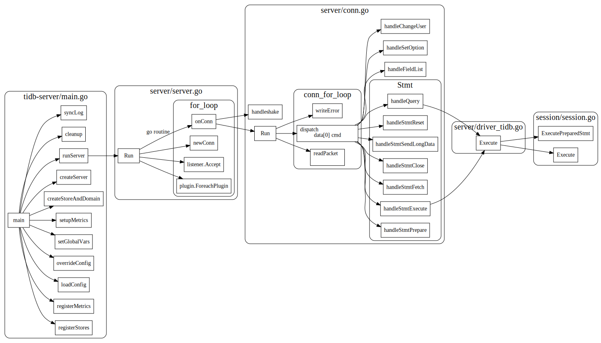
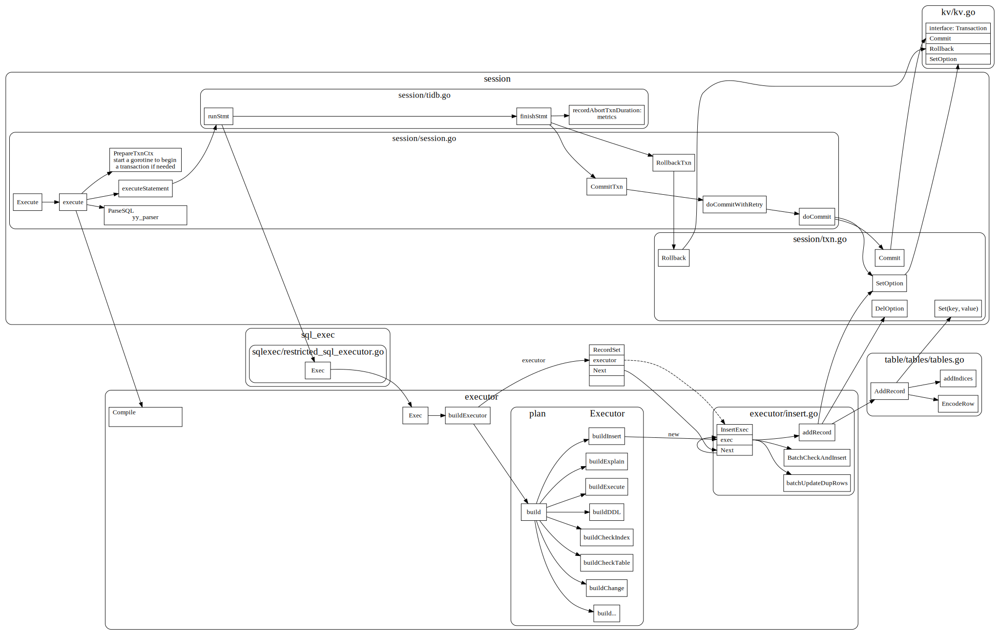

# tidb server main

tidb server main函数
跟着tidb 官方文档，大致读了一个SQL语句的处理过程。

## Accept Conn

Accept mysql client connection, 读取connection的mysql cmd并做分发，执行相应的SQL cmd，最后返回结果。



conn hanle loop
```go
// Run reads client query and writes query result to client in for loop, if there is a panic during query handling,
// it will be recovered and log the panic error.
// This function returns and the connection is closed if there is an IO error or there is a panic.
func (cc *clientConn) Run(ctx context.Context) {
  // other code
  for {
    //..
    // 从conn中读取数据
    data, err := cc.readPacket();
    //...
    // 做分发
    if err = cc.dispatch(ctx, data); err != nil {
      //..other code
    }
  }
}
```

dispatch

```go
// dispatch handles client request based on command which is the first byte of the data.
// It also gets a token from server which is used to limit the concurrently handling clients.
// The most frequently used command is ComQuery.
func (cc *clientConn) dispatch(ctx context.Context, data []byte) error {

//...
// 第一个字节为cmd
	cmd := data[0]
	data = data[1:]
//...
	dataStr := string(hack.String(data))
//..
  switch cmd {
  //..处理各种cmd
	case mysql.ComInitDB:
		if err := cc.useDB(ctx, dataStr); err != nil {
			return err
		}
		return cc.writeOK()
	case mysql.ComFieldList:
		return cc.handleFieldList(dataStr)
	case mysql.ComStmtExecute:
		return cc.handleStmtExecute(ctx, data)
  }
}

```

## Session Execute

TiDB中SQL执行过程


### SQL Plan Optimize: 制定查询计划以及优化


TiDB 主要分为两个模块对计划进行优化[1](https://pingcap.com/blog-cn/tidb-source-code-reading-8/)：

1. 逻辑优化，主要依据关系代数的等价交换规则做一些逻辑变换。
2. 物理优化，主要通过对查询的数据读取、表连接方式、表连接顺序、排序等技术进行优化。


``findBestTask`` 将logicalPlan 转换为physical plan

```
type LogicalPlan interface {
	// findBestTask converts the logical plan to the physical plan. It's a new interface.
	// It is called recursively from the parent to the children to create the result physical plan.
	// Some logical plans will convert the children to the physical plans in different ways, and return the one
	// with the lowest cost.
	findBestTask(prop *property.PhysicalProperty) (task, error)
}
```

### Execute Stmt: 生成执行器



在runStmt中会调用buildExecutor生成相应的执行器，并放在resultSet.executor中
```go
// Exec builds an Executor from a plan. If the Executor doesn't return result,
// like the INSERT, UPDATE statements, it executes in this function, if the Executor returns
// result, execution is done after this function returns, in the returned sqlexec.RecordSet Next method.
func (a *ExecStmt) Exec(ctx context.Context) (_ sqlexec.RecordSet, err error) {
//...
	e, err := a.buildExecutor()

// 不需要返回结果的, 直接执行Next
	if handled, result, err := a.handleNoDelay(ctx, e, isPessimistic); handled {
		return result, err
	}

//...
	return &recordSet{
		executor:   e,
		stmt:       a,
		txnStartTS: txnStartTS,
	}, nil
}
```

buildExecutor根据Plan生成相应的Executor

```go
// buildExecutor build a executor from plan, prepared statement may need additional procedure.
func (a *ExecStmt) buildExecutor() (Executor, error) {
//...
	b := newExecutorBuilder(ctx, a.InfoSchema)
  // 根据plan生成相应的executor
	e := b.build(a.Plan)
//...
	// ExecuteExec is not a real Executor, we only use it to build another Executor from a prepared statement.
	if executorExec, ok := e.(*ExecuteExec); ok {
		err := executorExec.Build(b)
    //...
		e = executorExec.stmtExec
  }
  //...
	a.isSelectForUpdate = b.isSelectForUpdate
	return e, nil
}
```

### RecordSet

RecordSet的驱动执行
```
// recordSet wraps an executor, implements sqlexec.RecordSet interface
type recordSet struct {
	fields     []*ast.ResultField
	executor   Executor
	stmt       *ExecStmt
	lastErr    error
	txnStartTS uint64
}
```


在writeResultset中会不断的调用ResultSet的Next方法，获取结果，返回给客户端。
```go
// writeChunks writes data from a Chunk, which filled data by a ResultSet, into a connection.
// binary specifies the way to dump data. It throws any error while dumping data.
// serverStatus, a flag bit represents server information
func (cc *clientConn) writeChunks(ctx context.Context, rs ResultSet, binary bool, serverStatus uint16) error {
	data := cc.alloc.AllocWithLen(4, 1024)
	req := rs.NewChunk()
	gotColumnInfo := false
	for {
		// Here server.tidbResultSet implements Next method.
		err := rs.Next(ctx, req)
    //...
		rowCount := req.NumRows()
		if rowCount == 0 {
			break
		}
		for i := 0; i < rowCount; i++ {
      //... other code
			if err = cc.writePacket(data); err != nil {
				return err
			}
		}
	}
	return cc.writeEOF(serverStatus)
}
```

insert语句，添加record

```go
func (t *tableCommon) AddRecord(ctx sessionctx.Context, r []types.Datum, opts ...table.AddRecordOption) (recordID int64, err error) {
//...
	h, err := t.addIndices(ctx, recordID, r, rm, createIdxOpts)
//...
// key编码
	key := t.RecordKey(recordID)
	sc := sessVars.StmtCtx
//Value 编码
	writeBufs.RowValBuf, err = tablecodec.EncodeRow(sc, row, colIDs, writeBufs.RowValBuf, writeBufs.AddRowValues)
//..
// 设置key,value
	value := writeBufs.RowValBuf
	if err = txn.Set(key, value); err != nil {
		return 0, err
	}
}
```
参考：

1. [TiDB 源码阅读系列文章（八）基于代价的优化](https://pingcap.com/blog-cn/tidb-source-code-reading-8/)：
2. [TiDB 源码阅读系列文章（七）基于规则的优化](https://pingcap.com/blog-cn/tidb-source-code-reading-7/)
