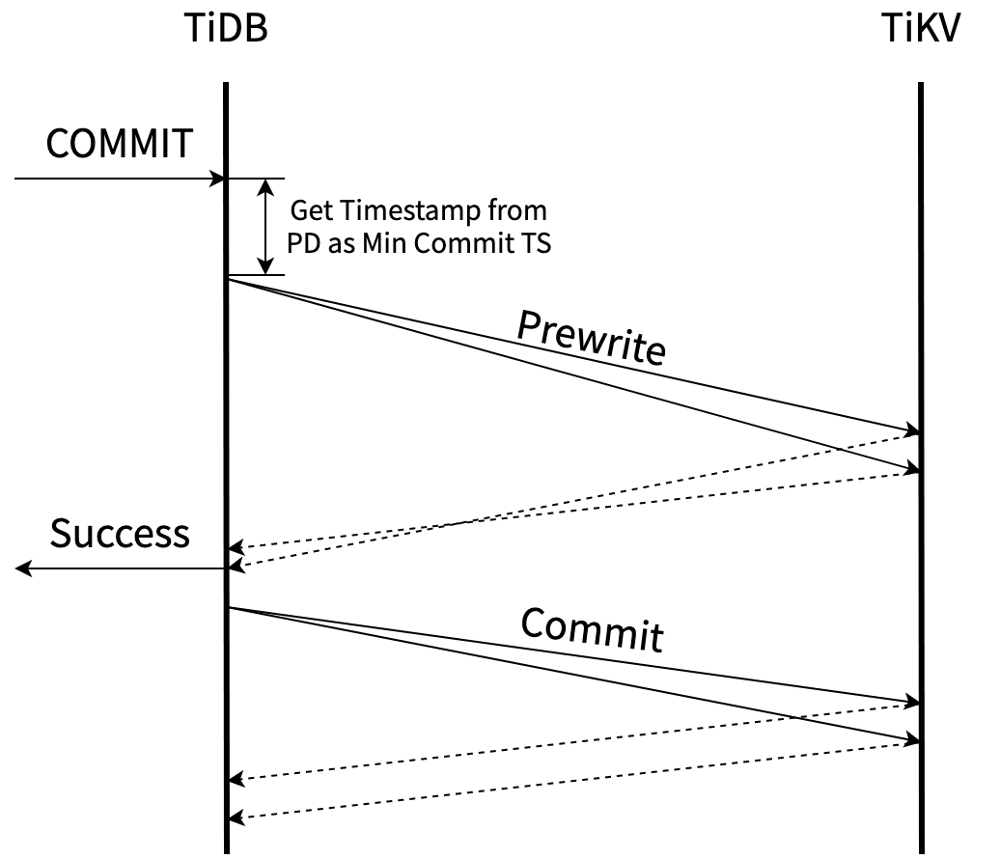

# AsyncCommit

AsyncCommit 等所有的key prewrite之后，就算成功了，TiDB即可返回告诉client事务提交成功了。
primary key 可以异步的commit.其流程如下(摘自[Async Commit 原理介绍][async-commit])




对应代码流程如下, 关键是minCommitTS的更新。


#### minCommitTS

PreWrite前从TSO获取ts, 更新成员变量`minCommitTS`

```go
func (c *twoPhaseCommitter) execute(ctx context.Context) (err error) {
//...
	if commitTSMayBeCalculated && c.needLinearizability() {
		latestTS, err := c.store.oracle.GetTimestamp(ctx, &oracle.Option{TxnScope: oracle.GlobalTxnScope})
    //...
		// Plus 1 to avoid producing the same commit TS with previously committed transactions
		c.minCommitTS = latestTS + 1
	}
//...
}
```

TiDB发送给TiKV的prewrite请求中带上minCommitTS.

```go
func (c *twoPhaseCommitter) buildPrewriteRequest(batch batchMutations, txnSize uint64) *tikvrpc.Request {
 //...
	c.mu.Lock()
	minCommitTS := c.minCommitTS
	c.mu.Unlock()
	if c.forUpdateTS > 0 && c.forUpdateTS >= minCommitTS {
		minCommitTS = c.forUpdateTS + 1
	} else if c.startTS >= minCommitTS {
		minCommitTS = c.startTS + 1
	}
  //...
```

根据prewriteResp.minCommitTS 更新commiter的`minCommitTS`

```go
func (action actionPrewrite) handleSingleBatch(c *twoPhaseCommitter, bo *Backoffer, batch batchMutations) error {
//...
			if c.isAsyncCommit() {
				if prewriteResp.MinCommitTs == 0 {
        // fallback到normal commit
        }else {
					c.mu.Lock()
					if prewriteResp.MinCommitTs > c.minCommitTS {
						c.minCommitTS = prewriteResp.MinCommitTs
					}
					c.mu.Unlock()
        }
```


#### TiKV端计算min_commit_ts

每次TiDB的prewrite请求，TiKV都会返回一个minCommitTS, minCommitTS流程如下


关键函数在`async_commit_timestamps`， 这个地方为什么要lock_key ?

```rust
// The final_min_commit_ts will be calculated if either async commit or 1PC is enabled.
// It's allowed to enable 1PC without enabling async commit.
fn async_commit_timestamps(/*...*/) -> Result<TimeStamp> {
    // This operation should not block because the latch makes sure only one thread
    // is operating on this key.
    let key_guard = CONCURRENCY_MANAGER_LOCK_DURATION_HISTOGRAM.observe_closure_duration(|| {
        ::futures_executor::block_on(txn.concurrency_manager.lock_key(key))
    });

    let final_min_commit_ts = key_guard.with_lock(|l| {
        let max_ts = txn.concurrency_manager.max_ts();
        fail_point!("before-set-lock-in-memory");
        let min_commit_ts = cmp::max(cmp::max(max_ts, start_ts), for_update_ts).next();
        let min_commit_ts = cmp::max(lock.min_commit_ts, min_commit_ts);

        lock.min_commit_ts = min_commit_ts;
        *l = Some(lock.clone());
        Ok(min_commit_ts)
    }
    ...
}
```

> TiDB 的每一次快照读都会更新 TiKV 上的 Max TS。Prewrite 时，Min Commit TS 会被要求至少比当前的 Max TS 大，也就是比所有先前的快照读的时间戳大，所以可以取 Max TS + 1 作为 Min Commit TS

每次读操作，都会更新`concurrency_manager.max_ts`


值得注意的是replica read 也会更新max_ts。replica reader 在read之前会发readIndex消息给leader（
TODO:不确定是否是这样）

发送ReadIndex 请求会附带上事务的start_ts, leader在处理reader index消息时，
会回调`ReplicaReadLockChecker::on_step` 更新`concurrency_manager.max_ts`。


相关commit见[check memory locks in replica read #8926]

