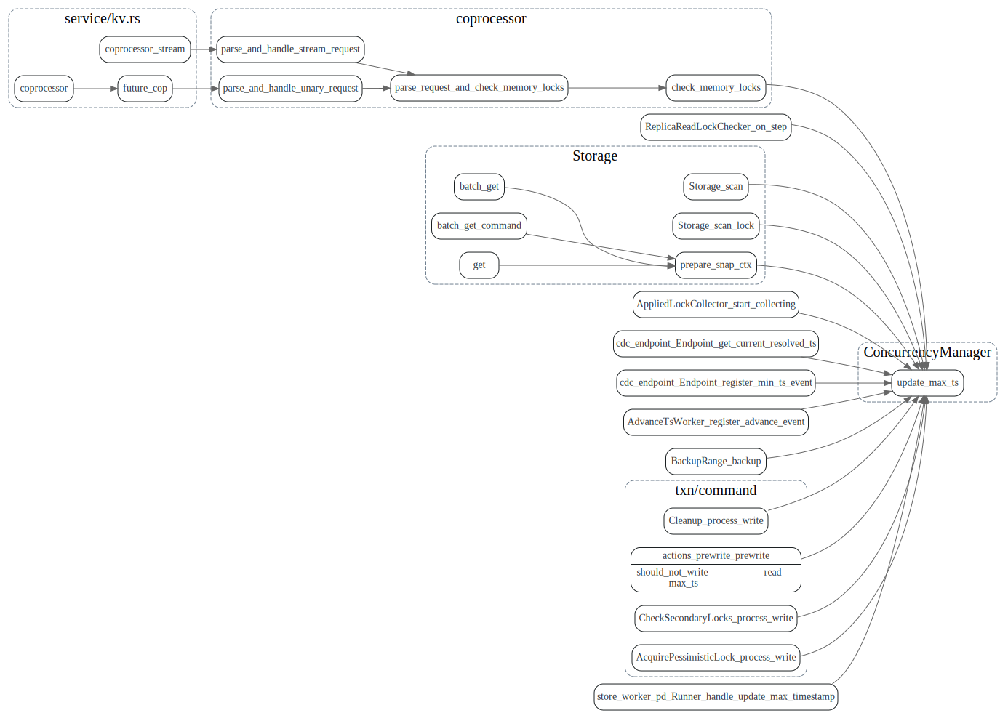

# AsyncCommit

<!-- toc -->

AsyncCommit 等所有的key prewrite之后，就算成功了，TiDB即可返回告诉client事务提交成功了。
primary key 可以异步的commit.其流程如下(摘自[Async Commit 原理介绍](https://pingcap.com/zh/blog/async-commit-principle))


好处是在prewrite结束后，就可以返回结果给client, commit由tidb在后台异步提交，降低了事务的延迟。

需要解决的主要有两个：

1. 从如何确定所有 keys 已被prewrite，需要根据primary key找到所有的secondary keys.
2. 如果确定`commit_ts`

对于问题1，primarylock中增加了`pub secondaries: Vec<Vec<u8>>`字段。

lock 包含了txn涉及到的所有的 secondaries keys

```rust
#[derive(PartialEq, Clone)]
pub struct Lock {
    pub lock_type: LockType,
    pub primary: Vec<u8>,
    pub ts: TimeStamp,
    pub ttl: u64,
    pub short_value: Option<Value>,
    // If for_update_ts != 0, this lock belongs to a pessimistic transaction
    pub for_update_ts: TimeStamp,
    pub txn_size: u64,
    pub min_commit_ts: TimeStamp,
    pub use_async_commit: bool,
    // Only valid when `use_async_commit` is true, and the lock is primary. Do not set
    // `secondaries` for secondaries.
    pub secondaries: Vec<Vec<u8>>,
    // In some rare cases, a protected rollback may happen when there's already another
    // transaction's lock on the key. In this case, if the other transaction uses calculated
    // timestamp as commit_ts, the protected rollback record may be overwritten. Checking Write CF
    // while committing is relatively expensive. So the solution is putting the ts of the rollback
    // to the lock.
    pub rollback_ts: Vec<TimeStamp>,
}
```

问题2，则使用每个key的`min_commit_ts`和TiKV的`max_ts`来确定事务的`commit_ts` TiDB的每次读都会更新Tikv的`max_ts`。

> 对于 Async Commit 事务的每一个 key，prewrite 时会计算并在 TiKV 记录这个 key 的 Min Commit TS，事务所有 keys 的 Min Commit TS 的最大值即为这个事务的 Commit TS。


## checkAsyncCommit

先关配置在Config.TiKVClient.AsyncCommit中, checkAsyncCommit 会遍历mutations
计算事务的total key size是否超过了限制。 最后结果保存在atomic变量`useAsyncCommit`中。

```rust
type AsyncCommit struct {
	// Use async commit only if the number of keys does not exceed KeysLimit.
	KeysLimit uint `toml:"keys-limit" json:"keys-limit"`
	// Use async commit only if the total size of keys does not exceed TotalKeySizeLimit.
	TotalKeySizeLimit uint64 `toml:"total-key-size-limit" json:"total-key-size-limit"`
	// The duration within which is safe for async commit or 1PC to commit with an old schema.
	// The following two fields should NOT be modified in most cases. If both async commit
	// and 1PC are disabled in the whole cluster, they can be set to zero to avoid waiting in DDLs.
	SafeWindow time.Duration `toml:"safe-window" json:"safe-window"`
	// The duration in addition to SafeWindow to make DDL safe.
	AllowedClockDrift time.Duration `toml:"allowed-clock-drift" json:"allowed-clock-drift"`
}
```


## isAsyncCommit caller

对`isAsyncCommit`的调用, 最主要的有两个地方

一个是buildPrewriteRequest时，需要遍历事务的 mutations将所有的secondaries lock keys 放到request中；另外一个是commit时在一个go routine
中异步提交的。prewrite成功后，就可以向client返回事务结果，不必向正常commit时等到primary key
提交成功才返回结果给client.


## minCommitTS

### client端更新min commit ts

对应代码流程如下, 关键是minCommitTS的更新。


PreWrite前从TSO获取ts, 更新成员变量`minCommitTS`

```go
func (c *twoPhaseCommitter) execute(ctx context.Context) (err error) {
//...
	if commitTSMayBeCalculated && c.needLinearizability() {
		latestTS, err := c.store.oracle.GetTimestamp(ctx, &oracle.Option{TxnScope: oracle.GlobalTxnScope})
    //...
		// Plus 1 to avoid producing the same commit TS with previously committed transactions
		c.minCommitTS = latestTS + 1
	}
//...
}
```

TiDB发送给TiKV的prewrite请求中带上minCommitTS.

```go
func (c *twoPhaseCommitter) buildPrewriteRequest(batch batchMutations, txnSize uint64) *tikvrpc.Request {
 //...
	c.mu.Lock()
	minCommitTS := c.minCommitTS
	c.mu.Unlock()
	if c.forUpdateTS > 0 && c.forUpdateTS >= minCommitTS {
		minCommitTS = c.forUpdateTS + 1
	} else if c.startTS >= minCommitTS {
		minCommitTS = c.startTS + 1
	}
  //...
```

根据prewriteResp.minCommitTS 更新commiter的`minCommitTS`

```go
func (action actionPrewrite) handleSingleBatch(c *twoPhaseCommitter, bo *Backoffer, batch batchMutations) error {
//...
			if c.isAsyncCommit() {
				if prewriteResp.MinCommitTs == 0 {
        // fallback到normal commit
        }else {
					c.mu.Lock()
					if prewriteResp.MinCommitTs > c.minCommitTS {
						c.minCommitTS = prewriteResp.MinCommitTs
					}
					c.mu.Unlock()
        }
```


### TiKV端计算min commit ts

每次TiDB的prewrite请求，TiKV都会返回一个minCommitTS, minCommitTS流程如下


关键函数在`async_commit_timestamps`， 这个地方为什么要lock_key ?

```rust
// The final_min_commit_ts will be calculated if either async commit or 1PC is enabled.
// It's allowed to enable 1PC without enabling async commit.
fn async_commit_timestamps(/*...*/) -> Result<TimeStamp> {
    // This operation should not block because the latch makes sure only one thread
    // is operating on this key.
    let key_guard = CONCURRENCY_MANAGER_LOCK_DURATION_HISTOGRAM.observe_closure_duration(|| {
        ::futures_executor::block_on(txn.concurrency_manager.lock_key(key))
    });

    let final_min_commit_ts = key_guard.with_lock(|l| {
        let max_ts = txn.concurrency_manager.max_ts();
        fail_point!("before-set-lock-in-memory");
        let min_commit_ts = cmp::max(cmp::max(max_ts, start_ts), for_update_ts).next();
        let min_commit_ts = cmp::max(lock.min_commit_ts, min_commit_ts);

        lock.min_commit_ts = min_commit_ts;
        *l = Some(lock.clone());
        Ok(min_commit_ts)
    }
    ...
}
```

## TiKV MaxTS

> TiDB 的每一次快照读都会更新 TiKV 上的 Max TS。Prewrite 时，Min Commit TS 会被要求至少比当前的 Max TS 大，也就是比所有先前的快照读的时间戳大，所以可以取 Max TS + 1 作为 Min Commit TS

每次读操作，都会更新`concurrency_manager.max_ts`



值得注意的是replica read 也会更新max_ts。replica reader 在read之前会发readIndex消息给leader（
TODO:不确定是否是这样）

发送ReadIndex 请求会附带上事务的start_ts, leader在处理reader index消息时，
会回调`ReplicaReadLockChecker::on_step` 更新`concurrency_manager.max_ts`。


相关commit见[check memory locks in replica read #8926]
