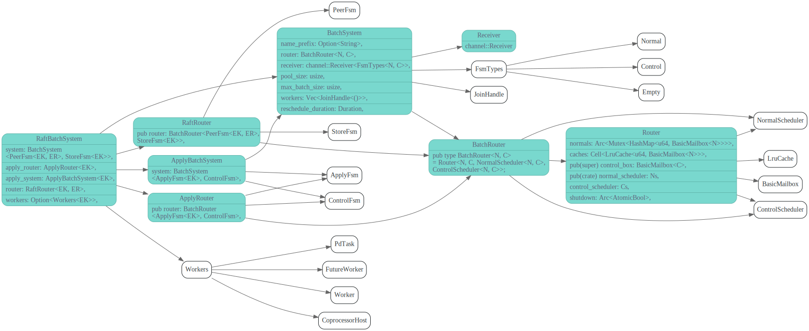

# BatchSystem

<!-- toc -->

## FSM

fsm 分为normal和control, `PeerFsm/ApplyFsm` 的FsmTypes为Normal
`StoreFsm`Fsmtypes为Control.

每个region对应着一个`PeerFsm`, `ApplyFsm`。 `PeerFsm/ApplyFsm/StoreFsm`
都有一个reciver从channel接收数据，其中 `PeerFsm/ApplyFsm` 的channel tx端，
存放在`Router.normals` HashMap中，而StoreFsm的tx端，存放在`Router.control_box`。

``BasicMailbox``则封装了向fsm发消息功能， mailbox首先使用Fsm对应的tx，发消息到
Fsm的reciver中，并且如果FsmState为Idle的话，则通过NormalScheduler/ControlScheduler
将Fsm使用FsmTypes包装一下，发送到BatchSystem.reciver中。

## BatchSystem

### create_system

创建channel, 发送数据端tx,会放入Router中，接收数据端rx, 放入BatchSystem.reciver中。
后面的poller会从该rx中`try_recv`消息。

注意此处Router中的normals map还没有初始化，它会在后面的router.register_all初始化

### create_raft_batch_system

会创建applyBatchSystem 和处理Raft消息的System.

### 初始化每个region的PeerFsm/ApplyFsm

`RaftPollerBuilder::init`中，会创建每个region对应的PeerFsm, 以及和PeerFsm 通信
channel的rx/tx, rx保存在PeerFsm中。

tx经过BasicMailbox包了一层厚，保存在Router的normals中。
normls保存了region_id到mailbox的映射, 这样router就可以根据regionId把消息发送给region对应的PeerFsm了。

同样每个region也会创建一个ApplyFsm，tx会注册到apply_router的normals字段中。

### Router::try_send: 发送normal消息流程

### Router::send_control: 发送control消息流程

### BatchSystem::spawn: 启动poller线程

这个地方会启动一个新的线程, 处理BatchSystem.reciever中的消息, reciever的发送端
为`BatchSystem.normal_scheduler`和`BatchSystem.control_scheduler`

从norml_scheduler发过来的消息，会调用`handler.handle_normal`来处理

从control_scheduler发过来的消息，会调用`handler.handle_control`来处理。

这个地方的poller感觉写的很精妙，每个handler在`handle_normal`中，会从fsm自己的reciver中处理完`messages_per_tick`消息后，
会返回了。感觉有点像线程的yield, 让出cpu。 poller会把这个fsm 加到自己本地batch中(根据handle_normal返回结果），
这样省去poller再去reciver中去取fsm了, 避免多个线程去reciver中取数据，lock的hot retention?(TODO: 这块使用正确的
术语，把tl博客里面关于线程池的那篇文章拿过来)

