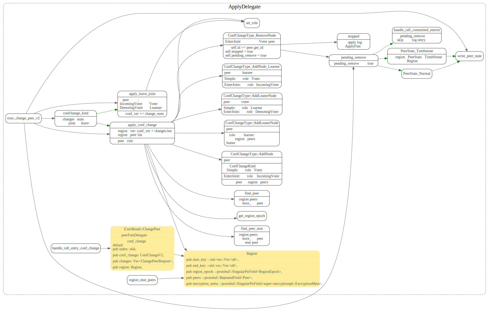
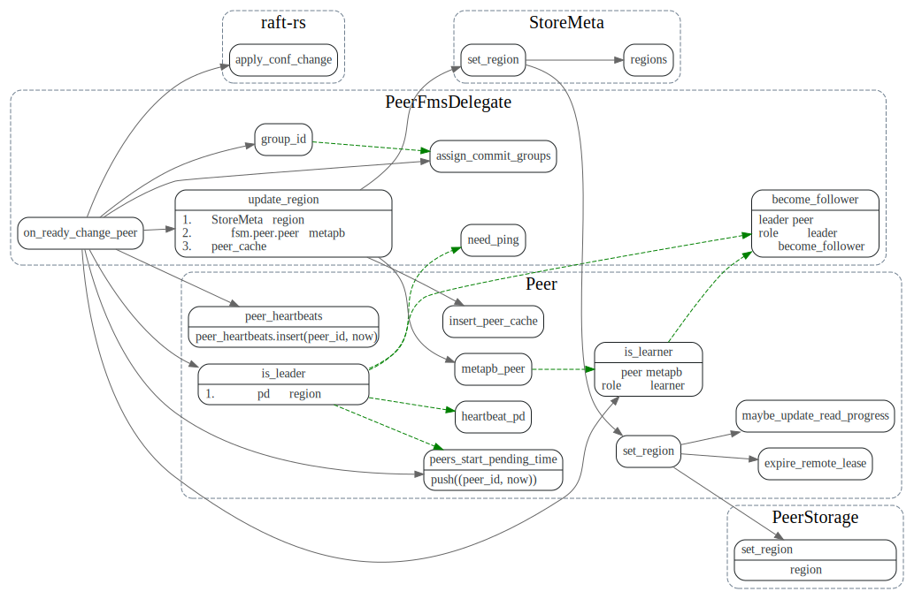
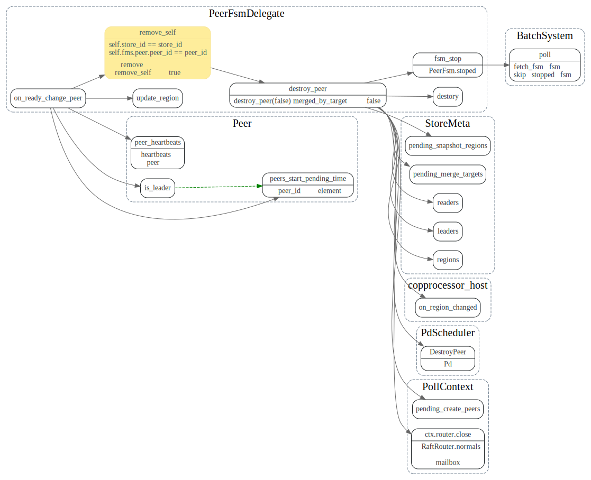

# Conf Change

<!-- toc -->

## PD 触发conf change


## PeerFsmDelegate::propose_conf_change

向raft propose conf change


## PeerFsmDelegate::collect_ready


## ApplyDelegate::exec_change_peer


`handle_raft_entry_conf_change` 会把entry的changes附加到ExecResult上 
然后发送给PeerFsm处理。


write_peer_state，更新kv engine中的region信息。

### exec_change_peer


### exec_change_peer_v2

此处会根据change_num个数来判断ConfChangeKind (因为raft-rs在ConfChange被applied
时，会再提交一个空的confChnage)

```rust
    pub fn confchange_kind(change_num: usize) -> ConfChangeKind {
        match change_num {
            0 => ConfChangeKind::LeaveJoint,
            1 => ConfChangeKind::Simple,
            _ => ConfChangeKind::EnterJoint,
        }
    }
```


AddNode时，先将Peer role设置为IncomingVoter, 在LeaveJoint时再由`IncomingVoter`
改为`Voter`

RemoveNode时，Peer role先由`Voter` 到`DemotingVoter`再到`Learner`?



## PeerFsmDelegate::on_ready_change_peer

此处会调用`apply_conf_change`把confChange 传给raft-rs，
raft-rs从而知道该conf change已经被applied了，然后会发一个空的confChange消息，
等这个空的confChange消息再次被`apply_conf_change`时，raft-rs 开始LeaveJoint，
使用incoming的新配置。（此处有疑问，需要再研究下)

### AddNode/AddLearnerNode

peers_start_pending_time 的作用是什么？
ping是干啥用的



### RemoveNode



## draft


