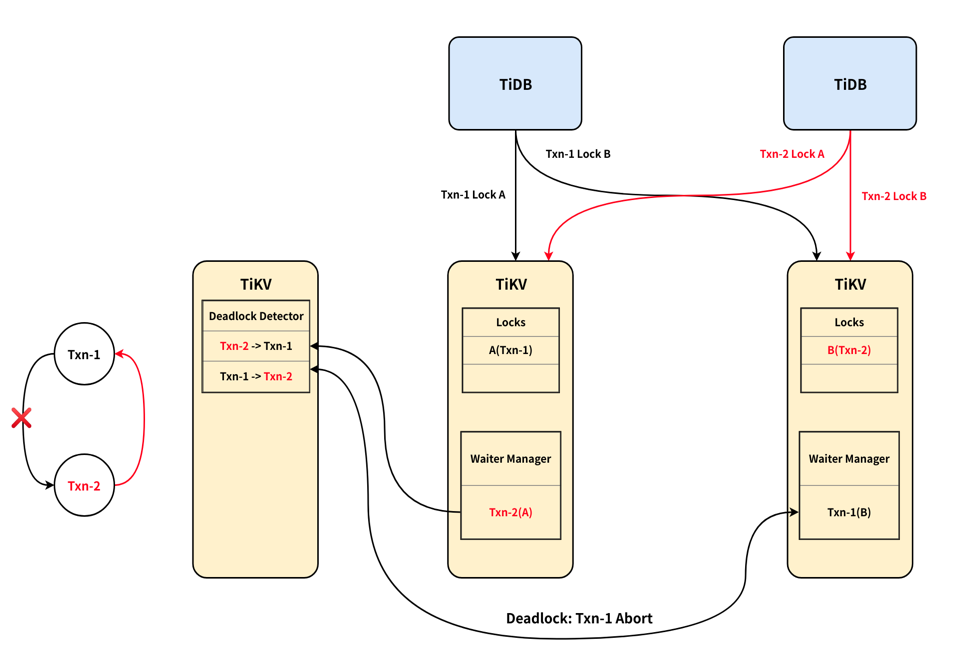
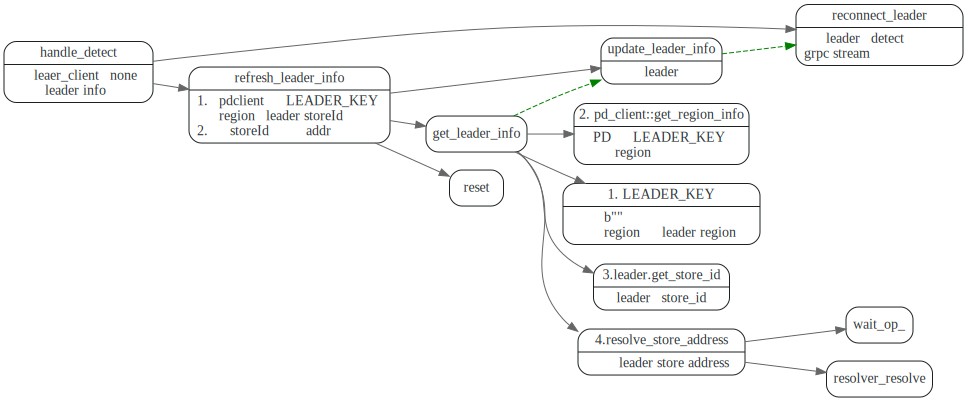

# 死锁检测

在事务被加到lock的等待队列之前，会做一发一个rpc请求, 到deadlock detector服务做deadlock检测。


TiKV 会动态选举出一个 TiKV node 负责死锁检测。

(下图摘自[TiDB 新特性漫谈：悲观事务][6]):



死锁检测逻辑如下(摘自[TiDB 悲观锁实现原理][1])

1. 维护全局的 wait-for-graph，该图保证无环。
2. 每个请求会尝试在图中加一条 `txn -> wait_for_txn` 的 edge，若新加的导致有环则发生了死锁。
3. 因为需要发 RPC，所以死锁时失败的事务无法确定。

#### deadlock leader本地detect

对应代码调用流程如下：


其中比较关键的是wait_for_map ，保存了txn 之间的依赖关系DAG图。

```rust
/// Used to detect the deadlock of wait-for-lock in the cluster.
pub struct DetectTable {
    /// Keeps the DAG of wait-for-lock. Every edge from `txn_ts` to `lock_ts` has a survival time -- `ttl`.
    /// When checking the deadlock, if the ttl has elpased, the corresponding edge will be removed.
    /// `last_detect_time` is the start time of the edge. `Detect` requests will refresh it.
    // txn_ts => (lock_ts => Locks)
    wait_for_map: HashMap<TimeStamp, HashMap<TimeStamp, Locks>>,

    /// The ttl of every edge.
    ttl: Duration,

    /// The time of last `active_expire`.
    last_active_expire: Instant,

    now: Instant,
}
```

#### 转发请求给Deadlock leader

如果当前Deadlock detector不是leader,则会把请求转发给Deadlock leader, 转发流程如下:

首先Deadlock client和leader 维持一个grpc stream, detect请求会发到一个channel中
然后由send_task异步的发送DeadlockRequest给Deadlock leader. 

recv_task则从stream接口中去获取resp, 然后调用回调函数，最后调用waiter_manager的
deadlock函数来通知等待的事务死锁了。


#### Deadlock Service

Deadlock leader会在`handle_detect_rpc`中处理deadlock detect请求，流程和leader处理本地的一样。


#### Deadlock Service的高可用

Detector在handle_detect,如果leader client为none,
则尝试先去pd server获取`LEADER_KEY`所在的region(Leader Key为空串，
所以leader region为第一region. 

然后解析出leader region leader的
store addr, 创建和deadlock detect leader的grpc detect接口的stream 连接



注册了使用Coprocessor的Observer, RoleChangeNotifier, 当leader
region的信息发变动时, RoleChangeNotifier会收到回调
会将leader_client和leader_inf清空，下次handle_detect时会重新
请求leader信息。


### 问题: DetectTable的wait_for_map需要保证高可用吗？

DetectTable的wait_for_map这个信息在deadlock detect leader
变动时候，是怎么处理的？看代码是直接清空呀？这个之前的依赖关系丢掉了，
这样不会有问题吗？


