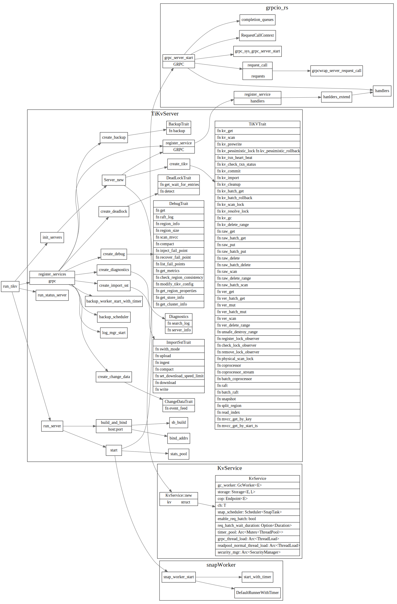
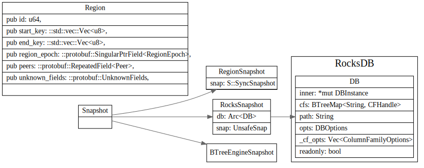

# Draft

## TiKV 启动流程


### Main 启动过程

1. 启动grpc服务
2. 启动snapworker, lockmgr, status server, stats pool等
backgroud线程



### Get过程

Trait Snapshot 这个定义了get, iter相关read接口

```rs
pub trait Snapshot: Send + Clone {
    type Iter: Iterator;

    fn get(&self, key: &Key) -> Result<Option<Value>>;
    fn get_cf(&self, cf: CfName, key: &Key) -> Result<Option<Value>>;
    fn iter(&self, iter_opt: IterOptions, mode: ScanMode) -> Result<Cursor<Self::Iter>>;
    fn iter_cf(
        &self,
        cf: CfName,
        iter_opt: IterOptions,
        mode: ScanMode,
    ) -> Result<Cursor<Self::Iter>>;
    // The minimum key this snapshot can retrieve.
    #[inline]
    fn lower_bound(&self) -> Option<&[u8]> {
        None
    }
    // The maximum key can be fetched from the snapshot should less than the upper bound.
    #[inline]
    fn upper_bound(&self) -> Option<&[u8]> {
        None
    }

    /// Retrieves a version that represents the modification status of the underlying data.
    /// Version should be changed when underlying data is changed.
    ///
    /// If the engine does not support data version, then `None` is returned.
    #[inline]
    fn get_data_version(&self) -> Option<u64> {
        None
    }
}

```


#### snapshot的实现者impl



RocksSnapshot

```rs
impl Snapshot for RocksSnapshot {
//...
}
```

RegionSnapshot 在RocksSnapshot上包装了一层？增加了啥功能呀？
```rs
impl Snapshot for RegionSnapshot<RocksSnapshot> {
//...
}
```

Btree放在里面是干啥用的，和rocksdb做对照？
```rs
impl Snapshot for BTreeEngineSnapshot {
//...
}
```


