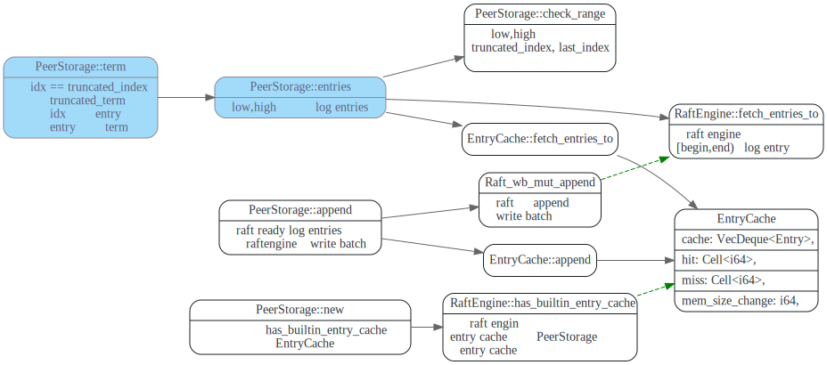
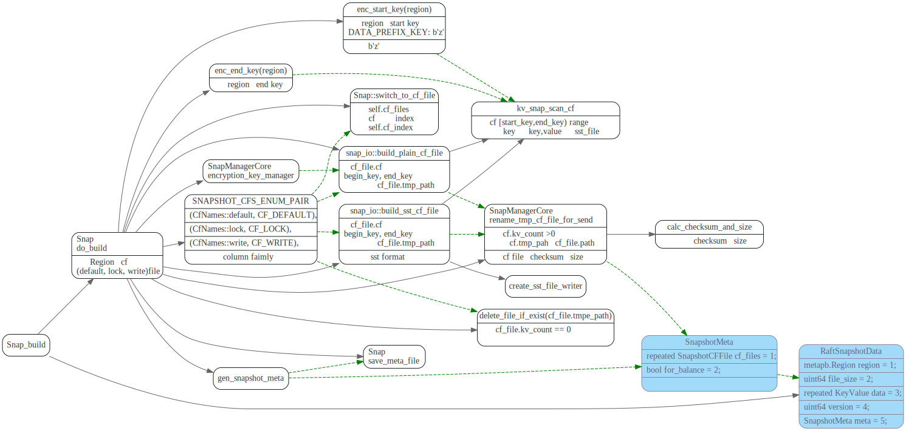
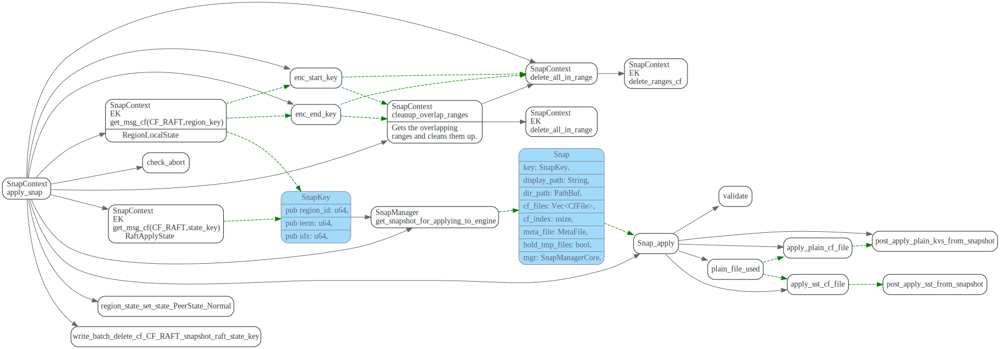

# PeerStorage

<!-- toc -->

## Trait Storage

```rust
/// Storage saves all the information about the current Raft implementation, including Raft Log,
/// commit index, the leader to vote for, etc.
///
/// If any Storage method returns an error, the raft instance will
/// become inoperable and refuse to participate in elections; the
/// application is responsible for cleanup and recovery in this case.
pub trait Storage {
    /// `initial_state` is called when Raft is initialized. This interface will return a `RaftState`
    /// which contains `HardState` and `ConfState`.
    ///
    /// `RaftState` could be initialized or not. If it's initialized it means the `Storage` is
    /// created with a configuration, and its last index and term should be greater than 0.
    fn initial_state(&self) -> Result<RaftState>;

    /// Returns a slice of log entries in the range `[low, high)`.
    /// max_size limits the total size of the log entries returned if not `None`, however
    /// the slice of entries returned will always have length at least 1 if entries are
    /// found in the range.
    ///
    /// # Panics
    ///
    /// Panics if `high` is higher than `Storage::last_index(&self) + 1`.
    fn entries(&self, low: u64, high: u64, max_size: impl Into<Option<u64>>) -> Result<Vec<Entry>>;

    /// Returns the term of entry idx, which must be in the range
    /// [first_index()-1, last_index()]. The term of the entry before
    /// first_index is retained for matching purpose even though the
    /// rest of that entry may not be available.
    fn term(&self, idx: u64) -> Result<u64>;

    /// Returns the index of the first log entry that is possible available via entries, which will
    /// always equal to `truncated index` plus 1.
    ///
    /// New created (but not initialized) `Storage` can be considered as truncated at 0 so that 1
    /// will be returned in this case.
    fn first_index(&self) -> Result<u64>;

    /// The index of the last entry replicated in the `Storage`.
    fn last_index(&self) -> Result<u64>;

    /// Returns the most recent snapshot.
    ///
    /// If snapshot is temporarily unavailable, it should return SnapshotTemporarilyUnavailable,
    /// so raft state machine could know that Storage needs some time to prepare
    /// snapshot and call snapshot later.
    /// A snapshot's index must not less than the `request_index`.
    fn snapshot(&self, request_index: u64) -> Result<Snapshot>;
}
```

## log entries


接口`first_index`, `last_index`, `initial_state`和
Region, RaftLocalState, RaftApplyState之间的关系如下图:


### entries 和term

entries和term接口实现逻辑如下图所示，主要是调用
RaftEngine的`fetch_entries_to` 获取`[low,high)`
范围内的log entries.

如果RaftEngine没有`builtin_entry_cache`, 则中间加一层EntryCache

在`PeerStorage`append raft log entry时，会同时append 到EntryCach
和raft write batch中,而 write batch最终会写到raft engine。



## raft snapshot

raft snapshot相关proto 如下，其中Snapshot是leader 发送给
follower的snapshot数据结构。 SnapshotMetadata则包含了confState
以及当前的index和term。


### 生成 snapshot

snapshot 生成流程如下:

1. PeerStorage::snapshot函数生成GenSnapTask, 然后`Peer::handle_raft_ready_append`将task发送给ApplyFsm
2. ApplyFsm将GenSnapTask转为`RegionTask::Gen`, 发送给snap-generator worker线程。
3. snap-generator worker 线程调用`peer_storage::do_snapshot`生成snapshot, 然后
使用notifier(对应GenSnapTask rx的tx),通知GenSnapTask已OK。
4. 下次PeerStorage::snapshot被调用时，会从GenSnapTask::Receiver中`try_recv` snapshot, 如果未准备好会返回SnapshotTemporarilyUnavailable，后面会再重试。

#### GenSnapTask


#### `ApplyFsm::handle_snapshot`

`ApplyFsm::handle_snapshot`, 此处主要处理`need_sync`的状况，
将write batch数据和apply sate flush写入rocksdb后，
再获取rocksdb 的snapshot. 最包装成`RegionTask::Gen`
由snap-generator worker线程池来执行。


#### snap-generator 线程池执行`handle_gen`

在worker/region 的`snap-generator`线程池中执行生成snapshot的任务,线程池大小为`GENERATE_POOL_SIZE` 2
该线程池还负责apply snapshot.


#### 生成SnapshotMetadata: `peer_storage::do_snapshot`

`do_snapshot`负责生成SnapshotMetadata, 而store/snap.rs中的build函数则负责生成snapshot的数据部分。


#### 生成Snapshot 数据: `Snap::build`

将region的default, lock, write 几个column family 数据分别写入对应的`cf_file`
先写入到`cf.tmp_file`,写入成功后再rename.

```rust
pub const SNAPSHOT_CFS_ENUM_PAIR: &[(CfNames, CfName)] = &[
    (CfNames::default, CF_DEFAULT),
    (CfNames::lock, CF_LOCK),
    (CfNames::write, CF_WRITE),
];

pub const CF_DEFAULT: CfName = "default";
pub const CF_LOCK: CfName = "lock";
pub const CF_WRITE: CfName = "write";
```



### apply snapshot



### send snapshot

### recv snapshot
