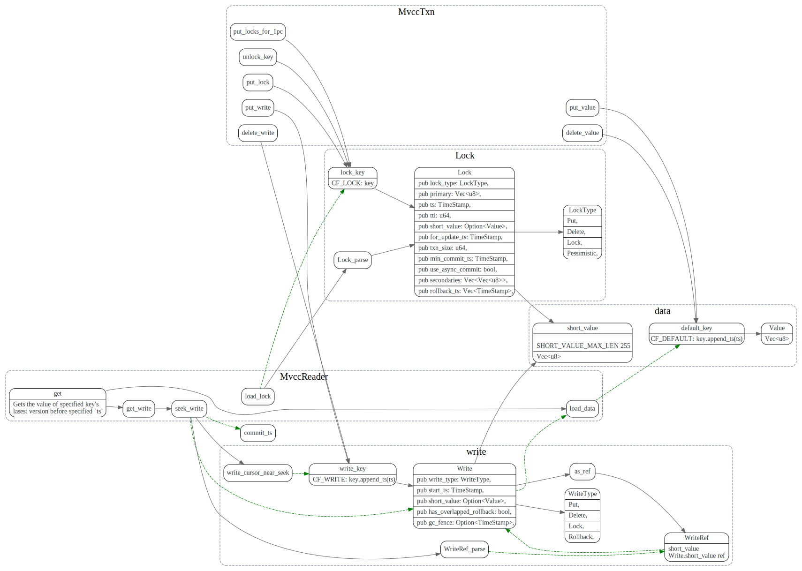

# Percolator

> * 每个column 有`data`, `write`, `lock` 几个属性, data负责保存多版本的value, write负责控制value版本可见性，lock 表示事务的锁，表示有并发的事务在修改该key。
> * lock分为`primary lock`和`secondary lock`, secondary lock 指向了primary lock，只要primay lock提交成功，则认为事务提交成功了。secondary lock可以异步提交
> * client failure的处理：在读数据时会检查lock和write由此确定是rollback事务还是roll-foward接着完成commit事务。

<!-- toc -->

## 2PC(Two Phase Commit)

> 2PC is an atomic commit protocol meaning all participants will eventually commit if all voted “YES” or leave the system unchanged otherwise.

### 2PC 主要思想

2pc 中有两种角色，coordinator(协调者)和participant(参与者)

coordinator在prepare阶段, 先写入begin commit日志，
然后向所有的participant发送prepare消息。如果所有的participant 投票yes, 
则向所有的participant发送commit消息，participant完成commit.


如果在prepare阶段，某个participant投了no, coordinator则需要
向所有的participant发送rollback消息。


可以看到2PC模型中，事务的一致性依赖于coordinator, 也只有coordinator知道
prepare 阶段所有参与者的投票结果。

coordinator会把事务日志做*本地持久化*，并保证coordinator从crash恢复后，
重新读取事务日志，获取当前事务状态，然后接着发送commit/rollback 消息，
从而保证事务可以接着一致的执行。

### 2PC缺陷


#### 无法处理fail stop

* fail stop Model: node can crash and never recover
* fail recover Model: nodes could crash and may at some later date recover from the failure and continue executing. 

如果coordinator node fail stop了，新选择的coordinator，
没有旧的coordinator的事务日志。也就无法得知事务的状态，无法决定是rollback 还是commit。

新的coordinator可以重新查询让所有的参与者上次的投票，来推算事务的状态。

但是这时候，如果有个参与者挂了，这样新的coordinator无法知道
他之前投的是yes还是no，还是已经将事务commit了， 这样也就无法推算事务状态了。

假定这个挂的参与者已经将事务commit了，新的coordinator就无法决定事务状态为abort.
假定他投的是no, 新的coordinator 就无法决定事务状态为commit。（或者coordinator 只能等到这个挂掉
参与者恢复了才能接着判断事务的状态？)

我个人觉得根源上是coordinator的事务日志没有分布式的持久化?

#### 同步阻塞问题

1. 参与者的资源要一直lock，直到收到coordinator 的commit/rollback
2. 如果coordinator和某个参与者都挂了，coordinator 要等到该参与者恢复了，才能判断事务状态.

## 3PC

### 3P主要思想

3pc 将2pc的Commit 阶段拆分为PreCommit, Commit两个阶段。加入PreCommit状态[2], 是为了告诉所有的参与者，当前的投票结果。
这样新的coordinator 只要根据precommit这个状态，就能得知上投票结果了。

> The purpose of this phase is to communicate the result of the vote to every replica so that the state of the protocol can be recovered no matter which replica dies.
> (if you are tolerating a fixed number f of failures, the co-ordinator can go ahead once it has received f+1 confirmations)


这样coordinator 节点fail stop之后，新的coordinator询问所有的参与者状态，

如果有参与者没达到preCommit状态，说明之前coordinator还没有commit, 这时候
新的coordinator可以放心的abort事务了。

如果有的参与者已经在commit状态了，说明所有的参与者，应该都收到PreCommit了，
新的coordinator可以决定事务状态为commit.

考虑到2pc的case, 假定有两个参与者p1, p2, p1 挂了，

1. 如果p2是precommit或者commit状态，说明p1投的是yes, 并且p1有可能已经将事务commit了，事务状态应该为commit.
2. 如果p2不是precommit，说明p肯定还没收到commit消息，可以安全的abort事务。


### 3PC缺陷

3PC 多了一轮消息，增加了延迟。 而且无法network partition 问题。

假定有三个参与者p1, p2, p3,
p1, p2处于precommit状态被分到一个一个network里面，p3还未收preCommit消息被分到了另外一个network里面，
这时候原有的coordinator 挂了，

p1, p2选举出coordinator c1, p3选举出coordinator c2。c1 判断事务应该为commit，c2判断事务应该为abort.
这样事务的状态就不一致了。

## Percolator 主要思想

### coordinator状态保存

Percolator 使用两阶段提交来完成事务，不过coordinator是client，coordinator的相关
状态也存放到bigtable中。这样作为coordinator的client就不用保存什状态了。

每个column 有data, write, lock 几个属性, 其中`start_ts` 是事务开始时时间戳,
`commit_ts`为事务提交时候的时间戳。`commit_ts` > `start_ts`。
事务读写都会用`start_ts`

* data  负责保存多版本的value: `(key, start_ts) -> value`
* write 负责控制value可见的版本控制: `(key, commit_ts) -> write_info` 
* lock 表示事务的锁，表示有事务在写key: `key -> lock_info` 

### 跨行事务

Percolator从key中任选一个作为`primary key`，事务的状态完全由`primary key`来决定。 
其他的作为`secondary key`，`secondary key`的lock保存了对`primary key`引用。
事务的`primary key` 提交成功后，client就认为事务提交成功了，其他的`secondary key`可以异步提交。

事务在读取或者prewrite 某个key时，如果发现key的lock column 不为空，如果lock类型为secondary的,
则会根据里面保存的引用来找到`primary key`，使用`primay key`的write/lock来判断lock是否是stale的。

可以认为`primary key`的write/lock 为coordinator的状态，其他的`secondary key` write/lock是participant的状态。


### prewrite阶段

### commit 阶段

key的提交操作，就在在write中写入事务所做修改的版本(start_ts), 并清除key对应的lock.


### client failure的处理

client failure由读操作处理，假定client正在执行事务t1, client failure有两类，


一类情况是在<b>commit point之前</b>，client在prewrite阶段拿到了primary key和一些secondary key的lock，然后client 挂了，一直没提交。
后续这些key的read操作会检查lock的ttl(如果是secondary key则先根据位置信息找到primary key)，
如果超时了，就会clean up 清理掉lock，然后对事务做`rollback`。

一类是在<b>commit point 之后</b>，提交primary key成功，但在提交secondary lock时挂了。
这些提交失败的seconary key的读取操作首先定位到primary key, 然后
发现事务是成功的，就会对这些secondary lock做`roll forward`


## 伪代码

```
```

```
CF_DEFAULT: (key, start_ts) -> value
CF_LOCK: key -> lock_info
CF_WRITE: (key, commit_ts) -> write_info
```
* LockColumn: 事务产生的锁，未提交的事务会写本项，记录primary lock的位置。事务成功提交后，该记录会被清理。记录内容格式
* Data Column: 存储实际数据
* Write Column: 已提交的数据信息，存储数据所对应的时间戳。



MvccReader封装了读操作
MvccTxn 封装了写操作。


An instance of RocksDB may have multiple CFs, and each CF is a separated key namespace and has its own LSM-Tree. However different CFs in the same RocksDB instance uses a common WAL, providing the ability to write to different CFs atomically.


事务lock冲突时候处理：

when a transaction T1 (either reading or writing) finds that a row R1 has a lock which belongs to an earlier transaction T0, T1 doesn’t simply rollback itself immediately. Instead, it checks the state of T0's primary lock.

1. If the primary lock has disappeared and there’s a record data @ T0.start_ts in the write column, it means that T0 has been successfully committed. Then row R1's stale lock can also be committed. Usually we call this rolling forward. After this, the new transaction T1 resumes.
2. If the primary lock has disappeared with nothing left, it means the transaction has been rolled back. Then row R1's stale lock should also be rolled back. After this, T1 resumes.
3. If the primary lock exists but it’s too old (we can determine this by saving the wall time to locks), it indicates that the transaction has crashed before being committed or rolled back. Roll back T1 and it will resume.
4. Otherwise, we consider transaction T0 to be still running. T1 can rollback itself, or try to wait for a while to see whether T0 will be committed before T1.start_ts.

memcomparable-encoded key

1. Encode the user key to memcomparable
2. Bitwise invert the timestamp (an unsigned int64) and encode it into big-endian bytes.
3. Append the encoded timestamp to the encoded key.


如何做rollback的

Doing rollback on a key will leave a Rollback record in CF_WRITE(Percolator’s write column)

Short Value in Write Column

直接把short value写到write column中。


## Percolator in TiKV

### async commit

> 判断 Async Commit 事务则需要知道所有 keys 的状态，所以我们需要能从事务的任意一个 key 出发，查询到事务的每一个 key。于是我们做了一点小的修改，保留从 secondary key 到 primary key 指针的同时，在 primary key 的 value 里面存储到到每一个 secondary key 的指针
> 对于 Async Commit 事务的每一个 key，prewrite 时会计算并在 TiKV 记录这个 key 的 Min Commit TS，事务所有 keys 的 Min Commit TS 的最大值即为这个事务的 Commit TS。


### 一阶段提交(1pc)

一阶段提交没有使用分布式提交协议，减少了写 TiKV 的次数。所以如果事务只涉及一个 Region，使用一阶段提交不仅可以降低事务延迟，还可以提升吞吐。4


## 参考文献

### percolator

* [Google Percolator事务](https://zhuanlan.zhihu.com/p/53197633)

### PinCap相关文档

* [TiKV Percolator](https://tikv.org/deep-dive/distributed-transaction/percolator/)
* [Async commit](https://mp.weixin.qq.com/s/m-22HHO3-9uyRxCfNNHLjA)
* [Async commit 设计文档](https://github.com/tikv/sig-transaction/tree/master/design/async-commit)
* [Percolator 和 TiDB 事务算法](https://pingcap.com/blog-cn/percolator-and-txn/)
* [TiDB 新特性漫谈：悲观事务](https://pingcap.com/blog-cn/pessimistic-transaction-the-new-features-of-tidb/)

### two phase commit

* [Two phase commit](https://tikv.org/deep-dive/distributed-transaction/distributed-algorithms/#two-phase-commit)
* [漫话分布式系统共识协议: 2PC/3PC篇](https://zhuanlan.zhihu.com/p/35298019)
* [Consensus Protocols: Two-Phase Commit](https://www.the-paper-trail.org/post/2008-11-27-consensus-protocols-two-phase-commit/)
* [Consensus Protocols: Three-phase Commit](https://www.the-paper-trail.org/post/2008-11-29-consensus-protocols-three-phase-commit/)
* [Consensus, Two Phase and Three Phase Commits](https://medium.com/@balrajasubbiah/consensus-two-phase-and-three-phase-commits-4e35c1a435ac)
* [Notes on 2PC](https://exactly-once.github.io/posts/notes-on-2pc/)
* [Sinfonia: A new Paradigm for Building scalable Distributed System](https://www.cs.rutgers.edu/~badri/553dir/notes/W9B-four.pdf)
