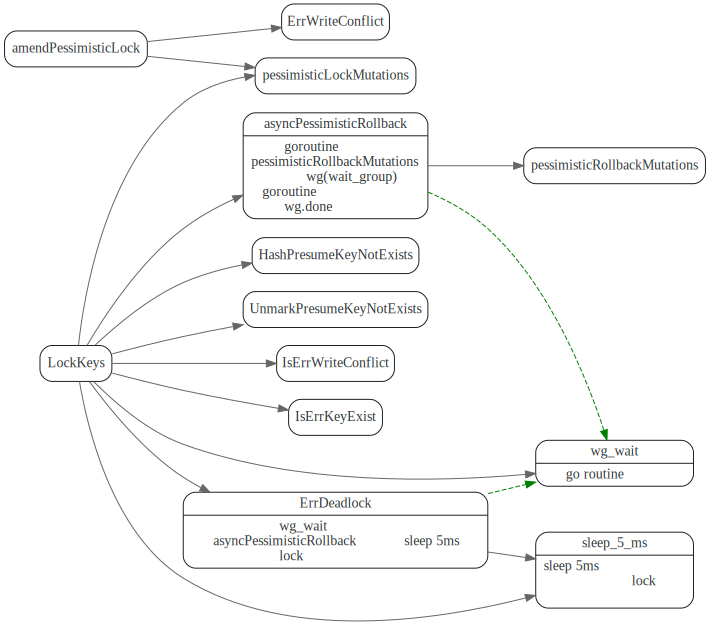

# 悲观事务

悲观事务将上锁时机从prewrite阶段提前到进行DML阶段,如下图所示(摘自[TiDB 新特性漫谈：悲观事务][6])


实现细节如下图所示(摘自[TiDB 悲观锁实现原理][1])


在DML阶段，多了获取从TSO服务for_update_ts和获取悲观锁步骤。

具体步骤如下：(摘自[TiDB 悲观锁实现原理][1])

1. 从 PD 获取当前 tso 作为当前锁的 for_update_ts
2. TiDB 将写入信息写入 TiDB 的内存中（与乐观锁相同）
3. 使用 for_update_ts 并发地对所有涉及到的 Key 发起加悲观锁（acquire pessimistic lock）请求，
4. 如果加锁成功，TiDB 向客户端返回写成功的请求
5. 如果加锁失败
6. 如果遇到 Write Conflict， 重新回到步骤 1 直到加锁成功。
7. 如果超时或其他异常，返回客户端异常信息


### forUpdateTS

ForUpdateTS 存放在SessionVar的TransactionContext中。
然后放到twoPhaseCommitter中，最后在actionIsPessimiticLock
向TiK发送请求时，放到PessimisticRequest请求参数中,发给TiKV.


在buildDelete, buildInsert, buildUpdate, buildSelectLock
时会去TSO服务获取最新的ts作为ForUpdateTS.

```go
// UpdateForUpdateTS updates the ForUpdateTS, if newForUpdateTS is 0, it obtain a new TS from PD.
func UpdateForUpdateTS(seCtx sessionctx.Context, newForUpdateTS uint64) error {
```


### 悲观锁: LockKeys

悲观锁不包含数据，只有锁，只用于防止其他事务修改相同的 Key，不会阻塞读，但 Prewrite 后会阻塞读（和 Percolator 相同，但有了大事务支持后将不会阻塞 
(摘自[TiDB in Action, 6.2 悲观事务][3])

调用流程类似于上面的，也是先对mutation按照region分组，然后每个组内分批。


### PessimisticLock

这个地方有LockWaitTime, 如果有key 冲突，TiKV会等待一段时间, 或者
等key 的lock被释放了，才会返回给TiDB key writeConflict或者deadlock


LockKeys中对于`ErrDeadlock`特殊处理，等待已经lock的key都被rollback之后并且sleep 5ms, 才会向上返回。



悲观事务对于`ErrDeadlock`和`ErrWriteConflict`重试，重新创建executor, 重试statementContext 状态，更新ForUpdateTS。


做selectForUpdate 做了特殊处理，没看明白没什么要这么干。

### TiKV处理PessimisticLock

TiKV端获取Pessimistic处理方法(摘自[TiDB 悲观锁实现原理][1])

* 检查 TiKV 中锁情况，如果发现有锁
  1. 不是当前同一事务的锁，返回 KeyIsLocked Error
  2. 锁的类型不是悲观锁，返回锁类型不匹配（意味该请求已经超时）
  3. 如果发现 TiKV 里锁的 for_update_ts 小于当前请求的 for_update_ts(同一个事务重复更新)， 使用当前请求的 for_update_ts 更新该锁
  4. 其他情况，为重复请求，直接返回成功
* 检查是否存在更新的写入版本，如果有写入记录
  1. 若已提交的 commit_ts 比当前的 for_update_ts 更新，说明存在冲突，返回 WriteConflict Error
  2. 如果已提交的数据是当前事务的 Rollback 记录，返回 PessimisticLockRollbacked 错误
  3. 若已提交的 commit_ts 比当前事务的 start_ts 更新，说明在当前事务 begin 后有其他事务提交过
  4. 检查历史版本，如果发现当前请求的事务有没有被 Rollback 过，返回 PessimisticLockRollbacked 错误


### PessimisticLockRollback 

TiDB从 事务的MemBuffer中获取所有被枷锁的key，向tikv发送rollback key lock请求。


### TiKV处理PessimisticLockRollback


### 加锁规则

TiDB中加锁规则如下(摘自[TiDB 悲观锁实现原理][1])

* 插入（ Insert）
  * 如果存在唯一索引，对应唯一索引所在 Key 加锁
  * 如果表的主键不是自增 ID，跟索引一样处理，加锁。
* 删除（Delete）
  * RowID 加锁
* 更新 (update)
  * 对旧数据的 RowID 加锁
  * 如果用户更新了 RowID, 加锁新的 RowID
  * 对更新后数据的唯一索引都加锁

TODO: 没找到insert/delete/update这块的lock代码


