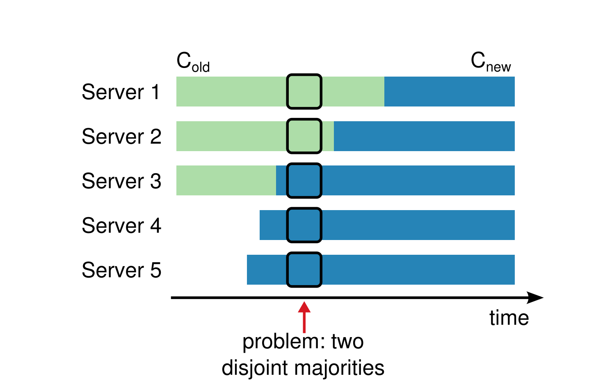
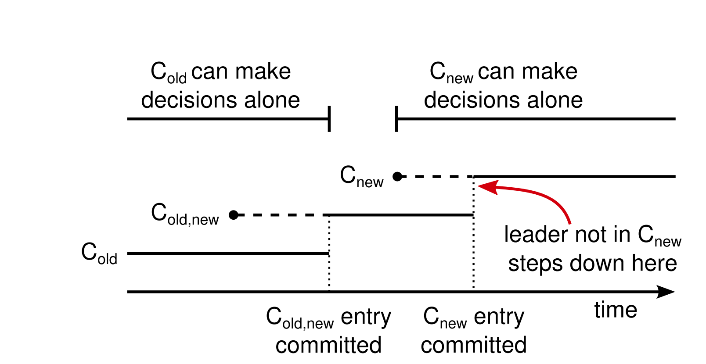
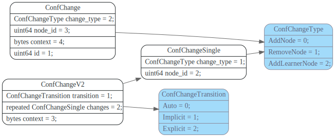
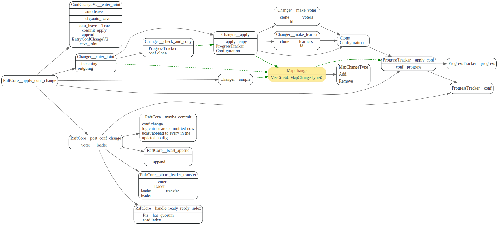

# ConfChange

<!-- toc -->

## joint consensus

raft中的决策(投票和计算commit index)，基础是集群中的majority， 由于无法同时原子性的将集群中所有成员配置都修改了，如果一次加入集群节点比较多，
就可能造成集群中使用新配置和使用旧配置的节点形成两个分裂的majority.



因此需要加入一个过渡期的概念，在过渡期的节点同时使用新老配置，保证新老conf change可以正常交接。

在conf change期间, 由于各个节点apply conf change的时间点不同，不同节点的配置也会不同。
有的会用conf old, 有的节点开始使用conf new.
有的节点还处于过渡期，投票和计算commit index需要同时使用新老配置来做决策。



### ProgressTracker

`ProgressTracker::Configuration` 存放着raft集群配置。


### 使用新老配置做决策

在Joint consensus期间，ProgressTracker同时使用新老配置来计算commit index和vote result

```rust
//JointConfig
pub struct Configuration {
    //incoming 为新的配置
    pub(crate) incoming: MajorityConfig,
    //outgoing 为老的配置
    pub(crate) outgoing: MajorityConfig,
}

// MajorityConfig
pub struct Configuration {
    voters: HashSet<u64>,
}
```

#### 计算committed index

```rust
    //同时统计新老配置中的committed index
    // JointConfig
    pub fn committed_index(&self, use_group_commit: bool, l: &impl AckedIndexer) -> (u64, bool) {
        let (i_idx, i_use_gc) = self.incoming.committed_index(use_group_commit, l);
        let (o_idx, o_use_gc) = self.outgoing.committed_index(use_group_commit, l);
        (cmp::min(i_idx, o_idx), i_use_gc && o_use_gc)
    }
```

#### 统计vote result
```rust
    //
    pub fn vote_result(&self, check: impl Fn(u64) -> Option<bool>) -> VoteResult {
        let i = self.incoming.vote_result(&check);
        let o = self.outgoing.vote_result(check);
        match (i, o) {
            // It won if won in both.
            (VoteResult::Won, VoteResult::Won) => VoteResult::Won,
            // It lost if lost in either.
            (VoteResult::Lost, _) | (_, VoteResult::Lost) => VoteResult::Lost,
            // It remains pending if pending in both or just won in one side.
            _ => VoteResult::Pending,
        }
    }
```

### conf change流程

raft-rs中的conf change流程下图所示，比较关键的是，leader节点在conf change被applied后，
会自动append一个空的conf change，开始leave joint流程。空的conf change被app applied之后
该节点就使用新的配置。


## propose conf change

raft-rs中，conf change先像正常的log entry 那样append 到leader的log中，然后由leader，分发给其他
follower.

`RaftCore::pending_conf_index`指向了该log entry的index，该index可用于防止在这个conf change 被apply完之前，
app 又propose conf change。


AppPropose的ConfChange如下, ConfChange 会被转换为ConfChangeV2

这里面的context的作用是什么？



## enter joint consensus

conf change被app保存后，应用调用`RawNode::apply_conf_change`，
来修改`ProgressTracker`的conf和progress。
在更改配置时，先clone一份`ProgressTracker`, 然后修改他的conf,
最后在`ProgressTracker::apply_conf`中实用新的conf。

另外这个地方还会设置conf的`auto_leave`字段，如果该字段为true, 在后面的`RaftCore::commit_apply`
会自动的apply 一个空的EntryConfChangeV2消息，开始leave joint.


修改完毕后，就开始了joint consensus，同时会使用新老配置(incoming/outging)。
来统计投票 `ProgressTracker::tall_votes`和 计算commit index.
`ProgressTracker::maximal_committed_index`。





## leave joint consensus

在conf change 被commit时，说明集群<b>老配置</b>中的大部分节点，都收到了该conf change, 并且会
apply 这它， 这时候集群开始准备leave joint.

leader会append一个空的confchange 给集群中新老配置。当这个空的conf change达到commit 状态时，集群开始
leave joint, 开逐步切换到新的配置。

### auto leave

在log entry被applied到state machine时候，raft-rs可以根据`applied_index`和`pending_conf_index` 
来判断pending conf change是否已被applied到state machine上。

leader 节点在conf change log entry 被applied之后, 会自动(根据`conf.auto_leave`)
append一个空的EntryConfChangeV2消息，开始leave joint.


```rust
pub fn commit_apply(&mut self, applied: u64) {
    let old_applied = self.raft_log.applied;
    #[allow(deprecated)]
    self.raft_log.applied_to(applied);

    // TODO: it may never auto_leave if leader steps down before enter joint is applied.
    if self.prs.conf().auto_leave
        && old_applied <= self.pending_conf_index
        && applied >= self.pending_conf_index
        && self.state == StateRole::Leader
    {
        // If the current (and most recent, at least for this leader's term)
        // configuration should be auto-left, initiate that now. We use a
        // nil Data which unmarshals into an empty ConfChangeV2 and has the
        // benefit that appendEntry can never refuse it based on its size
        // (which registers as zero).
        let mut entry = Entry::default();
        entry.set_entry_type(EntryType::EntryConfChangeV2);

        // append_entry will never refuse an empty
        if !self.append_entry(&mut [entry]) {
            panic!("appending an empty EntryConfChangeV2 should never be dropped")
        }
        self.pending_conf_index = self.raft_log.last_index();
        info!(self.logger, "initiating automatic transition out of joint configuration"; "config" => ?self.prs.conf());
    }
}
```

### leave joint

第二次自动append空的ConfChange 达到commit 状态，App在处理该log entry时，调用

`RawNode::apply_conf_change`开始leave joint, 使用新配置(ProgressTracker.conf.incoming).

在`RaftCore::apply_conf_change` 的change 为空时候，开始leave joint


