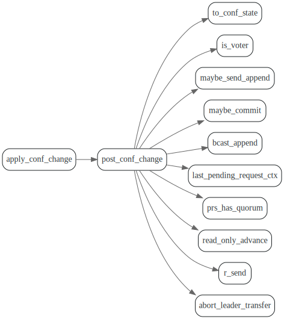

# ConfChange

在leader节点， 通过`RawNode.propose_conf_change` 使用上述Log Append机制，
发送ConfChange日志给raft cluster中其他节点。

在`ConfChange` Log Entry committed之后，集成raft-rs的服务，在处理committed Log Entry时, 会调用`RawNode.apply_conf_change` 更改conf配置，最终这些修改会更改
ProgressTracker中的progress和conf， 并进入JointConsensus，同时使用新老配置来计算committed index和统计vote result。

leader节点在`commit_apply`时，如果发现applied 的Log Entry中有ConfChange entry(还有其他一些条件)
会再发一个空的`ConfChange` Log Entry，在该日志被`apply_conf_change`时，会清空JointConfig的outgoing，
结束JointConseus状态。

### Joint Consensus

此处贴上论文中的那张图。

```rust
//JointConfig
pub struct Configuration {
    //incoming 为新的配置
    pub(crate) incoming: MajorityConfig,
    //outgoing 为老的配置
    pub(crate) outgoing: MajorityConfig,
}

// MajorityConfig
pub struct Configuration {
    voters: HashSet<u64>,
}
```
#### 计算committed index
```rust
    //同时统计新老配置中的committed index
    // JointConfig
    pub fn committed_index(&self, use_group_commit: bool, l: &impl AckedIndexer) -> (u64, bool) {
        let (i_idx, i_use_gc) = self.incoming.committed_index(use_group_commit, l);
        let (o_idx, o_use_gc) = self.outgoing.committed_index(use_group_commit, l);
        (cmp::min(i_idx, o_idx), i_use_gc && o_use_gc)
    }

    //MajorityConfig
    pub fn committed_index(&self, use_group_commit: bool, l: &impl AckedIndexer) -> (u64, bool) {
        if self.voters.is_empty() {
            // This plays well with joint quorums which, when one half is the zero
            // MajorityConfig, should behave like the other half.
            return (u64::MAX, true);
        }
        // other codes
    }
```

#### 统计vote result
```rust
    //
    pub fn vote_result(&self, check: impl Fn(u64) -> Option<bool>) -> VoteResult {
        let i = self.incoming.vote_result(&check);
        let o = self.outgoing.vote_result(check);
        match (i, o) {
            // It won if won in both.
            (VoteResult::Won, VoteResult::Won) => VoteResult::Won,
            // It lost if lost in either.
            (VoteResult::Lost, _) | (_, VoteResult::Lost) => VoteResult::Lost,
            // It remains pending if pending in both or just won in one side.
            _ => VoteResult::Pending,
        }
    }

    // majority config
    pub fn vote_result(&self, check: impl Fn(u64) -> Option<bool>) -> VoteResult {
        if self.voters.is_empty() {
            // By convention, the elections on an empty config win. This comes in
            // handy with joint quorums because it'll make a half-populated joint
            // quorum behave like a majority quorum.
            return VoteResult::Won;
        }
    }
```

### ConfChange Log Entry 数据结构


### propose conf change


### apply conf

#### enter joint 

leader节点的ConfChange日志被commit后，节点在apply该日志时，开始使用JointConseus，
同时使用新(incoming)老(outgoing)配置来做统计vote和计算committed index


#### leave joint

leader 在`commit_apply`时, 如果发现pending_conf_index 的日志被
commit了，且`prs.conf().auto_leave`会发送空的EntryConfChangeV2消息。

节点在处理(`apply_conf_change`)该空消息时, 会进入leave joint，清空outgoing的配置，
使用incoming新的配置。


```rust
    pub fn commit_apply(&mut self, applied: u64) {
        let old_applied = self.raft_log.applied;
        #[allow(deprecated)]
        self.raft_log.applied_to(applied);

        // TODO: it may never auto_leave if leader steps down before enter joint is applied.
        if self.prs.conf().auto_leave
            && old_applied <= self.pending_conf_index
            && applied >= self.pending_conf_index
            && self.state == StateRole::Leader
        {
            // If the current (and most recent, at least for this leader's term)
            // configuration should be auto-left, initiate that now. We use a
            // nil Data which unmarshals into an empty ConfChangeV2 and has the
            // benefit that appendEntry can never refuse it based on its size
            // (which registers as zero).
            let mut entry = Entry::default();
            entry.set_entry_type(EntryType::EntryConfChangeV2);

            // append_entry will never refuse an empty
            if !self.append_entry(&mut [entry]) {
                panic!("appending an empty EntryConfChangeV2 should never be dropped")
            }
            self.pending_conf_index = self.raft_log.last_index();
            info!(self.logger, "initiating automatic transition out of joint configuration"; "config" => ?self.prs.conf());
        }
    }
```

#### post conf change

暂时还不太清楚post conf change的作用是什么


