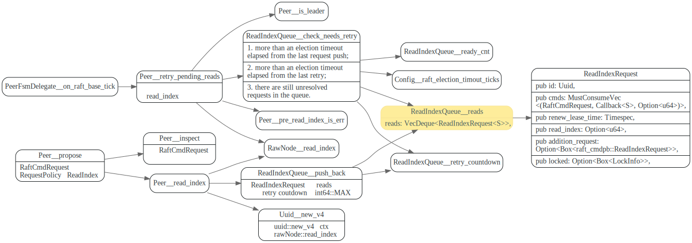

# ReadIndex

## Readindex 要解决的问题

> 当出现网络隔离，原来的 Leader 被隔离在了少数派这边，多数派那边选举出了新的 Leader，但是老的 Leader 并没有感知，在任期内他可能会给客户端返回老的数据。

## Read index流程

leader节点在处理读请求时，首先需要与集群多数节点确认自己依然是Leader，然后读取已经被应用到应用状态机的最新数据。

1. 记录当前的commit index，称为 ReadIndex
2. 向 Follower 发起一次心跳，如果大多数节点回复了，那就能确定现在仍然是 Leader
3. 等待状态机至少应用到 ReadIndex 记录的 Log
4. 执行读请求，将结果返回给 Client

## 发起ReadIndex

应用通过调用`RawNode::read_index`方法来获取当前的leader的committed index，
调该接口时，会附带上一个ctx, 它的类型为`vec<u8>`，起到唯一标识的作用。
在read index ready后，该ctx会回传给App.

如果是在follower 节点，follower节点会将`MsgReadIndex`转发给leader，等待
leader回复`MsgReadIndexResp`。

如果ReadOnlyOption为Safe, leader节点则会广播发送一次心跳信息，来确认自己
还是leader,发送的心跳信息，会附带上ctx, follower的hearbeat resp中
会带回该ctx.

如果ReadOnlyOption为LeaseBased并且leader的lease还没过期，就省掉了一次广播心跳信息过程。

等leader确认好自己还是集群的leader后，如果在MsgReadIndex是由leader节点自己发起的，
leader节点就直接将ReadState放入`RaftCore::read_states`。

如果是由follower 发起的，leader会发送MsgReadIndexResp给follower, follower放入自己的`RaftCore::read_states`中

等app下次调用ready时，就能跟ctx获取对应的`comitted_index`了
`RaftCore::read_states`中。

## 处理follower hearbeat resp

leader在收到follower的hearbeat resp时，会使用resp中的ctx,
找到之前的`ReadIndexStatus`, 更新里面的`acks`，当`acks` 达到大多数时候，
read index就Ready了，可以返回给上层应用了。

leader节点上的`read_index`, leader节点会将ReadIndexStatus中的index,和ctx 放入
`RaftCore::read_states`, 在App调用ready时候，返回给App.

follower节点上的`read_index`, leader节点会发送MsgReadIndexResp给follower, follower
将index和ctx放入它自己的`RaftCore::states`, 然后在App调用ready时，返回给App。

## retry

如果client读到了老的leader节点，leader一直没达到quorum，这个该怎么办？

在TiKV代码中，会由上层周期性的检查一次，如果再一个election timout 时间周期内
有的read index没有ready，就重试。

## 参考资料

1. [TiDB 新特性漫谈：从 Follower Read 说起](https://pingcap.com/zh/blog/follower-read-the-new-features-of-tidb)
