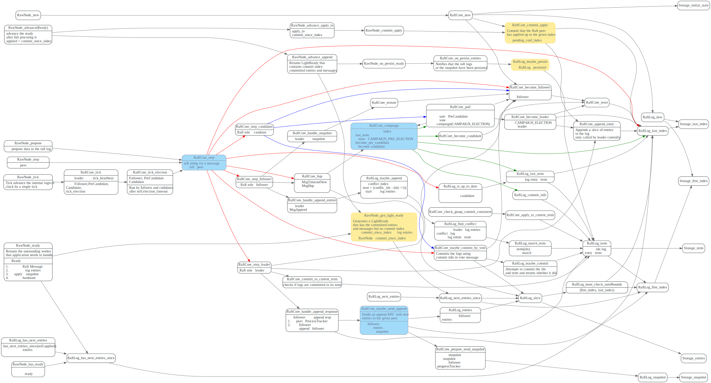
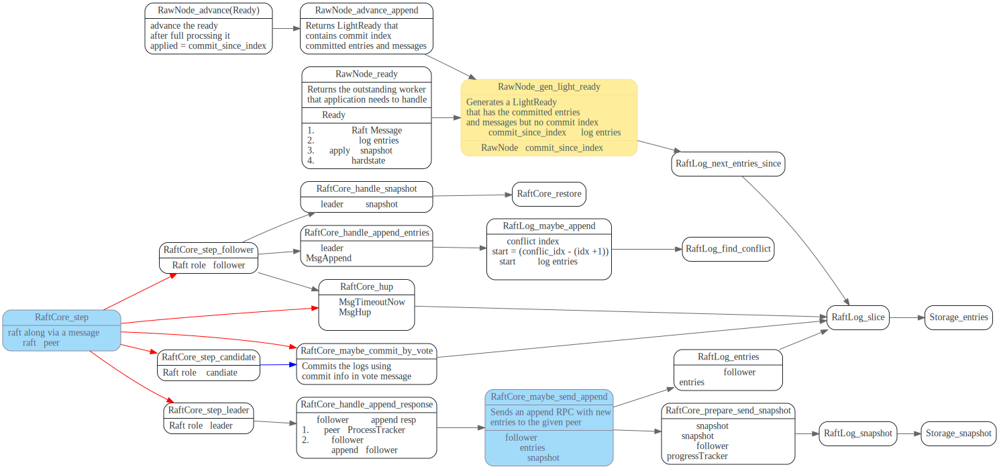

# Storage

<!-- toc -->

## trait Storage

另外raft底层又抽象出一个trait Storage负责保存Raft log entries和hard state. App需要实现Storage的trait

```rust
/// Storage saves all the information about the current Raft implementation, including Raft Log,
/// commit index, the leader to vote for, etc.
///
/// If any Storage method returns an error, the raft instance will
/// become inoperable and refuse to participate in elections; the
/// application is responsible for cleanup and recovery in this case.
pub trait Storage {
    /// `initial_state` is called when Raft is initialized. This interface will return a `RaftState`
    /// which contains `HardState` and `ConfState`.
    ///
    /// `RaftState` could be initialized or not. If it's initialized it means the `Storage` is
    /// created with a configuration, and its last index and term should be greater than 0.
    fn initial_state(&self) -> Result<RaftState>;

    /// Returns a slice of log entries in the range `[low, high)`.
    /// max_size limits the total size of the log entries returned if not `None`, however
    /// the slice of entries returned will always have length at least 1 if entries are
    /// found in the range.
    ///
    /// # Panics
    ///
    /// Panics if `high` is higher than `Storage::last_index(&self) + 1`.
    fn entries(&self, low: u64, high: u64, max_size: impl Into<Option<u64>>) -> Result<Vec<Entry>>;

    /// Returns the term of entry idx, which must be in the range
    /// [first_index()-1, last_index()]. The term of the entry before
    /// first_index is retained for matching purpose even though the
    /// rest of that entry may not be available.
    fn term(&self, idx: u64) -> Result<u64>;

    /// Returns the index of the first log entry that is possible available via entries, which will
    /// always equal to `truncated index` plus 1.
    ///
    /// New created (but not initialized) `Storage` can be considered as truncated at 0 so that 1
    /// will be returned in this case.
    fn first_index(&self) -> Result<u64>;

    /// The index of the last entry replicated in the `Storage`.
    fn last_index(&self) -> Result<u64>;

    /// Returns the most recent snapshot.
    ///
    /// If snapshot is temporarily unavailable, it should return SnapshotTemporarilyUnavailable,
    /// so raft state machine could know that Storage needs some time to prepare
    /// snapshot and call snapshot later.
    /// A snapshot's index must not less than the `request_index`.
    fn snapshot(&self, request_index: u64) -> Result<Snapshot>;
}
```

从RawNode到Storage之间的调用路径如下：




### `initial_state`

获取初始的RaftState, 设置HardState和ConfState
初始state 为follower, `leader_id`是`INVALID_ID`


### `entries` 和`snapshot`

leader在向follower发送log entry或者snapshot时，会调用entries或者snapshot接口。



### term


## 参考文献

1. [raft-rs proposal 示例情景分析](https://pingcap.com/zh/blog/tikv-source-code-reading-2)
2. [etcd-raft的线性一致读方法一：ReadIndex](https://zhuanlan.zhihu.com/p/31050303)
