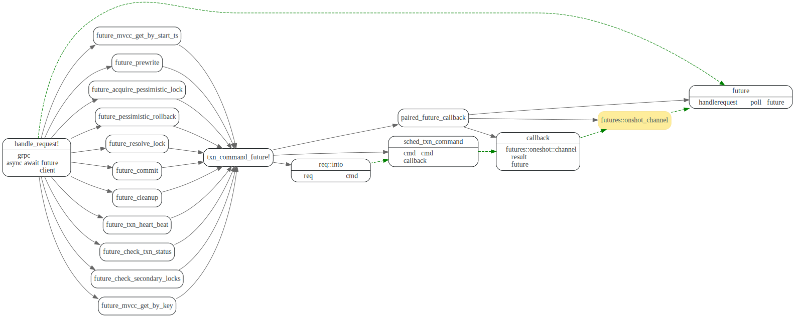

# Scheduler

### schedule_txn_cmd

从service/kv.rs grpc接口handler处理函数中，首先会将 req::into会将request 转换成
对应的cmd, 然后创建一个oneshot channel, 并await oneshot channel返回的future.

然后由`Scheduler::sched_txn_command`调度执行该cmd, cmd执行完毕，或者
遇到error后，会调用callback, callback触发onshot channel,
然后grpc handler 从await future中获取的resp 返回给client.

### TaskSlots

Scheduler command中，会将cmd 包装为一个TaskContext
TaskContext中则包含了Task, cb(向上的回到), ProcessResult cmd的执行结果.

对于每个cmd会分配一个唯一的cid, task_slot则用于从cid获取cmd 对应的taskContext.

task slots 会先找到cid 对应的的slot, 之后上mutex lock，获取slot中的hashmap，
做插入查找操作。这样的好处是检查mutex lock，增加了并发度。

### run_cmd

在run cmd之前，会尝试获取cmd的所有的key的latches, 如果成功了，就执行cmd
否则就放入latches等待队列中。latches和task slot一样，也对key hash做了slot.

在cmd执行结束或者遇到error了，会release lock，释放掉command获取的key laches.

然后唤醒等待key latch的command id.

### release lock

释放cid拥有的latches lock, 唤醒等待的task,
这些被唤醒的task 会尝试去获取lock
如果task的涉及的所有key 的latches都拿到了，
就去执行task.

### Scheduler execute

Scheduler执行cmd

