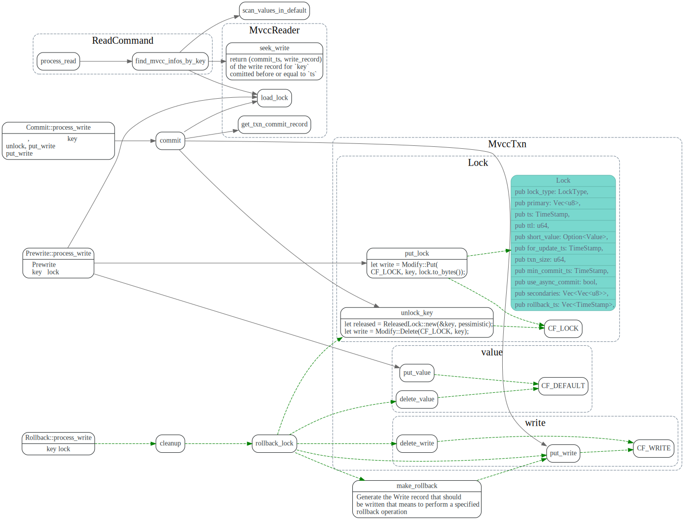
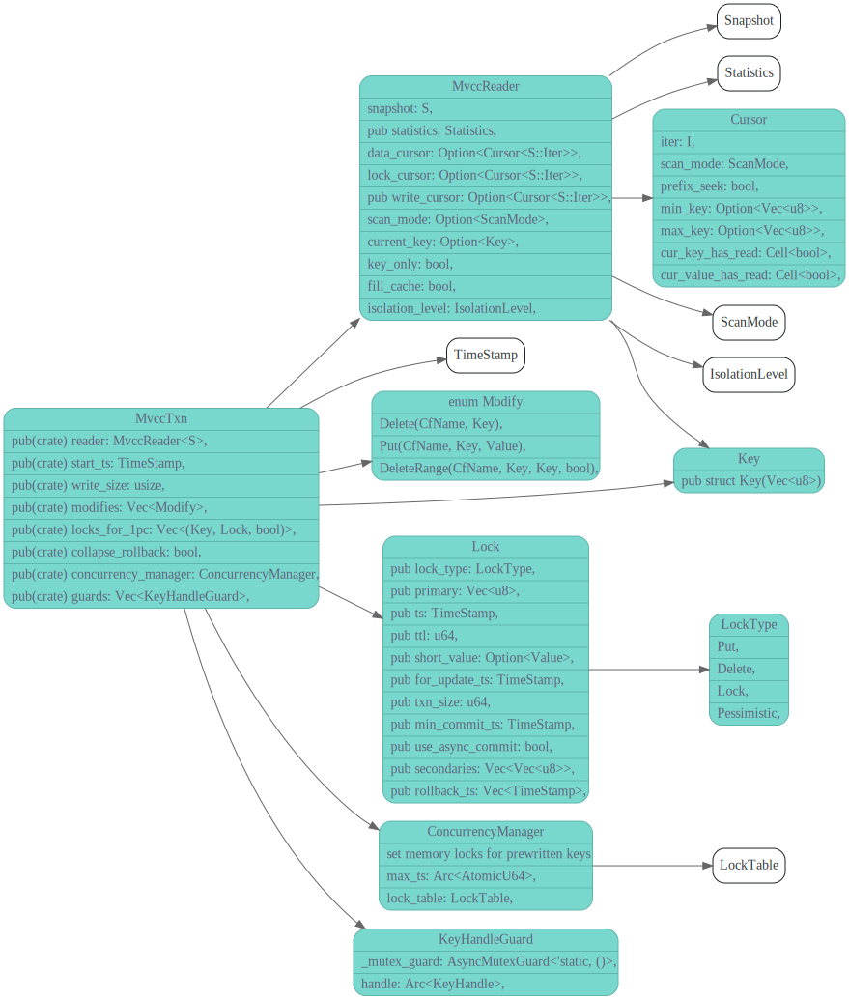

# Storage

<!-- toc -->

## DataFormat

每个key分别写入三个column family, 
Default存放数据

```
Lock	user_key	lock_info
Default	{user_key}{start_ts}	user_value
Write	{user_key}{commit_ts}
```

* LockColumn: 事务产生的锁，未提交的事务会写本项，记录primary lock的位置。事务成功提交后，该记录会被清理。记录内容格式
* Data Column: 存储实际数据
* Write Column: 已提交的数据信息，存储数据所对应的时间戳。

> 关键在于WRITE COLUMN，只有该列正确写入后，事务的修改才会真正被其他事务可见。读请求会首先在该COLUMN中寻找最新一次提交的start timestamp，这决定了接下来从DATA COLUMN的哪个key读取最新数据。
## MvccTxn

它主要提供写之前的事务约束检验功能


### Lock

`MvccTxn::put_lock`, 这个lock的key不带ts

```rust
    pub(crate) fn put_lock(&mut self, key: Key, lock: &Lock) {
        let write = Modify::Put(CF_LOCK, key, lock.to_bytes());
        self.write_size += write.size();
        self.modifies.push(write);
    }
```
MvccTxn::unlock 会删掉key的lock， 然后通过ReleasedLock来通知其他事务重试
```rust
    pub(crate) fn unlock_key(&mut self, key: Key, pessimistic: bool) -> Option<ReleasedLock> {
        let released = ReleasedLock::new(&key, pessimistic);
        let write = Modify::Delete(CF_LOCK, key);
        self.write_size += write.size();
        self.modifies.push(write);
        Some(released)
    }
```

## Latches

Latches作用是在内存中先拦截一下可能会write key conflict的事务？
避免在后面prewrite阶段浪费时间 ?。

在事务模式下，为了防止多个请求同时对同一个 key 进行写操作，请求在写这个 key 之前必须先获取这个 key 的内存锁。为了和事务中的锁进行区分，我们称这个内存锁为 latch

## Storage::sched_txn_command


# TODO

1. lock 的ttl超时是怎么处理的？
2. 失败的lock 是怎么处理的
3. 死锁是咋搞的
4. latches 是怎么处理死锁问题的？比如事务需要的key在不同的tikv机器上。
5. 什么是overlap write record?

## MvccReader

## MvccTxn


## 参考

1. [Google Percolator事务](https://zhuanlan.zhihu.com/p/53197633)

[TiKV Percolator](https://tikv.org/deep-dive/distributed-transaction/percolator/)

https://www.zhihu.com/question/300050882/answer/518833781
> 传统的2PC中的Coordinator是为了保证原子性提交，如果在Coordinator commit成功，认为事务Commit；如果发生异常，由Coordinator来负责rollback 或者 roll-forward整个事务。实际上Coordinator的角色可以进一步分解：向所有Participant发送Prepare请求，确定这个是否可以提交 如果可以提交，写Commit Log，并向所有Participant广播消息 如果不能提交，回滚或者重试，释放在Prepare阶段申请到的资源因此Percolator实际上就是一个把Coordinator的任务分解重组之后的方案：Prepare请求的广播，由Client负责Commit的决定，也由Client判断Commit Log：Client在Bigtable中写Primary Key的Write列Commit信息广播：Client在Bigtable修改Secondary Key的Write列rollback/roll-forward：这个也是由Client驱动，通过Prepare Log和Commit Log的状态来判断概括一下，Percolator把Coordinator的角色分成有状态和无状态两部分，有状态的下沉到Bigtable，无状态的话就交给Client执行。至于Percolator这种设计的优劣，以及其他2PC的工程实现（例如Spanner的2PC就是另一种取舍），甚至于Percolator事务的Isolation保证，那就是另一个问题了，暂且不提
