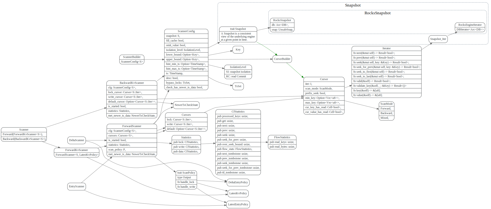

# Scanner

> Scanner 使用归并排序的思路扫描CF_LOCK, CF_WRITE来做遍历

<!-- toc -->

## PointGetter

假定事务t2,使用PointGetter::get读取user_key的value，t2的`start_ts` 保存在PointGetter::ts中。

get 一个user_key value过程如下：
```rust
    pub fn get(&mut self, user_key: &Key) -> Result<Option<Value>> {
```

1. 如果IsolationLevel为SI(Snapshot Isolation), 则需要检查先`load_and_check_lock`， 如果为RC(read commit), 则直接去`load_data`即可。
2. load_and_check_lock 会从`CF_LOCK`中读取`user_key`的lock， 然后检查lock和t2的时间戳。
3. `load_data`从`CF_WRITE`中查找`[0, t2.start_ts]`之间最新事务(假设为t1)的Write, 其key为`{user_key}{t1.commit_ts}`, 如果write type为Rollback
或者Lock，就skip掉，接着查找下一个, 如果Write type 为delete，则直接返回None，如果是Put, 则从WriteRef中读取到事务t1的start_ts。
然后去读取数据。

4. 从`CF_DEFAULT` 找到 `{user_key}{t1.start_ts}`对应的value。TiKV 对short_value做了优化，直接把value写在CF_WRITE中了，避免了一次再从`CF_DEFAULT`读取数据的过程。


## MvccReader

## Scanner 主要struct

Scanner主要分为`ForwardScanner `和`BackwardKvScanner`，它们公用信息保存在`ScannerConfig`中，它们使用`Cursor`来遍历CF_LOCK, CF_WRITE, CF_DEFAULT中的数据。

`Cursor`主要在底层RocksDB的iter基础上，包装了一些near_seek, seek, valid等函数，并会将一些统计信息
写入到`CfStatistics`中。

`ScannerConfig` 用于保存一些公用的信息，比如scan key的lower_bound和upper_bound, 另外它还负责使用CursorBuilder创建cursor.

`Snapshot` 则提供了Iterator供Cursor使用。

`ForwardKvScanner`在遇到lock/write时，使用`Trait ScanPolicy`来处理lock/write.
`Trait Policy` impl有:  

1. DeltaEntryPolicy 
2. LatestKvPolicy 
3. LatestEntryPolicy



## Cursor

Cursor则在RocksSnapshot的ite基础上包装了一些seek, near_seek等功能。
并每次读取key,value, 都会在`CfStatistics`上加一些统计，

在iter上加了一个near_seek结合和scan_mode，每次Key,value 
会加一些key, value的统计。


## ForwardScanner

ForwardScanner 用于扫描range(对应`ScannerConfig`中的lower_bound和upper_bound)内所有key最新(`commit_ts <=T.start_ts`) value

最简单粗暴的做法是像PointGetter那样，一个个扫描，但问题是对于`CF_WRITE`中扫描到的每个user_key，都需要到`CF_LOCK`中seek 查找它的lock信息。
但这样效率太低了.

TiKV采用了类似于归并排序的思路，同时移动 write cursor和 lock cursor. 使用最小的作为current_user_key。

```rust
//current_user_key, user_key, has_write, has_lock

// `current_user_key` is `min(user_key(write_cursor), lock_cursor)`, indicating
// the encoded user key we are currently dealing with. It may not have a write, or
// may not have a lock. It is not a slice to avoid data being invalidated after
// cursor moving.
//
// `has_write` indicates whether `current_user_key` has at least one corresponding
// `write`. If there is one, it is what current write cursor pointing to. The pointed
// `write` must be the most recent (i.e. largest `commit_ts`) write of
// `current_user_key`.
//
// `has_lock` indicates whether `current_user_key` has a corresponding `lock`. If
// there is one, it is what current lock cursor pointing to.
(Some(wk), Some(lk)) => {
    let write_user_key = Key::truncate_ts_for(wk)?;
    match write_user_key.cmp(lk) {
        Ordering::Less => {
            // Write cursor user key < lock cursor, it means the lock of the
            // current key that write cursor is pointing to does not exist.
            (write_user_key, true, false)
        }
        Ordering::Greater => {
            // Write cursor user key > lock cursor, it means we got a lock of a
            // key that does not have a write. In SI, we need to check if the
            // lock will cause conflict.
            (lk, false, true)
        }
        Ordering::Equal => {
            // Write cursor user key == lock cursor, it means the lock of the
            // current key that write cursor is pointing to *exists*.
            (lk, true, true)
        }
    }
```

然后调用`Trait ScanPolicy` 的`handle_lock`, `handle_write`来处理遇到的lock, write

ScanPolicy 有以下三种impl

* <b> LatestKvPolicy</b>: outputs the latest key value pairs.
* <b> LatestEntryPolicy</b>: only outputs records whose commit_ts is greater than `after_ts`. It also supports outputting delete records if `output_delete` is set to `true`.
* <b>DeltaEntryPolicy</b>: The ScanPolicy for outputting `TxnEntry` for every locks or commits in specified ts range.  The `ForwardScanner` with this policy scans all entries whose `commit_ts`s (or locks' `start_ts`s) in range (`from_ts`, `cfg.ts`].


### LatestKvPolicy


### LatestEntryPolicy

### DeltaEntryPolicy

## BackwardKvScanner


## Questions
1. bypass_locks ? 这个作用是什么?
2. check_ts_conflict 为啥lockType为Pessimistic 就可以返回OK?

## 参考

1. [percolator-in-tikv](https://tikv.org/deep-dive/distributed-transaction/percolator/#percolator-in-tikv)
2. [MVCC 数据读取](https://pingcap.com/blog-cn/tikv-source-code-reading-13/)
