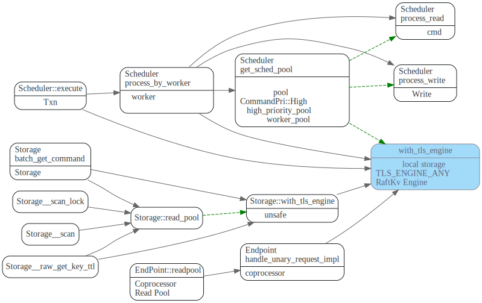

# Thread Local Engine

<!-- toc -->

RaftStorage中有read pool和两个write pool, 分别负责storage的读写操作，每个pool中的
每个线程都有自己的RaftKV engine clone为tls engine。

每个线程启动完，在`after_start`方法中，会调用`set_tls_engine`设置好自己的`TLS_ENGINE_ANY`指针。
线程关闭时，会调用`destroy_tls_engine`清理掉 tls engine.
使用时，用`with_tls_engine`来使用该指针。


`TiKVServer::init_servers`初始化时，会创建一些yatp thread pool. TxnScheduler会创建两个
worker pool用来处理Txn command，而Storage和Coprocessor 则有个`read_pool`,

如果enable了config.pool中的`unified_read_pool`选项，Storage和coprocessor会共享一个read pool.
Unified thread pool 参见pingcap博客 [Unified Thread Pool](https://pingcap.com/zh/blog/unified-thread-pool)


## `with_tls_engine`

使用`with_tls_engine`主要有三处，

1. TxnScheduler在执行事务cmd时，会在worker thread pool，执行read/write cmd.
2. Storage的正常的`batch_get_command`, `scan`等读操作。
3. Coprocessor的读数据操作。





## tls LRUcache

tls engine的作用是，这样每个线程在使用RaftKV时，会优先使用自己线程 tls RaftKv的LruCache，如果cache miss或者cache的数据
stale了才会使用Lock去mutex共享的变量中获取数据，并插入LruCache中。
这样大大的降低了lock使用的概率.

RaftKv中LRUcache主要有两处：

### Router::caches

Router给region 的raft peer 发送消息时候(具体方法为`Router::check_do`)，先从Router::caches获取BasicMailbox, 如果cache miss
再加锁去normals中读取BasicMailbox.

```rust
pub struct Router<N: Fsm, C: Fsm, Ns, Cs> {
    normals: Arc<Mutex<HashMap<u64, BasicMailbox<N>>>>,
    caches: Cell<LruCache<u64, BasicMailbox<N>>>,
    //...
}
```

### LocalReader::delegate

在读数据时，线程会先在自己的LocalReader::delegates LRUcache中获取delegate(具体方法为`LocalReader::get_delegate`)，
如果cache中没有或者delegate 版本发生了变化，才会去加lock 去`store_meta`中获取ReadDelegate.


```rust
pub struct LocalReader<C, E>
where
    C: ProposalRouter<E::Snapshot>,
    E: KvEngine,
{
    store_meta: Arc<Mutex<StoreMeta>>,
    delegates: LruCache<u64, Arc<ReadDelegate>>,
}
```

## 参考文献
1. [Unified Thread Pool | Hackathon 2019 优秀项目介绍](https://pingcap.com/zh/blog/unified-thread-pool/)
