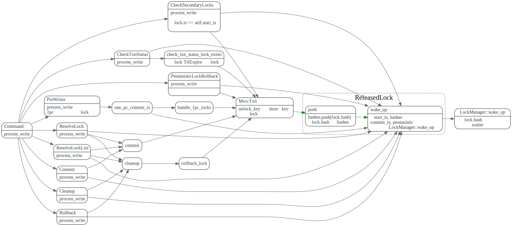

# Wait Lock

Lock冲突事后，TiKV会将lock, StorageCallback, ProcessResult等打包成waiter.
放入等待队列中，等lock释放了，或者timeout了，再调用callback(ProcessResult)
回调通知client ProcessResult.  相当于延迟等待一段时间，避免client 无效的重试


lock和cb还有ProcessResult会被打包成waiter, cb调用会触发向client返回结果吗？

```rust
/// If a pessimistic transaction meets a lock, it will wait for the lock
/// released in `WaiterManager`.
///
/// `Waiter` contains the context of the pessimistic transaction. Each `Waiter`
/// has a timeout. Transaction will be notified when the lock is released
/// or the corresponding waiter times out.
pub(crate) struct Waiter {
    pub(crate) start_ts: TimeStamp,
    pub(crate) cb: StorageCallback,
    /// The result of `Command::AcquirePessimisticLock`.
    ///
    /// It contains a `KeyIsLocked` error at the beginning. It will be changed
    /// to `WriteConflict` error if the lock is released or `Deadlock` error if
    /// it causes deadlock.
    pub(crate) pr: ProcessResult,
    pub(crate) lock: Lock,
    delay: Delay,
    _lifetime_timer: HistogramTimer,
}
```


### 加入等待队列


将请求放入等待队列中，直到lock被cleanup了，调用StorageCallback, cb中返回WriteConflict错误给
client 让client重试。

在放入前还会将wait lock信息放入dead lock scheduler, 检测死锁.


WaitManager 从channel中去取task, 放入lock的等待队列中。
并加个timeout, 等待超时了会调用cb。并从dead lock scheduler中去掉wait lock。


### WakeUp

lock被释放后, LockaManager::wake_up 唤醒等待该lock的waiter.

TODO: 需要对lock.hash做一些说明。
TODO: task的回调机制需要整理下。



LockManager::Wakeup


WaiterManager::handle_wake_up


