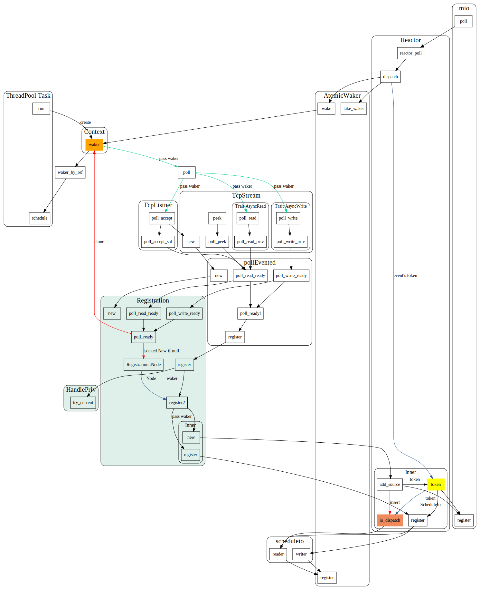

# tokio driver

Driver 简单来说，就是io event事件触发后，找到相应等待的task, 然后调用预设好的回调函数.


tokio中事件驱动主要靠``mio::poll``, 在像mio::register中注册一个event时，会带上一个token(token是在tokio中生成的）, driver根据该token建立到SchduleIo的映射，event触发的时候，就会调用schedulIo中预先定义好的方法。
然后事件被触发的时候,mio会把这个token带过来。


## task <-> mio event

task和mio event通过token 建立关系，回调函数waker通过过Context包装, 传递给future的poll函数，当future需要等待某个事件时候，就会把事件和context关联起来。然后等事件被触发了，就调用context中预先设置好的waker.


## 主要数据结构


``reactor::inner``中的``io_dispatch``表，用于记录事件token到ScheduleIO的一个映射关系.

```rust
//reactor.rs
pub(super) struct Inner {
    /// The underlying system event queue.
    io: mio::Poll,

    /// ABA guard counter
    next_aba_guard: AtomicUsize,

    /// Dispatch slabs for I/O and futures events
    pub(super) io_dispatch: RwLock<Slab<ScheduledIo>>,

    /// Used to wake up the reactor from a call to `turn`
    wakeup: mio::SetReadiness,
}

```

ScheduledIo, 主要用于指向context 

```rust
pub(super) struct ScheduledIo {
    aba_guard: usize,
    pub(super) readiness: AtomicUsize,
    pub(super) reader: AtomicWaker,
    pub(super) writer: AtomicWaker,
}

```
Context 中的waker则定义了如何唤醒task, 对于threadpool 会去调用Task::Schedule方法，而对于current thread, 则会去调用Node.Notify


## context 注册过程

首先ctx会在task run时候，被创建，然后传递给future_poll, 经过层层的poll_ready 之类的，注册到``Reactor::inner::io_dipatch``表中
注册的key会在``Reactor::inner::add_source``计算出来，然后传递给mio的register函数。

然后mio的poll函数在事件发生时，会将该token带上，在Reactor::dispatch中根据token找到相应的contex waker, 调用对应的wake函数。


### thread pool 中 ctx waker的创建

```rust
//threadpool/task/mod.rs
    pub(crate) fn run(me: &Arc<Task>, pool: &Arc<Pool>) -> Run {
    //...
            let waker = task::waker(Arc::new(Waker {
                task: me.clone(),
                pool: pool.clone(),
            }));

            let mut cx = Context::from_waker(&waker);
    //...
    }
```
其中Waker定义如下, event经过dispatch 后, 最终会调用Task::Schedule.

```rust
// threadpool/waker.rs
impl ArcWake for Waker {
    fn wake_by_ref(me: &Arc<Self>) {
        Task::schedule(&me.task, &me.pool);
    }
}
```

### current thread中ctx waker的创建

```rust
    pub fn block_on<F>(&mut self, mut future: F) -> F::Output
    where
        F: Future,
    {
        // Safety: we shadow the original `future`, so it will never move
        // again.
        let mut future = unsafe { Pin::new_unchecked(&mut future) };
        let waker = self.executor.scheduler.waker();
        let mut cx = Context::from_waker(&waker);
        // ... other code
    }
```

### event, token, scheduleIO

tokio中通过token将event和scheduleIO关联起来

#### token到ScheduleIO

在``reactor::inner::add_source``中, 会在``io_dispatch``表中先创建一个ScheduleIO， key为aba_guard, 使用aba_guard计算出一个token, 
最后通过调用mio.register 将token和event关联起来, 这样就建立了ScheduleIO和event之间的关系.

```rust
// tokio-net/src/driver/reactor.rs
    pub(super) fn add_source(&self, source: &dyn Evented) -> io::Result<usize> {
        // Get an ABA guard value
        let aba_guard = self.next_aba_guard.fetch_add(1 << TOKEN_SHIFT, Relaxed);

        let key = {
            // Block to contain the write lock
            let mut io_dispatch = self.io_dispatch.write();

            if io_dispatch.len() == MAX_SOURCES {
                return Err(io::Error::new(
                    io::ErrorKind::Other,
                    "reactor at max \
                     registered I/O resources",
                ));
            }

            io_dispatch.insert(ScheduledIo {
                aba_guard,
                readiness: AtomicUsize::new(0),
                reader: AtomicWaker::new(),
                writer: AtomicWaker::new(),
            })
        };

        let token = aba_guard | key;
        debug!("adding I/O source: {}", token);

        self.io.register(
            source,
            mio::Token(token),
            mio::Ready::all(),
            mio::PollOpt::edge(),
        )?;

        Ok(key)
    }
```

#### ScheduledIo 到context, 

主要在Registration::inner::register中完成.

```rust

    pub(super) fn register(&self, token: usize, dir: Direction, w: Waker) {
        debug!("scheduling {:?} for: {}", dir, token);
        let io_dispatch = self.io_dispatch.read();
        let sched = io_dispatch.get(token).unwrap();

        let (waker, ready) = match dir {
            Direction::Read => (&sched.reader, !mio::Ready::writable()),
            Direction::Write => (&sched.writer, mio::Ready::writable()),
        };

        waker.register(w);

        if sched.readiness.load(SeqCst) & ready.as_usize() != 0 {
            waker.wake();
        }
    }
```


